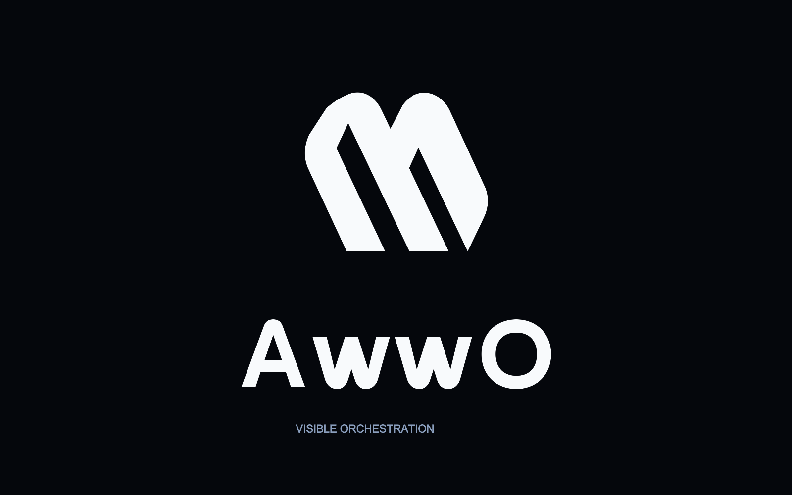

# AwwO Fold

The AwwO identity uses two paths that converge into one compact mark, echoing the connections on an agent canvas. These are the original approved vector paths and custom AwwO lettering; no third-party logo or font outline is used.

## Files

- `vector-source.json`: canonical geometry, transform, wordmark positions and colors.
- `svg/mark-{blue,ink,white}.svg`: transparent standalone icon, viewBox 256 × 256.
- `svg/wordmark-{blue,ink,white}.svg`: custom lettering, viewBox 625 × 140.
- `svg/lockup-{blue,ink,white}.svg`: horizontal logo, viewBox 1040 × 256.
- `png/mark-blue-{24,32,128,256,1024}.png`: transparent exports for application and small-size use.

The blue mark is `#2f7df6`; ink is `#05070c`; ivory is `#f8fafc`. Keep the two paths and their transform intact. Leave at least one quarter of the icon width clear around the standalone mark. Use a single flat color, with no added outline or glow.

The Mac build consumes the canonical 1024-pixel PNG and adds the application icon's ivory rounded surface. The web mark at `apps/web/src/awwo-mark.svg` and favicon at `apps/web/public/awwo-fold.svg` are exact copies of `svg/mark-blue.svg`. The custom wordmark stays in this directory for product and media use.

These first-party assets are distributed under the repository's [MIT license](../../../LICENSE). This file does not grant trademark rights or claim trademark clearance.
