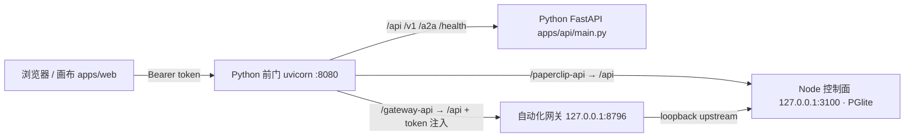

# SuperClaw Canvas — 接口清单（API Surface）

> 面向协同开发的三面接口总览。**单一入口**：所有请求都打到 Cloud Run 服务的同一个域名，
> Python 前门按前缀反向代理到对应的面。
>
> ⚠️ **本服务当前是公开的（业主知情决定，用于开放 demo）**：`allUsers` 被授予 `roles/run.invoker`，IAM 仍强制。
> 任何人有 URL 即可访问。由于控制面是 `local_trusted` 模式（给每个请求 instance-admin），**匿名访客能建司/招聘/派发 run，并用 relay key 真实花钱** —— 这是已接受的取舍，不是漏洞。
> 收回私有：`gcloud run services remove-iam-policy-binding superclaw-canvas --region us-central1 --member=allUsers --role=roles/run.invoker`，并把 `scripts/deploy-canvas.sh` 的 `EXPECT_PUBLIC` 设 0。
>
> 线上服务：`https://superclaw-canvas-838011692216.us-central1.run.app`
> （k-project-481102 / us-central1 / 私有；`min-instances=0`，冷启动约 12s 内 Node 面返回 503/演示回退，稍后重试即可。）
>
> 本清单更新于 2026-07-19；以 `main` 分支代码为准（路由源文件在各节标注）。

## 架构一图流



- **前缀路由清单**：`packages/superclaw/src/superclaw/node_routes.json`（Vite dev 代理与生产前门共用同一份）。
- **前门实现**：`packages/superclaw/src/superclaw/node_front_door.py`（控制面）、`gateway_front_door.py`（网关，自动注入 `x-superclaw-gateway-token`，浏览器永远不持有该 token）。
- **fail-closed 语义**：sidecar 未共启 → 前缀 404（回落 Python）；已共启但不可达 → **503**（绝不静默回落）。

---

## 面 1：Node 控制面（`/paperclip-api/*` → :3100 `/api/*`）— 公司/agent/运行 事实源

画布实时世界的数据来源。路由源：vendored `server/server/src/routes/`。状态存 **in-process PGlite**（当前部署为临时态：revision 重启即清空 —— 已接受的测试期取舍；持久化路线见文末）。

| 方法 | 路径（穿前门写法） | 用途 | 画布调用方 |
|---|---|---|---|
| GET | `/paperclip-api/companies` | 列公司 | `liveWorld.ts` 投影 / `paperclipBridge.ts` |
| POST | `/paperclip-api/companies` | 建公司 `{name}` | 双击空白画布（P4a）/ 提案批准（P2b） |
| GET | `/paperclip-api/companies/{id}/agents` | 公司成员名册 | `liveWorld.ts` 投影 |
| POST | `/paperclip-api/companies/{id}/agent-hires` | 招聘 agent（**请求/响应 schema 见附录 C**；⚠️ 新雇 agent 初始 `pending` 待审批） | `canvasHire.ts` / HireRosterDialog / HireAgentDialog |
| GET | `/paperclip-api/companies/{id}/live-runs` | 进行中运行（queued/running） | live-runs 5s 轮询徽标 |
| GET | `/paperclip-api/companies/{id}/artifacts` | 运行产出/交付物 | `canvasRunDetail.ts` RunDetailPanel |
| GET | `/paperclip-api/companies/{id}/sidebar-badges` | 待办计数 | 侧栏未读徽标 |

> 控制面还有大量上游路由（issues / documents / skills / plugins …），按需查 `server/server/src/routes/`。上表是画布当前实际消费的最小面。

## 面 2：自动化网关（`/gateway-api/*` → :8796 `/api/*`）— 规划/派发/对话

跨公司编排层。路由源：`apps/gateway/src/{mission,conversation,automation}/routes.ts`。**所有路由要求 `x-superclaw-gateway-token`**——由 Python 前门服务端自动注入，直连 :8796 调试时才需手带。

| 方法 | 路径（穿前门写法） | 用途 | 画布调用方 |
|---|---|---|---|
| POST | `/gateway-api/missions/plan` | 任务规划 → 轨道图 + 公司匹配（**精确 schema 见附录 A**） | `mission.ts` planMissionViaGateway |
| POST | `/gateway-api/missions/dispatch` | 真实派发一条轨道到某公司 agent（人审门之后；**附录 B**） | `mission.ts` dispatchTrackViaGateway（P3g） |
| POST | `/gateway-api/conversations/{companyId}/agents/{agentId}/messages` | 单 agent 对话（SSE 流式；**请求体 + 事件联合见附录 D**） | `canvasAgentChat.ts` CompanyChatPanel |
| GET | `/gateway-api/conversations/{companyId}` | **全公司会话索引**（P3f）→ `{companyId, conversations[]}`，按更新时间倒序 | 会话历史列表 |
| GET | `/gateway-api/conversations/{companyId}/issues/{issueId}/messages` | 某会话的完整记录（正序）→ `{issueId, messages[]}` | 恢复一段会话 |
| GET | `/gateway-api/automations` | 列自动化（可按 `?sessionIssueId=` 过滤） | 自动化面板 |
| POST | `/gateway-api/automations` | 建自动化 | 同上 |
| DELETE | `/gateway-api/automations/{id}` | 删自动化 | 同上 |

> 网关自身健康检查在**根路径** `/health` 与 `/gateway-id`（不在 `/api` 下）——设计上**不穿前门**，容器内 `curl 127.0.0.1:8796/health` 才能摸到。别用 `/gateway-api/health` 探活（会得到 Express 的 `Cannot GET /api/health`，这不是前门故障）。

## 面 3：Python 面（`/api/*`、`/health`）— 前门宿主 + 遗留内核

| 方法 | 路径 | 用途 | 状态 |
|---|---|---|---|
| GET | `/health` | 服务探活 `{"ok":true,"service":"superclaw"}` | ✅ 现役（Cloud Run 探针目标） |
| GET | `/` + `/assets/*` | apps/web SPA 静态托管（未匹配路径回落 index.html；`api/`、`gateway-api/` 等 API 前缀严格 404） | ✅ 现役 |
| GET | `/api/team/companies` | 只读公司名录（名称/状态，无成员） | ⚠️ 遗留（composer @-picker 尚在用） |
| — | `/api/*` 其余大量路由 | 旧 Python 内核（run/delivery/chat…） | ⚠️ Python→Node 退役过渡中，**新功能勿依赖** |

---

## 精确 Schema 附录（从源码逐字抽取，写代码以此为准）

> 类型源文件已标注 —— 文档与代码冲突时以源码为准并回改本文档。

### A. `POST /gateway-api/missions/plan`（源：`apps/gateway/src/mission/types.ts` + `routes.ts`）

**请求体**（`parseMissionRequest`，坏输入 → 400 `{error}`）：

```jsonc
{
  "prompt": "string，必填，trim 后非空，≤ 4000 字符",
  "topology": "可选，缺省 'linear'。枚举：'linear' | 'implement_fanout' | 'explore_fanout' | 'review_consensus'"
}
```

**响应 200 = `MissionPlanResult`**：

```ts
type MissionRole = 'explore' | 'plan' | 'implement' | 'verify' | 'review';

interface MissionTrack {
  trackId: string;          // 't1'...
  role: MissionRole;
  label: string;            // 中文角色标签（勘探/规划/实现/验证/评审）
  dependsOn: string[];      // 前置 track id
  depth: number;            // 拓扑深度，0 = 首层
  lane: number;             // 同 depth 并发轨道区分
  fanout?: { branches: number };
}

interface MissionPlanResult {
  prompt: string;
  plan: { topology: MissionTopology; tracks: MissionTrack[] };
  matches: Array<{           // 每条 track 的公司匹配（真实公司，按能力匹配）
    trackId: string; role: MissionRole; label: string;
    companyId: string | null;   // null = 无公司可覆盖该角色
    companyName: string | null;
  }>;
  companies: string[];       // 触及的公司 id（首触顺序去重）
  unmatchedRoles: MissionRole[];      // 无人可接的角色（诚实暴露）
  unreadableCompanies: string[];      // 名册读取失败的公司（能力未知）
  fullyMatched: boolean;     // 全部匹配 && 全部名册可读 才为 true（绝不假成功）
  proposal?: {               // 仅当 unmatchedRoles 非空：建议新建的公司（纯提案，未创建）
    name: string; mandate: string;
    coversRoles: MissionRole[];
    roster: Array<{ role: MissionRole; title: string }>;
  };
}
```

### B. `POST /gateway-api/missions/dispatch`（源：`apps/gateway/src/mission/dispatch-routes.ts` + `dispatch.ts`）

**请求体**（坏输入 → 400 `{error}`）：

```jsonc
{
  "companyId": "string，必填",
  "role": "必填，MissionRole 枚举（见上）",
  "task": "string，必填，≤ 8000 字符 —— 成为被唤醒 agent 执行的 issue 正文",
  "agentId": "可选 —— 指定则直派该 agent；缺省由网关按角色自动挑选可用 agent",
  "agentName": "可选，展示用",
  "title": "可选，issue 标题"
}
```

**响应**（`DispatchTrackResult` 判别联合；`dispatched`/`queued`/`no_agent` 都是 **200 的诚实真实结果**，只有上游故障才 502）：

```ts
type DispatchTrackResult =
  | { status: 'dispatched'; companyId: string;
      agent: { id: string; name: string; roleMatch: boolean };
      issueId: string; runId: string }                       // 已派发且 run 已启动
  | { status: 'queued'; companyId: string; agent: {...}; issueId: string; detail: string }  // issue 已建，run 排队中
  | { status: 'no_agent'; companyId: string;
      reason: 'empty_roster' | 'roster_unreadable'; detail: string }  // 无人可派（非错误）
  | { status: 'error'; detail: string };                     // 上游故障 → HTTP 502
```

### C. `POST /paperclip-api/companies/{companyId}/agent-hires`（源：`server/packages/shared/src/validators/agent.ts` `createAgentHireSchema`，zod 校验，坏输入 → 400）

**请求体**（画布实际发送的最小集见 `apps/web/src/canvasHire.ts` `buildHireBody`）：

```jsonc
{
  "name": "string，必填，非空",
  "role": "可选，缺省 'general'。枚举 AGENT_ROLES：ceo|cto|cmo|cfo|security|engineer|designer|pm|qa|devops|researcher|general|...（画布映射：explore→researcher, plan→pm, implement→engineer, verify→qa, review→security）",
  "title": "可选（画布传 persona 名）",
  "adapterType": "runtime 类型，缺省 'process'。内置：process|http|acpx_local|claude_local|codex_local|cursor_cloud|gemini_local|hermes_gateway|hermes_local|opencode_local|pi_local|cursor|openclaw_gateway（外部 adapter 可注册新值——用 GET /paperclip-api/… runtime 契约拉真实清单，勿硬编码）",
  "adapterConfig": {           // 可选。model/effort 放这里（不是顶层！），只在用户显式选择时发送
    "model": "可选 string",
    "effort": "可选 string"
  },
  "sourceIssueId": "可选 uuid（hire 专有：溯源 issue）",
  "sourceIssueIds": "可选 uuid[]"
  // 其余可选：icon, reportsTo(uuid), capabilities, desiredSkills, instructionsBundle,
  // runtimeConfig, defaultEnvironmentId(uuid), budgetMonthlyCents(int≥0), permissions, metadata
}
```

**响应 `201 { agent, approval }`** —— ⚠️ **agent 初始 `status: "pending"`（待董事会审批）**，审批通过前不可派发/对话；画布上显示为「待审批 ·」前缀且不算角色覆盖。`approval.id` 是审批单号。404 = 公司不存在。

### D. `POST /gateway-api/conversations/{companyId}/agents/{agentId}/messages`（SSE；源：`apps/gateway/src/conversation/routes.ts` + `stream.ts`）

**请求体**（坏输入 → 400 JSON；成功 → `Content-Type: text/event-stream`）：

```jsonc
{
  "message": "string，必填，≤ 16000 字符",
  "issueId": "可选 —— 续接既有 issue 的对话；缺省新建"
}
```

**SSE 帧格式**：`event: <名>\ndata: <JSON>\n\n`，data JSON 内也带同名 `event` 字段。事件联合（`ConversationFrame`）：

```ts
type ConversationFrame =
  | { event: 'accepted'; issueId: string; runId: string | null; runVisible: boolean }  // 已受理
  | { event: 'delta';    text: string }                       // agent 文本输出增量
  | { event: 'phase';    phase: string; message: string | null }  // 进度阶段
  | { event: 'status';   status: string }                     // run 状态迁移
  | { event: 'done';     status: string }                     // run 终态（正常结束）
  | { event: 'no_run';   issueId: string; detail: string }    // agent 已唤醒但 run 未出现/流提前结束（诚实非终态）
  | { event: 'error';    detail: string };                    // 派发失败，什么都没送达
```

> 终态帧 = `done` | `no_run` | `error` 三者之一，流随后关闭；客户端参考实现 `apps/web/src/canvasAgentChat.ts`。

### E. 鉴权备忘

- 网关全部路由（A/B/D）要求 header `x-superclaw-gateway-token` —— **穿 `/gateway-api` 前门时由 Python 服务端自动注入**，浏览器/外部调用方无需也无法持有；缺失/错误 → 401 `{error:'unauthorized'}`。
- 控制面路由（C）当前 `local_trusted` 模式无额外 token；整个服务外层是 Cloud Run 私有 IAM（`Authorization: Bearer` identity token）。

---

## 本地开发速查

```bash
# 前端 + 全套代理（vite 自动拉起网关；控制面需另起）
npm run dev --prefix apps/web          # http://localhost:5311

# 全量测试（推 PR 前）
npm test --prefix apps/web

# 线上冒烟（任一面）
TOK=$(gcloud auth print-identity-token)
curl -H "Authorization: Bearer $TOK" https://superclaw-canvas-838011692216.us-central1.run.app/paperclip-api/companies
```

## 部署（Cloud Run，手动）

**用脚本部署，不要手敲 `gcloud run deploy`：**

```bash
scripts/deploy-canvas.sh            # 构建 → 0% 流量 → 校验 → 提升到 100%
scripts/deploy-canvas.sh --canary   # 同上，但停在 0% 不提升
```

脚本把下面三个**真的踩过、且绿色构建/健康检查都发现不了**的坑固化成机械检查：

- 🚨 **绝对不要传 `--no-allow-unauthenticated`** —— 它只清 IAM *policy*，同时却把
  `run.googleapis.com/invoker-iam-disabled: true` 写回去，于是 policy **根本不被查**。
  （本服务现在是**刻意公开**的，但走的是干净的 `allUsers` invoker 绑定 + IAM 强制，**不是** invoker-iam-disabled 那条脏路径 —— 后者会绕过 IAM、无法用 policy 精细控制、且随 flag 静默翻转。脚本部署后仍补 `--invoker-iam-check` 保持 IAM 强制。）
- **`--source` 上传的是工作树、不是 HEAD**：改到一半部署会产出本地复现不了的远端编译错误。脚本拒绝脏树。
- **「部署成功」≠「上线且可达状态正确」**：Cloud Run 启动探针只探 Python 前门 :8080，**Node 控制面拒启的 revision 照样通过探针并接流量**。脚本从外部实测两件事，失败就报错不提升：Node 真的起来了、以及匿名可达性 == `EXPECT_PUBLIC` 意图（当前 =1，即匿名必须 200；设 0 则匿名必须 403）。任一方向漂移都会响。

**唯一能发现「服务被重新敞开」的检查，是不带 token 打一次**（健康检查两种情况都返回 200）：

```bash
curl -s -o /dev/null -w '%{http_code}\n' https://superclaw-canvas-838011692216.us-central1.run.app/health   # 必须 403
```

其余关键约束（改动部署前必读，血泪换来的）：
- **服务级 env 覆盖镜像 ENV 且跨部署持久**：`SUPERCLAW_NODE_SERVER=on`、`SUPERCLAW_GATEWAY=on` 必须保持在服务上。
- 🚨 **画布有自己的 Cloud SQL 实例，绝不要把它接回 ClawHunt 的实例。**
  - 画布：实例 `superclaw-canvas-pg` / 库 `superclaw_canvas` / 用户 `superclaw_canvas` / secret `SUPERCLAW_CANVAS_DB_ISOLATED`
  - ClawHunt（**别碰**）：实例 `clawhunt-paperclip-pg` / 库 `paperclip`（22 家真实公司）/ secret `PAPERCLIP_DATABASE_URL`
  - `--set-cloudsql-instances` 会**整体替换**挂载列表 —— 这正是隔离的支点：容器**物理上连不到** ClawHunt 的实例。运行时 SA 也已被移除对 `PAPERCLIP_DATABASE_URL` 的读取权限，所以连凭据都拿不到。
  - 历史：画布曾直接读写 `paperclip`，画布上任何建司/招聘/派发/删除都落在真实业务数据上。
- **改 DB 接线时必须同时改三处**，漏一处就连错库或起不来：`--set-cloudsql-instances`（proxy 挂载）、`CLOUD_SQL_INSTANCE`（容器内 proxy 的目标）、`DATABASE_URL`（secret）。
- **`DATABASE_URL` 指向 `127.0.0.1:5432`，靠容器内的 cloud-sql-proxy 供给**：直接换成 unix-socket 形态会让控制面 `TypeError: Invalid URL` 拒启；proxy 没起来则 `ECONNREFUSED :5432` 拒启。
- **空库首启会跑完 125 个 migration**（约 20-30s 才回 200，属正常，不是故障）。
- **为什么不是「原地改权限」**：曾计划在同一实例上给画布单独建用户 + `REVOKE CONNECT ... FROM PUBLIC`，被 4/4 对抗评审否决 —— 那会（a）在 GRANT 前 REVOKE 造成 ClawHunt 连不上的窗口；（b）连带打断 Cloud SQL 系统角色（`cloudsqlimportexport` → `gcloud sql export` 会在数周后**静默**失败、Query Insights、连接池、逻辑复制）；（c）把 `paperclip` 的 `datacl` 从 NULL 永久固化，此后 ClawHunt **每建一个新角色**都要显式 GRANT 否则报错。独立实例是唯一对 ClawHunt **零改动**的彻底方案。
- **`--no-cpu-throttling` 必须保留**：共启的 Node sidecar 是后台进程，默认请求期 CPU 会把它饿死在启动半途。
- **`min-instances=1` 是为了让后台 run 活下来**，不是为了性能：派发请求一返回，Cloud Run 就不再保证后台 agent run 的 CPU 与实例寿命，关掉浏览器标签页后尤其明显（画布的 liveness 轮询在标签页隐藏时会停）。代价是常驻账单。
- **`maxScale=1` 是刻意的，别调大**：每个实例启动都会自动跑 migration，多实例并发启动会**争抢 migration**。要调大必须先解决迁移互斥。
- **规格按实测定**：CPU p99 约 1-2%、内存峰值 1.16GiB，所以从 4 vCPU 降到 2 vCPU（仍是峰值的 ~25 倍余量），常驻账单约减半；内存保持 4Gi 给 claude run 留头寸。
- 镜像构建依赖 `scripts/apply-workspace-publish-config.mjs`（把 vendored workspace 的 publishConfig 就地应用，否则 Node 解析到 TS 源码拒启）。

## 已知路线 / 后续

- **状态持久化**：当前 PGlite 为临时态。持久化选项 = 接回 Cloud SQL（实例 `k-project-481102:us-central1:clawhunt-pa…` 已存在；`feat/cloudrun-stage2-node` 分支留有 Cloud SQL proxy 的参考实现，已被 PGlite 线取代但思路可复用：挂回 `DATABASE_URL` + Cloud SQL 连接即自动切外部 DB 分支）。
- **B3 余量**：把 hire/dispatch/chat 动作接进 Studio 卡片（宿主回调 `setHireRosterTarget` 等已在 `apps/web/src/App.tsx` 挂载，待穿入 `StudioSurface`）。
- **协作纪律**：`main` 无分支保护（刻意），**永远不要 force-push main**；发 PR 前先 `git fetch` 吸收 `origin/main`。2026-07-19 曾发生 main 被旧检出覆盖回退、丢失已合并 PR 的事故（本文档所在 PR 已恢复）。
