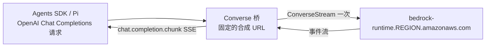

# AwwO 通过 Amazon Bedrock 提供模型

状态：实现与本地验收完成（2026-10-03），尚未部署。代码推送、生产 IAM 变更与服务部署分别授权、分别验收，不能由本文件推定。

运营方在自己的 AWS 账号里调用 Bedrock，AwwO 的模型架子因此可以列出 Claude、GPT、Grok、Kimi、DeepSeek、Qwen、GLM、MiniMax、Mistral、Llama、Nova、Gemma、Nemotron 等约 50 个热门模型。LLM Gate 保持不变：Bedrock 上没有的模型（例如 Gemini）继续由 Gate 提供，个人连接仍只允许 Gate。

## 为什么是 Converse 桥

Bedrock 上各家模型支持的接口不一样：Claude 在 Bedrock 上没有 OpenAI Chat Completions 或 Responses 接口，只有 Invoke、Converse 和（bedrock-mantle 上的）Anthropic Messages；GPT-5.4/5.5 反过来没有 Converse。除这两款外，所有热门文本模型都支持 **ConverseStream**，因此它是整个目录唯一共用的协议。目录里的 GPT 用 GPT-5.6/6/6.1，不收录 5.4/5.5。

三个 worker 原本都把模型请求交给一个固定 URL 的 OpenAI 兼容客户端。Bedrock 档案使用同一套 SDK，只是请求不出网，而是交给桥：



- Node：`apps/bedrock-bridge.ts`，Pi worker 与 OpenAI Agents JS worker 共用（AWS SDK 由调用方注入，文件本身不导入任何包）。
- Python：`apps/openai-agents-python-worker/bedrock_bridge.py`，作为 httpx2 transport 接入同一个 `AsyncOpenAI` 客户端。两种实现必须对 `apps/bedrock-bridge-vectors.json` 中的共享向量给出逐字节相同的结果，测试强制这一点。
- 用量、思考字数计数、取消、超时、输出上限、错误码都沿用原有路径：桥输出的是标准 Chat Completions 流，`usage` 来自 Converse 的 `metadata`（缓存读取计入 prompt，且不伪造 total），思考内容只以 `reasoning_content` 交给 worker 计数，永不显示。

桥只做能忠实映射的事，其余一律 400 拒绝，不静默丢弃：图像/非文本内容、JSON schema 输出、思考强度、采样惩罚、`seed`、logprobs、以 assistant 开头或结尾的对话、不是 JSON 字符串的工具参数。流在没有停止原因时结束视为不完整；未知停止原因、未知事件和未知内容类型（例如 citation）都视为错误，而不是悄悄丢掉。AWS 错误只保留状态码和异常类型，消息里的账号 ID、角色 ARN 不会离开 worker；流开始后才出现的 AWS 错误在错误帧里带上状态码，所以中途限流仍归为 `MODEL_RATE_LIMIT`；桥自己的拒绝（无法转发的内容、不完整的流）不带状态码，不会被当成服务不可用。SDK 客户端固定区域端点、`maxAttempts: 1`（一次受理只发一次上游请求）。

桥有意做的适配只有这几项，两种实现一致：

| 请求 | Converse 没有对应能力时桥的做法 |
| --- | --- |
| `parallel_tool_calls: false`（三个 worker 都这样请求） | Converse 没有通用开关，Claude 等模型默认会一次发多个工具调用。桥只转发本轮第一个完整的工具调用并以 `tool_calls` 结束；之后的调用不转发、不执行、也不进入对话历史，模型在下一轮按需再发。用量仍覆盖整轮。`true` 或不写时转发全部调用 |
| 空的工具结果 | Converse 拒绝空白文本块，以 `(empty result)` 送入 |
| 工具的 `strict` | Converse 不保证参数严格符合 schema；worker 执行前仍逐项校验参数，不合格的调用失败而不是执行 |
| `store`、`user`、`metadata`、`prompt_cache_key`、`safety_identifier`、`stream_options` | 只是请求元数据，不改变回答，忽略 |

只走流式对话：托管执行（managed execution）每次是一次非流式补全，桥不提供，所以 Bedrock 模型不出现在托管执行的模型列表里；直接用 API 创建时以 `computer_model_unsupported` 拒绝（不预留调用额度），worker 也会在任何请求离开前以 `MODEL_NOT_SUPPORTED` 拒绝。

## 内置目录

`apps/bedrock-models.json`（`version: 1`）每项：

| 字段 | 含义 |
| --- | --- |
| `id` | AwwO 选择器，`bedrock.` 开头，画布节点保存的就是它 |
| `name` / `vendor` | 显示名与厂商；网页按显示名归入品牌组 |
| `target` | Converse `modelId`：只通过推理配置文件提供的模型用 `global.`/`us.` 配置文件，否则用区域内模型 ID |
| `contextWindow` / `maxTokens` | AwwO 的保守预算（worker 把 contextWindow 当字节预算），不是厂商上限 |
| `input` | `text`，可含 `image`（仅展示；桥目前只发文本） |
| `tools` | 观察到流式工具调用或文档写明支持；没有工具能力的模型只放 Pi |
| `runtime` | 默认归属：有工具能力的放 `openai-agents`（含项目执行），其余放 `pi`，每个模型默认只出现一次 |
| `verified` | 本账号真实调用成功的日期；空值表示需要跨区域推理权限、尚未实测，`builtin` 模式不提供这些模型 |

目录顶层的 `regions` 记录这些条目核对过的区域（目前只有 `us-east-1`）：模型 ID 和推理配置文件因区域而异，`AWWO_BEDROCK_REGION` 不在其中时内置目录直接拒绝启动，其他区域请先核对，再用 `*_MODELS_JSON` 写明确的档案。目录在每个 worker 启动时严格校验，格式错误直接拒绝启动。模型会下线或改名：修改目录前先只读核对账号可见的模型（不产生推理费用）：

```sh
python scripts/bedrock-catalog-check.py --region us-east-1 --profile <aws-profile>
```

2026-10-03 结果：us-east-1 目录 0 项需处理；us-east-2 缺 `qwen.qwen3-coder-next`，因此目录只声明 us-east-1，默认区域也是 us-east-1（跨区域配置文件本身会路由，生产主机在 us-east-2 不影响）。

## 配置

每个 worker 读自己的环境（变量名相同）：

| 变量 | 说明 |
| --- | --- |
| `AWWO_BEDROCK_CATALOG` | 空/`off`（默认）不加任何 Bedrock 模型；`builtin` 加入内置目录中**已用真实调用核验过**的模型；`builtin-all` 再加入需要跨区域推理权限、尚未核验的模型（Claude、GPT-6、Grok、Kimi K3、Llama、Nova 等），在实例角色获得权限并核验后再用 |
| `AWWO_BEDROCK_REGION` | Bedrock 运行时区域，默认 `us-east-1`；只接受商业区域白名单。内置目录只在它的 `regions` 内可用，`*_MODELS_JSON` 档案可用任意白名单区域 |
| `AWWO_BEDROCK_MODELS` | 空：上一项模式提供的、默认归属本 worker 的模型；否则为逗号分隔的目录 ID（按目录顺序生效，明确列出即视为运营方确认可调用，含未核验模型）。OpenAI Agents worker 拒绝没有工具能力的模型，Pi 可以承载任何目录模型 |
| `AWWO_BEDROCK_API_KEY` | 可选 Bedrock API Key。留空时用 worker 自己的 AWS 凭证链签名（EC2 实例角色），不在文件里保存长期密钥 |
| `AWWO_PLATFORM_PROVIDERS` | `AWWO_LLMGATE_ONLY=true` 时允许的运营方目标，默认 `llmgate`；要启用 Bedrock 设为 `llmgate,bedrock`。**API 与 worker 都要设置** |

也可以在 `*_MODELS_JSON` 里写单个 Bedrock 档案，不带 URL、协议、思考强度或结构化输出：

```json
[{"id":"bedrock-kimi","name":"Kimi K2.5","provider":"bedrock","model":"moonshotai.kimi-k2.5","region":"us-east-1"}]
```

`apiKeyEnv` 可选；不写就用 AWS 凭证链。Compose 用 `AWWO_PI_BEDROCK_MODELS` / `AWWO_OPENAI_AGENTS_BEDROCK_MODELS` 分别给两个 worker 选模型；本地 `npm run dev:saas` 同样把 Bedrock 设置只发给 worker，Bedrock Key 不会进入 API 或网页进程。

### Gate-only 模式的平台策略

生产是 `AWWO_CREDENTIAL_MODE=operator` + `AWWO_LLMGATE_ONLY=true`。健康信息声明的是 worker 的模型**实际**到达的目标，而不是策略允许的范围：没有 Bedrock 模型的 worker 仍上报原来的 `llmgateOnly: true`，健康信息逐字节不变（即使策略里写了 `bedrock`）；提供 Bedrock 模型时如实上报 `platformOnly: true, platformProviders: ["llmgate","bedrock"]`，不会再声称"只走 Gate"。API 只在以下情况接受 worker：原样的 Gate-only 声明且没有 Bedrock 模型；或规范顺序的平台列表，且其中每一项都在 API 自己的 `AWWO_PLATFORM_PROVIDERS` 里，有 Bedrock 模型时列表必须含 `bedrock`。Bedrock 用的是运营方凭证：`AWWO_CREDENTIAL_MODE=user` 的 worker 配了 Bedrock 模型会直接拒绝启动，个人连接仍只能用 LLM Gate。

**部署顺序**：先部署能识别平台声明的 API，再给 worker 打开 Bedrock；只部署新 worker 而不打开 Bedrock 时，worker 仍是 Gate-only，旧 API 也能正常使用。

## 凭证与 IAM（运营方选择：EC2 实例角色）

当前实例配置文件 `dongfeng-demo-ssm` 只有 `AmazonSSMManagedInstanceCore`，没有任何 Bedrock 权限；名字显示它可能被其他实例共用，建议为 AwwO 单独建角色。最小策略（把账号与区域换成实际值）：

```json
{
  "Version": "2012-10-17",
  "Statement": [
    {
      "Sid": "AwwOBedrockInference",
      "Effect": "Allow",
      "Action": ["bedrock:InvokeModel", "bedrock:InvokeModelWithResponseStream"],
      "Resource": [
        "arn:aws:bedrock:*::foundation-model/*",
        "arn:aws:bedrock:::foundation-model/*",
        "arn:aws:bedrock:us-east-1:563688183799:inference-profile/*"
      ]
    },
    {
      "Sid": "AwwOBedrockMarketplaceFirstUse",
      "Effect": "Allow",
      "Action": ["aws-marketplace:ViewSubscriptions", "aws-marketplace:Subscribe"],
      "Resource": "*"
    }
  ]
}
```

- 跨区域推理是必需的：Claude、GPT-5.6/6.x、Grok、Kimi K3、Llama 4、Nova 等**只能**通过 `global.`/`us.` 推理配置文件调用，配置文件会路由到其他区域（`global.` 的模型 ARN 不带区域），所以策略必须同时允许配置文件与各区域的基础模型。若组织 SCP 限制区域，需要放开相应区域或只用 `us.` 配置文件。
- 2026-10-03 用 PlatformEngineer SSO 角色实测：区域内模型全部可调用，所有推理配置文件目标均被拒绝（该角色只允许区域内基础模型）。这是那个角色的权限范围，不是模型访问问题；目录里 `verified` 为空的条目要等实例角色获得上述权限后再验收。
- 第三方模型首次调用可能需要 Marketplace 订阅；Anthropic 模型在账号首次使用时可能要求提交用例表单。
- worker 父进程读取凭证链；子进程整轮运行都用启动时拿到的凭证（最长 600 s 超时加 10 s 宽限），所以剩余有效期不足 15 分钟时父进程就让凭证链强制刷新（凭证源暂时给不出新凭证时每分钟最多再问一次；刷新失败而现有凭证仍有至少 1 分钟时继续用现有凭证）。子进程只通过私有 IPC 收到短期凭证或 API Key，从不自己读凭证链。Python worker 进程内直接使用 boto3 凭证链（botocore 自动刷新），并按区域、Key 和超时复用客户端（连接池 32）；凭证链暂时取不到凭证时不缓存客户端、本次报 `MODEL_AUTHENTICATION`，下次调用重新解析。

### 凭证边界（启用前必读）

实例角色的凭证来自 IMDS（169.254.169.254），**主机上任何进程都能取到**，不只是 worker：API、nginx 后面的服务、worker 启动的子进程都一样。给角色加上 Bedrock 权限，也就让这些进程在被攻破时可以调用 Bedrock（主要风险是费用滥用）。启用前至少做一项：

1. **只让 worker 访问 IMDS**（推荐，保持无静态密钥）：原生 systemd 部署按服务 cgroup 放行，例如
   `iptables -A OUTPUT -d 169.254.169.254 -m cgroup --path system.slice/awwo-saas-pi.service -j ACCEPT`，对两个 OpenAI Agents worker 单元同样放行，SSM agent（root）保留，其余一律 `REJECT`。同一 uid 的服务无法靠用户名区分，所以用 cgroup 而不是 `--uid-owner`。
2. **或改用 Bedrock API Key**：只写进 worker 的环境文件（root 所有、0600，经 systemd `EnvironmentFile` 载入），实例角色不加 Bedrock 权限。
3. **Compose**：保持 IMDS hop limit 为 1（容器经网桥多一跳，取不到实例凭证），给两个 worker 容器配 `AWWO_BEDROCK_API_KEY`；API 容器不会收到这个变量。

无论哪种方式，都建议把策略的 `foundation-model/*` 收窄到目录里实际使用的模型，并在 AWS Budgets 设 Bedrock 费用告警。本地 `npm run dev:saas` 只把环境里的 `AWS_*` 与 Bedrock 设置交给两个 worker，API、网页与构建进程收不到。

Python worker 从仓库或发布树（`apps/openai-agents-python-worker`）运行，目录文件在上一级 `apps/bedrock-models.json`；若以非 editable 方式安装，需要把该文件复制到模块旁边，否则开启目录时 worker 会明确报错拒绝启动。

## 生产启用清单

1. IAM：为 AwwO 实例角色附加上述策略，并先按“凭证边界”限制 IMDS（运营方操作）。
2. 发布包含本变更的 API 与三个 worker（Python worker 的 venv 需安装 `boto3==1.43.75`），先 API 后 worker。
3. API 环境：`AWWO_PLATFORM_PROVIDERS=llmgate,bedrock`。
4. worker 环境（Pi、JS、Python 各自的 env 文件）：`AWWO_BEDROCK_CATALOG=builtin`（先只开已核验的 23 个模型）、`AWWO_PLATFORM_PROVIDERS=llmgate,bedrock`，可选 `AWWO_BEDROCK_REGION`、`AWWO_BEDROCK_MODELS`。实例角色获得跨区域推理权限后，对 Claude、GPT 等各做一次冒烟，再改为 `builtin-all`（或在 `AWWO_BEDROCK_MODELS` 中逐个列出），并把核验日期写回目录的 `verified`。
5. 读回每个 worker 的 `/health`：`platformOnly: true`、模型列表含 `bedrock.*`，且不含任何 URL 或密钥。
6. **工作区模型权限**：现网新工作区默认只允许 `qwen3.8-27b-p6`（`tenants.allowed_models`）。不调整的话用户看不到新模型；开放哪些模型（Opus 等高价模型的成本）由运营方决定，通过管理端 `PATCH /api/v1/admin/tenants/{id}` 或 `AWWO_NEW_WORKSPACE_ALLOWED_MODELS` 设置。
7. 用一个测试工作区对一到两个模型做真实冒烟（不在生产创建测试画布时可用 shadow-plan 流程）。

## 限制

- 思考强度：Bedrock 档案目前不宣告任何档位，桥拒绝 `reasoning_effort`。Claude 与 GPT 的映射需要在实例角色获得权限后真实验证再开放。
- 结构化输出：不宣告 `structuredOutput`，节点交付契约走文本路径。
- 只发文本；图像输入、文件附件不经过桥。
- 托管执行不支持 Bedrock 模型（见上文）。
- 计费走 AWS 账单；`AWWO_MODEL_PRICING_JSON` 未加入 Bedrock 价格，用量估算显示为未知。

## 验收记录（2026-10-03，本机 WSL，真实 Bedrock，us-east-1）

真实 worker 进程（Node 24.21 / Python 3.12，openai-agents 0.22.3）经桥调用：

| Worker | 模型 | 结果 |
| --- | --- | --- |
| JS | DeepSeek V3.2、GLM-5、Kimi K2.5、Qwen3 Coder Next、MiniMax M2.5、Mistral Large 3、Nemotron 3 Super、gpt-oss-120b | 全部完成，usage 为 reported；MiniMax 与 gpt-oss 的思考只计数 |
| JS | DeepSeek V3.2、GLM-5 + calculator | 工具调用一次，结果 `{"value":66}` 即 (17+5)×3 |
| JS / Python | GLM-5 多轮历史 | 正确复述上一轮的“青色” |
| Python | DeepSeek V3.2、GLM-5、Kimi K2 Thinking；两次工具调用 | 全部完成 |
| Pi | Gemma 3 27B、GLM-5、Kimi K2 Thinking | 全部完成，思考只计数 |

首次实测发现并修复一个缺陷：可读流的 `pull()` 若一次没有产出数据块（推理签名、块结束等事件），在读者已等待时不会再被调用，导致带推理或工具调用的流挂到 120 s 超时。修复后对应回归测试在去掉修复时会复现挂起。

自动测试：桥与目录单测 26 项、JS worker Bedrock 集成 10 项（官方 Agents SDK 端到端、工具、一次两个工具调用只执行第一个、错误码、中途限流、子进程凭证传递）、项目执行在凭证失败后仍可用、托管执行拒绝 Bedrock、Python 17 项（含与 TS 的向量一致性：9 个请求、30 个拒绝、7 个流、12 个流错误）、Go 平台策略 54 种声明组合与托管执行模型列表、网页目录分组（全部 50 个目录模型归入正确品牌）。

安全复核（2026-10-03，独立 reviewer 子代理）提出 10 项，均已处理：凭证失败曾让整个 worker 关闭项目执行；`parallel_tool_calls: false` 曾被忽略；托管执行曾把 Bedrock 模型发往桥不服务的路径；健康声明曾取自策略而非实际模型；内置目录曾可在未核对的区域启用；凭证刷新余量短于一轮运行；`seed`、对象形式的工具参数、未知流事件曾被静默忽略；中途错误曾丢失状态码；Python 每次调用都新建 boto3 会话。第 10 项（`qwen3.8-27b-p6` 从「ClawHunt · 平台模型」移到「通义千问 Qwen」组）是有意的界面变化，待运营方确认。复核第二轮又发现并修复：Python 客户端缓存会把一次凭证链失败固化成持续故障（阻断项）；桥自己的拒绝被归为服务不可用；关闭目录时仍读取目录文件；直接 API 创建托管执行时未拒绝 Bedrock 模型；compose 示例未提示必须是运营方模式；连接池小于并发；测试读取了本机真实凭证链。
