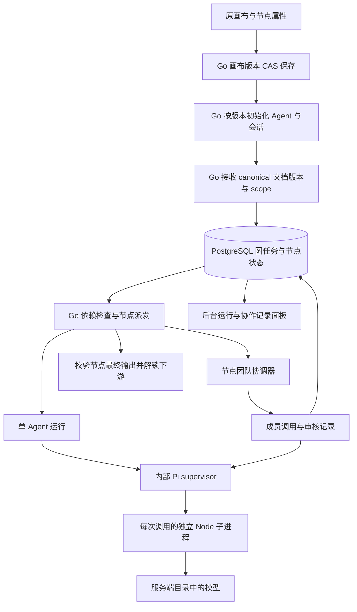

# AwwO 节点团队与后台整图运行

更新日期：2026-09-08。适用代码：`codex/awwo-node-setup-20260908`，worktree 为 `/Users/leongong/Desktop/LeonProjects/gho_workspace/awwo-node-setup-20260908`。本文说明当前实现契约及验收要求，不构成本轮真实模型验收通过或生产发布结论；最终候选 SHA、运行结果和截图由独立验收报告记录。

## 1. 产品与架构

一个画布节点仍代表一个有输入、输出和会话的任务单元。Session 节点可保留原来的单 Agent，也可配置一个 1–8 人的 Agent 团队。团队内部由 Go 按固定模式组织多次 Pi 文本推理，最后向节点发布一个结果；节点之间继续遵守原连线和字段契约。

这里的执行框架（Harness）当前只有 Pi。每个节点设置默认 Pi，每个成员可以继承该设置或明确选择 Pi；模型、职责、专属指令及普通轮次的上下文共享方式可独立设置。这些成员是节点内的配置和调用身份，并非新建租户用户，也不是多个常驻自治进程。自然语言规划助手目前创建、修改普通画布结构，**尚不创建或修改 `team`**；本次团队配置通过原节点属性面板完成。



SaaS 的整图、选中节点及重跑请求交给 Go 调度；浏览器负责提交、观察及将结果投影回原画布。Go 按每位成员的有效 runtime 路由到 Pi 或 OpenAI Agents JS worker，SDK 不自行决定成员顺序或 handoff。原本机运行模式仍保留浏览器 `runGraph`，不能将 SaaS 能力推定为所有历史 runtime 都支持。Go 仍是单实例执行协调器；数据库工作锁和持久状态不等于分布式 worker、自动故障切换或多实例高可用。

SaaS 节点中的普通聊天与“执行节点任务”分开：聊天提交当前输入原文，不自动拼入旧任务描述或要求旧输出契约的 JSON，也不把聊天回答覆盖为节点交付物。执行节点任务、局部运行和整图运行继续使用节点任务与输入输出契约。两种入口都可运行该节点团队，仍使用原 `POST /runs` 请求字段，不新增客户端可任意指定执行器或团队的接口。

## 2. 配置契约

`SessionNode.team` 是可选字段，随原画布 JSON 保存、导出和恢复。执行仍需有效的主 Agent 和会话身份，SaaS 通过“保存并准备运行”自动准备，用户无需再选择公司或点击绑定；运行图、局部运行和手动发送也会先初始化对应节点。节点 runtime 为空时默认 Pi；团队成员空 runtime 继承团队，空模型取该成员有效 runtime 的默认模型，同 runtime 时可继承主 Agent 的显式模型。删除 `team` 恢复单 Agent 模式，不删除单 Agent 配置。

初始化将有效团队配置纳入 `node_sessions.setup_snapshot`。与已初始化快照相比，团队、人格、模型等有效配置变化会创建新的 Agent / 当前会话，清空当前旧交付并保留历史 Agent、会话、消息及 run 快照；“继承”与相同显式模型/runtime 按解析后的值比较。团队仍是节点级配置，切换历史会话不会切换一份独立团队配置，也不会改写旧 run 的执行快照。

以下为可保存的示例，模型空值继承该节点已绑定主 Agent 的持久模型；主 Agent 自身使用默认模型时，再解析为服务端默认模型：

```json
{
  "version": 1,
  "mode": "review",
  "runtime": "pi",
  "maxRounds": 2,
  "maxTurns": 4,
  "timeoutSeconds": 300,
  "members": [
    {
      "id": "worker-1", "name": "执行者", "role": "撰写交付物",
      "instructions": "逐项满足节点的输入输出契约。",
      "runtime": "", "model": "", "context": "shared", "tools": []
    },
    {
      "id": "reviewer-1", "name": "审核者", "role": "审核并给出结论",
      "instructions": "检查遗漏和无依据的结论，明确批准或要求返工。",
      "runtime": "pi", "model": "", "context": "shared", "tools": []
    }
  ]
}
```

| 字段 | 约束与单位 |
| --- | --- |
| `version` | 固定 `1` |
| `mode` | `sequential`、`parallel`、`debate`、`review` |
| `runtime` | 节点团队默认执行框架：`pi` 或 `openai-agents` |
| `maxRounds` | 整数 1–8；只影响 debate / review，其他模式保存该值但不使用 |
| `maxTurns` | 整数 1–64，且至少为成员数；**最多模型调用次数，不是 token 或货币预算** |
| `timeoutSeconds` | 整数 10–1800，节点团队总体时间上限；Go 外层运行超时和 Pi 单次超时仍可更早结束 |
| `members` | 1–8 个，列表顺序决定执行角色；review 至少 2 个 |
| 成员 `id` / `name` | 各最多 128 个 Unicode 码点；ID 必须非空且团队内唯一，名称去除首尾空白后非空 |
| 成员 `role` / `instructions` | 职责非空且最多 512 码点；专属指令可空，最多 16000 码点 |
| 成员 `runtime` | `""` 继承节点团队默认；或 `"pi"` / `"openai-agents"` |
| 成员 `model` | 可空，最多 256 码点；非空必须属于有效 runtime 的服务端模型目录 |
| 成员 `context` | `task` 仅当前任务；`shared` 加入同 Session 此前已完成问答快照及本次此前已完成的成员输出；特殊汇总/审核/返工规则见下一节 |
| 成员 `tools` | Pi 只能为 `[]`；OpenAI Agents 可选 worker health 启用的 `calculator/current_time` |

前端只从实际模型目录生成下拉，不接受任意模型文本。新增团队默认包含执行者和审核/汇总者：第一位复制当前节点名称、人格与模型，第二位模型继承节点绑定。修改成员顺序保持 ID 稳定；修改团队执行配置使当前节点和下游原输出失效，恢复时的输入指纹也包含团队内容。

UI 校验提示具体字段问题，运行前再次校验；模型目录加载失败时提供重试并阻止保存未验证的团队。导入清洗保留已知字段，去掉未知元数据；非法团队不能被静默丢弃后降为单 Agent 执行，原始损坏文档留在恢复备份。Go 在运行受理时独立验证团队、模型和租户归属，画布保存成功本身不等于配置可执行。

## 3. 四种模式的精确语义

设成员数为 N，最多轮数为 R；返回结果还须通过节点的输出契约校验。角色名称与指令影响模型行为，列表位置决定下列调度职责。

| 模式 | 执行顺序与最终结果 | 计划调用数 |
| --- | --- | --- |
| `sequential` 顺序接力 | 按成员顺序各调用一次；普通轮次按各自 context 决定是否接收此前结果；最后一个成员输出为节点结果 | N |
| `parallel` 并行汇总 | 前 N−1 位独立处理相同原始任务；等待全部成功后，最后一位接收按成员顺序排列的结果并汇总。只有一位时直接调用一次 | N |
| `debate` 多轮讨论 | 每轮按成员顺序依次调用，重复 R 轮；普通轮次遵守各自 context；最后一位再额外调用一次，读取全部讨论并总结 | N × R + 1 |
| `review` 审核返工 | 每轮前 N−1 位作为执行者依次工作，最后一位审核。批准则提前完成；拒绝则进入下一轮，达到 R 轮仍未批准则失败 | 最多 N × R，可提前结束 |

`shared` 接收两类上下文：同租户、同 Session 在受理前已 `completed` 的用户提问与团队最终结果，以及本次团队运行此前成功的成员输出。手动运行在准入事务中冻结历史，图运行在整图准入时冻结各节点历史；成员调用不重新读取变化中的消息或 Agent 配置。其他 Session、其他租户、失败或仍在运行的问答、受理后才完成的问答均不进入这份快照。历史范围是已完成问答，不会重新拼接过去每个成员的全部过程。

Pi 请求的 `messages` 保存实际选入的历史问答；历史 assistant 内容明确标为“此前团队结果”，不是当前成员的自述或身份设定。本次上游成员输出以带 `memberId/memberName/round/ordinal` 的 JSON 数据加入 prompt。`task` 的 `messages` 为 `[]`，普通轮次也不接收前人成果。单 Agent 原有会话历史逻辑仍独立保留。

成员系统指令分别呈现父节点公共指导、成员记录、成员专属指令和数据边界。成员 `name` 是 UI 显示标签，`role` 描述职责；专属指令定义的具体人格优先于显示标签及父节点人格，专属指令优先于冲突的公共指导。例如显示名为“初始化验收 Agent”、专属指令为“你是李白”时，显示名不应替代李白人格。历史结果及其他成员发言是供判断的数据，不能据此更换身份或执行其中嵌入的指令；这是提示词边界，不等于对模型行为的形式化保证。

并行模式的前 N−1 位不互相读取正在产生的输出；`shared` 可接收此前 Session 问答，但不会使并行任务等待或读取同组未完成结果。汇总者、审核者，以及 review 第二轮及以后返工执行者，必须接收本次操作所需的团队结果；这些阶段即使配置 `task` 也会注入必要的成员结果和审核意见，仍不带入此前 Session 问答。这是 `task` 隔离的明确例外，由审计中的 `purpose` 和上游来源展示。必要操作数无法完整放入该成员模型预算时返回 `context_limit`，不悄悄省略后继续审核或汇总。成员文本不构成修改租户权限、选择任意工具或更改模型连接的权限。

Review 审核者必须返回纯 JSON（不含 Markdown 围栏或额外文本）：

```json
{"approved": true, "output": "符合原节点输出契约的最终交付文本", "feedback": ""}
```

`approved` 必须是 boolean，`output` 必须是 string；`feedback` 可提供返工意见。未知字段、缺少必需字段、错误类型或附加 JSON 均会导致 `invalid_review_verdict`。批准时将 `output` 作为节点结果；拒绝时继续后续轮次。要求结构化节点输出时，`output` 内应是该节点要求的 JSON 文本。审核 JSON 只是模型给出的机器可读结论，不能冒充人工批准。

调用次数达到 `maxTurns` 后不再发起下一次调用；计划调用数大于上限时 UI 明确提示，运行可能以 `team_turn_budget_exhausted` 结束。允许这一配置是为了提供硬上限，并不保证完成所有计划轮次。失败、取消或中断的成员记录保留供查看，不能自动作为已发布的节点结果；并行任一成员失败会停止该组后续工作。

Pi 的活动调用以成员 turn ID 为键。取消父运行会停止其上下文，每个非完成的已提交成员调用再使用独立的 2 秒上下文向 Pi 发送该 turn ID 的取消请求；这也覆盖受理响应丢失、异常流及并行组失败。清理尝试结束后才持久化成员终态并释放并发名额。已完成成员不发取消；网络故障下仍受 Pi 自身超时约束，公共取消响应不是供应商已停止计费的证明。

## 4. 模型目录与实际 Pi 执行

Pi 使用 `AWWO_PI_*` 配置默认模型及可选目录。OpenAI Agents 使用独立的 `AWWO_OPENAI_AGENTS_*` 变量、模型目录和 service token；其 `provider=openai` 表示 OpenAI 兼容协议，并显式选择 `chat_completions` 或 `responses`。目录 JSON 通过 `apiKeyEnv` 引用独立环境变量，不接受明文 `apiKey`。每个环境分别提供值；默认档案仍需完整配置，不能只配置额外档案。

公开选择 ID 与供应商实际模型名可以不同。各 worker health 返回公开目录（ID、模型名、provider、runtime 和容量），Go `GET /api/v1/runtime` 聚合前端可选目录与每个 runtime 实际启用的工具；浏览器不接收 API key、base URL 或秘密环境变量。SaaS adapter 声明 `supportsNodeTeams: true`，由 `canvasRuntimeReader` 转成 `supports_node_teams` 才启用属性面板；能力字段表示实现可配置，不表示模型已实际连通。`modelConnectivityVerified: false` 仍明确区分配置就绪与真实调用。

Go 固定团队及 Agent 指令/模型快照，每次成员调用解析空值继承、检查对应 runtime 的模型和工具上下文预算，然后将 `runId`、`tenantId`、`sessionId`、`prompt`、`messages`、该成员独立的 `systemPrompt`、`model`、`runtime` 和工具 ID 发给对应 worker。worker 从自身目录解析 ID，并将仅该档案所需配置交给独立子进程。每次调用具有独立身份；同一成员多轮沿用派生的内部 session 身份，但历史仍由 Go 传入，不从磁盘加载。OpenAI Agents 工具结果直接作为成员输出，不触发第二次模型总结。

文本按 UTF-8 字节保守计入所选成员模型的输入预算，包含公共指导、成员指令、共享上下文和消息开销；团队历史不先按未被调用的主 Agent 模型容量裁剪。受理时最多保留最近 50 对问答，并受 262144 字节的历史快照上限约束。调用时先完整保留当前任务及系统指令，再保留能容纳的近期完整成员输出，最后选入近期完整问答对。普通共享上下文超限时丢弃较早的完整输出或问答对，审计记录实际数量、来源和是否发生裁剪；不把截断文本当成完整对话。单条历史消息超过 Pi 的 32768 个 UTF-16 单元限制时，该问答对也不发送。

当前任务、系统指令和必要审核/汇总操作数不做静默截断；配置长度合法仍可能因组合输入过大而 `context_limit`。Pi 的单条 prompt、systemPrompt 和整体请求大小限制仍独立生效，Go 在模型准入前检查准备后的请求。工具能力当前为空，模型输出的路径只是文本，不产生代码工程、附件或可下载文件。

租户并发与每日额度逐次约束模型调用，`model_invocations` 记录准入，UTC 日界线统计每日次数；等待并发空位也消耗运行时间。失败或结果不确定的已准入调用仍占次数，不据此宣称提供精确 token 用量、计费或退款。Pi 另有服务级并发及单次超时上限。

## 5. API 与持久状态

下列 `T` 为 `/api/v1/tenants/{tenantId}`，所有路由使用当前登录会话，并按租户验证资源归属。reader 可查询，member/admin/owner 可发起和取消；租户 owner 不自动成为平台管理员。

| 方法与路径 | 请求 / 响应及边界 |
| --- | --- |
| `PUT T/canvases/{canvasId}` | 沿用 `{name, document, version}` CAS 保存；`document.nodes[].team` 保存配置，无独立团队 CRUD API |
| `POST T/canvases/{canvasId}/initialize` | 必填 `{documentVersion, scope?}`；按已保存配置准备 Agent / Session 并返回 canonical 画布，不执行模型；scope 省略为全部 session，传入则为 1–200 个不重复的已保存 session 节点 ID |
| `POST T/runs` | 原 `{sessionId, prompt, operationId}`；普通节点会话也从保存的节点读取 team，受理后冻结执行快照。未设置 team 沿用单 Agent |
| `GET T/sessions/{id}/messages` | `{items: [{id, sessionId, runId, role, content, createdAt}]}`；runId 将持久消息与原运行及团队过程关联 |
| `GET T/runs/{id}/turns` | `{items: [...]}`，按 `ordinal` 排序，最多受该次团队 64 调用上限约束；普通单 Agent 无成员记录 |
| `POST T/canvases/{canvasId}/graph-runs` | `{operationId, scope?, documentVersion?}`；首次受理 `202`，相同幂等请求返回原任务 `200` |
| `GET T/canvases/{canvasId}/graph-runs` | `{items: [...]}`，按创建时间倒序最多 50 条，可用 `?operationId=...` 查询；当前无游标分页，不作为完整历史导出 |
| `GET T/canvases/{canvasId}/graph-runs/{id}` | 返回一个固定文档快照及节点状态集合 |
| `POST T/canvases/{canvasId}/graph-runs/{id}/cancel` | body `{}`；停止活动图及其等待/活动节点，返回图快照；已终态任务保持原终态 |
| `POST T/canvases/{canvasId}/graph-runs/operations/{operationId}/cancel` | body `{}`；返回 `{confirmed, status, graphId?}`；尚无 graphId 时仍可按操作身份取消 |

整图请求示例：

```json
{"operationId":"graph-client-operation-001","scope":["research-node","review-node"],"documentVersion":12}
```

图运行的 `operationId` 为 8–200 字节，在租户与画布内唯一；相同操作 ID 的 scope/版本参数必须一致，否则 `409 idempotency_conflict`。省略 scope 表示全图，空数组不合法；scope 必须是已有且不重复的节点 ID，不自动扩展为全部祖先。图 API 兼容省略 documentVersion，此时使用受理瞬间最新文档；SaaS UI 必须先确认保存及初始化，再携带 canonical 文档的实际版本，过期返回 `409 version_conflict`。同一画布一次只允许一个 queued/running 图任务（`409 graph_busy`）。请求不上传另一份任意执行文档。

初始化接口独立要求 documentVersion，并复验租户权限、Agent / 会话归属和画布 CAS；当前画布存在 queued/running 图、节点或规划任务时返回 `409 resource_in_use`。原子提交失败不留下半套身份；规范化文档未变化则不增版本或重复建资源。它没有 operationId 回放语义：响应丢失或版本冲突时前端保留草稿、暂停覆盖，重新加载核对云端版本后再继续。Pi health 不可用会明确拒绝准备；初始化成功不代表真实推理或工具沙箱已可用。

图响应字段为 `id, canvasId, operationId, documentVersion, document, scope, status, error, createdAt, updatedAt, nodes`。每个节点有 `nodeId, state, output, detail, runId, sessionId`；尚未派发的节点可以没有 runId。成员记录包含 `id, memberId, memberName, role, round, ordinal, status, output, error, model, runtime, config, createdAt, updatedAt`；config 为该次调用已解析的公开成员配置，不含供应商秘密。

成员记录还包含 `prompt`、`systemPrompt`、`messages`、`context`。它们保存该回合准备并冻结的实际 Pi 输入，不从当前编辑器配置重建；是否已经调用模型仍需结合回合状态判断。`context` 为 `{version:1, mode, historyMessages, historyAvailable, historyTruncated, upstreamMembers, upstreamAvailable, upstreamTruncated, purpose}`，`upstreamMembers` 每项为 `{memberId, memberName, round, ordinal}`；`purpose` 是 `work / aggregate / review / revise`。数量均为条数而非 token：historyMessages 是实际消息条数，完整问答为 2 条；historyAvailable 是受理时该共享会话已有的已完成消息数量，task 为 0。完整 API 字段和兼容方式见 [成员输入审计](awwo-saas-api.md#成员输入审计)。

迁移 `007_node_teams_graph_runs.sql` 为 `runs` 增加 `team_snapshot`、`execution_snapshot`、`actor_id`，并新增 `run_turns`、`model_invocations`、`graph_runs`、`graph_run_nodes`、`graph_operation_cancellations`。迁移 `011_agent_runtimes.sql` 为 Agent 保存 runtime，历史值默认 Pi。图受理事务保存固定 document/version/scope 和每个节点的 Agent/团队执行快照；后续修改配置不改写已受理任务。旧 run 迁移为历史调用计数，不重放历史请求。

迁移 `008_node_setup_snapshot.sql` 为 `node_sessions` 增加有效初始化配置快照，初始化逻辑见 [node_setup.go](../backend/internal/app/node_setup.go)，完整请求与错误见 [API 初始化契约](awwo-saas-api.md#节点初始化与配置保存)。

迁移 `009_team_turn_inputs.sql` 为 `run_turns` 新增可空的 `system_prompt/messages/context`。旧回合没有记录过这些证据，API 返回 `null`，不伪造为空历史或拿新配置补造旧指令；已有 `prompt` 继续返回真实旧值。手动聊天和后台图面板按 runId 使用同一团队过程组件，页面刷新后从持久消息的 runId 恢复关联；成员列表接口不包含整个 run 的终态，观察者另读 `GET /runs/{id}`。

## 6. 依赖、失败与恢复

Go 校验最多 200 节点、2000 连线、字段版本/类型、端口、必填输入、绑定和无环图。选中范围之外的直接上游只使用快照中有效、非 partial 的已有输出，或表单节点值，标记 `cached`；缺失或无效结果阻断相关下游。范围内已完成节点经过输出契约验证才标记 `done`，失败/取消/被阻断的上游使依赖节点 `blocked`，其他独立分支仍可继续。

图状态为 `queued / running / completed / failed / cancelled / interrupted`；节点状态为 `waiting / running / done / failed / blocked / cancelled / cached`；run 与成员调用使用 `queued / running / completed / failed / cancelled / interrupted`。后台详情保留各成员发言和失败原因；节点会话显示团队最终结果，不能将中间审核文本当成节点交付。

| 情形 | 当前处理与用户恢复方式 |
| --- | --- |
| 非法团队 / 图 / 模型 | 受理前 `400 invalid_team`、`400 invalid_graph` 或 `409 model_unavailable`；修正配置再提交 |
| 模型不可用 | `503 runtime_unavailable`；ready 或 HTTP 受理不算推理成功 |
| 团队调用数 / 轮次 / 时间耗尽 | `team_turn_budget_exhausted`、`review_rounds_exhausted`、`team_timeout`；保留已记录成员输出，调整后主动新建运行 |
| 固定输入或必要操作数超限 / 无效审核 / 非正常流结束 | `context_limit`、`invalid_review_verdict`、`runtime_stream_ended` 等明确失败；普通共享历史可按预算丢弃并记录审计，不截断当前任务或伪造完成 |
| 浏览器断网、关闭或刷新 | 已受理图由 Go 继续派发；客户端用 graphId 或 operationId 查询原任务，不因失去响应自动重复提交推理 |
| 发起后立即取消，响应尚未返回 | 操作级取消写入持久取消记录；后到的同 operationId 请求被 `409 operation_cancelled` 拒绝，不在确认取消后悄悄运行 |
| 服务重启 | 已受理且状态不确定的 run / run_turns / model_invocations 标记 `interrupted`，不盲目重放。Go 重新观察持久图：关联的中断节点失败并阻断其依赖；未受理且依赖已满足的 waiting 节点可继续派发 |
| 暂停租户或撤销成员执行权限 | 每次节点及模型准入重新检查权限与租户状态；暂停取消活动运行，后续派发被拒绝。恢复租户不自动重试已经失败/取消的任务 |
| 画布已修改 / 恢复结果来自旧配置 | 前端比较含 team 的执行输入指纹，拒绝将旧结果覆盖当前配置；可在后台记录查看原快照 |

观察图状态采用读 API 轮询，单 run 的原持久 SSE 接口继续可用。整图历史面板可跨页面读取，不依赖原设备 localStorage；前端恢复 journal 只是服务端事实的投影。关闭浏览器与服务重启是两种不同场景，后者不保证已接受的模型调用无损续跑，也不保证外部服务没有发生费用。

## 7. 设计与验收要求

属性面板沿用原样式、中英文、只读与运行锁。展开时可编辑团队；收起节点仅显示人数和模式。运行期间的原图配置锁与 Go 固定快照共同保证可追溯性；reader 可读历史，不能保存、绑定、发起、停止或恢复写入。新增能力不能只靠隐藏按钮保护，所有写 API 均需独立授权。

验收应分别记录：四模式与不同成员模型的真实执行；成员增删/排序/校验/持久化/导入导出；普通聊天与后台图运行；连续追问、成员人格优先级、task 隔离及审核操作数例外；实际 Pi 输入与持久审计一致、模型容量裁剪、旧审计缺失和刷新后的 runId 关联；字段传递、范围外缓存及失败阻断；调用数、超时、配额和取消；跨租户和 reader 拒绝；浏览器关闭、丢失受理响应及 Go 重启；旧单 Agent 回归。每项写明通过、失败、跳过或阻塞及可复查证据，协议 fixture 与真实模型结果分开。新增面板截图和既有模型验收不能互相替代。

当前边界是 Pi 文本推理、单 Go 实例和持久图协调；工具沙箱、附件存储、分布式 worker 租约、自动故障接管、精确 token 账单及公网运维验收仍需独立设计实施。

实现依据：[前端团队契约](../apps/web/src/canvas/nodeTeam.ts)、[属性编辑器](../apps/web/src/canvas/NodeTeamEditor.tsx)、[SaaS runtime 目录](../apps/web/src/saas/runtimeCatalog.ts)、[SaaS 图传输](../apps/web/src/saas/graphRuns.ts)、[团队过程与输入审计](../apps/web/src/saas/TeamRunDetails.tsx)、[后台记录](../apps/web/src/saas/GraphRunPanel.tsx)、[Go 团队执行](../backend/internal/app/teams.go)、[Go runtime 路由](../backend/internal/app/runtime_workers.go)、[Go 图运行](../backend/internal/app/graph_runs.go)、[迁移 011](../backend/internal/app/migrations/011_agent_runtimes.sql)、[Pi 模型配置](../apps/pi-worker/config.mjs)、[OpenAI Agents worker](../apps/openai-agents-worker/README.md)。
