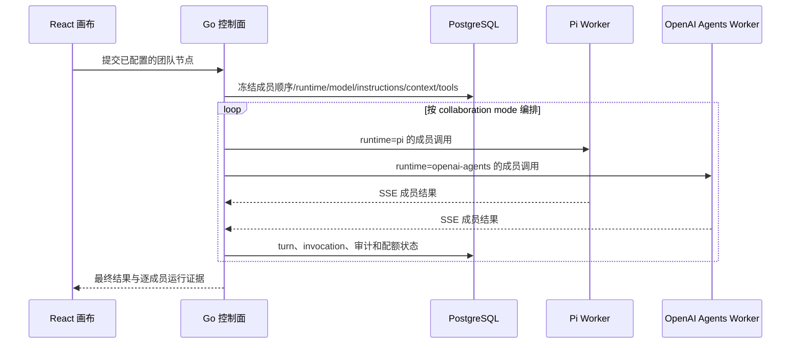

# AwwO OpenAI Agents JS 本地验收报告

日期：2026-09-12
结论：**本地候选通过，达到提交与精确 SHA 合并评审条件；尚未合并、推送或部署到 online。**
实现基线：`e05d2afd29700b07b918193432b4ba18ad6dd5ec`
验收工作区：`/Users/leongong/Desktop/LeonProjects/gho_workspace/awwo-openai-agents-20260912/worktree`

## 验收范围

本次给 AwwO 增加 `openai-agents` 可选运行时，同时保留 Pi。React 画布负责配置和展示；Go 继续作为多租户控制面，负责权限、团队编排、运行快照、配额、审计、取消和持久化；独立 Node worker 使用 `@openai/agents` 完成 Go 已受理的一次成员调用。

验收覆盖运行时目录、Agent/团队成员持久化、Pi 与 OpenAI Agents 混合顺序执行、每位成员的专属 system prompt、上游结果传递、模型调用计数、只读工具、取消、错误边界、本地五进程启动、Compose 接线和浏览器展示。没有对 production 做写入或破坏性 E2E。

## 运行逻辑

Go 不把团队控制权交给 SDK。顺序模式明确等待前一成员完成，再把已完成结果作为命名来源交给后一成员。每个成员的 system prompt 由节点通用指导、成员记录和成员专属指令组合而成，成员专属指令优先。OpenAI Agents worker 禁用 tracing 和客户端重试，并以 `maxTurns: 1`、`stop_on_first_tool` 和额外调用守卫限制一次成员 turn 至多一次上游请求。

## 自动化验收

| 层面 | 结果 | 主要证据 |
| --- | --- | --- |
| OpenAI Agents worker | 通过 | 34/34；配置/秘密边界、Chat Completions、Responses、SSE、取消、超时、并发、输出上限、工具校验、单请求守卫；依赖树版本精确，`npm audit` 0 漏洞 |
| Go 控制面 | 通过 | 完整 `go test -race ./... -count=1`：79 个顶层测试，通过真实本地 PostgreSQL 随机 schema；最终针对性 race：7 个顶层、6 个子场景；`go vet ./...` 通过 |
| Web SaaS | 通过 | 254/254；runtime/model/tool 选择、继承、未配置 runtime 禁用、切换清理、混合成员展示、运行详情和初始化链路；SaaS typecheck 与 build 通过 |
| 本地启动器 | 通过 | 10/10；独立 OA token/端口、五端口冲突检查、各服务模型密钥隔离、启动就绪和反向关闭顺序 |
| 双 worker 协议栈 | 通过 | Go + PostgreSQL + Pi + OpenAI Agents fixture 端到端 1/1，验证混合团队和 system prompt |
| Compose | 通过 | `.env.example` 渲染和 `docker compose config --quiet` 通过；worker 使用独立 URL/token 和受限容器配置 |

SaaS 构建只有既有的 chunk-size 提示，没有构建错误。原生非 SaaS `npm run build` 仍受仓库既有 `server/ui` 缺少 `@mdxeditor/editor/style.css` 阻断；该路径不属于本次 SaaS runtime 改动，也未将其计为通过。

## 真实模型与数据库验收

使用本机私有、git 忽略的环境配置连接既有 OpenAI 兼容端点，模型为 `gpt-5.6`。密钥未写入报告、浏览器、画布 JSON、运行快照或提交文件。

### 混合运行时顺序团队

- 收紧本地服务环境变量并修复密钥变量前缀碰撞后，最终冷启动复验 Run：`atmwW3bqw-kNZZwCVbG4BBZEIxdUn3HV7`
- 状态：`completed`
- 第 1 次成员调用：`李白`，runtime=`pi`，输出以 `【李白指令已触发】` 开头。
- 第 2 次成员调用：`王伟`，runtime=`openai-agents`，输出以 `【王伟指令已触发】` 开头并明确包含“已收到李白结果”。
- 数据库：该 run 恰有 2 条 `model_invocations`，状态均为 `completed`。
- 浏览器：团队节点显示 `2 Agent · Sequential`、`Completed · 2 member calls`，两条 call 分别显示 runtime、模型、专属指令、实际 system prompt、上下文来源和成员输出。

### OpenAI Agents 工具调用

- 最终冷启动复验 Run：`arvotOlOJm8aboYnvYqcKApZvNuXchtEM`
- runtime=`openai-agents`，工具=`calculator`
- 真实结果：`{"value":56}`
- 数据库：恰有 1 条 `model_invocations`，状态为 `completed`；工具结果直接成为成员结果，没有第二次模型总结调用。

## Computer Use 界面证据

验收使用用户正常 Chrome 配置访问本地 `127.0.0.1:15199`，由 Computer Use 读取可访问性树并实际展开节点。证据确认：

- 页面顶部明确显示 `Agent nodes: 1`，表示画布上有 1 个团队节点；节点内部显示 2 名 Agent，消除了旧文案 `1 Agents` 的歧义。
- 运行详情出现 `Call #1 · 李白`、runtime `pi` 与李白指令触发标记。
- 运行详情出现 `Call #2 · 王伟`、runtime `openai-agents` 与王伟指令触发标记。
- 展开审计项可见李白的成员专属指令和实际 system prompt；王伟调用中包含已完成的李白结果来源。

本机证据目录（git 忽略）：`.local/awwo-saas/openai-agents-acceptance-20260912/`

- `mixed-team-runtime-evidence.png`
- `member-system-prompt-evidence.png`
- `mixed-team-runtime-evidence-cold-start.jpeg`
- `member-system-prompt-evidence-cold-start.jpeg`
- `api-acceptance.json`
- `model-invocations.tsv`

## 安全与兼容性结论

- OpenAI Agents 凭据只在 worker 私有环境和子进程 IPC 中存在；health、SSE、错误和日志不返回 key。
- worker 临时目录在正常、失败、超时和取消后清理；子进程不继承用户 HOME、代理、Node 注入参数或父进程凭据。
- 只允许服务端和成员请求的双重工具交集；首版仅 `calculator` 和 `current_time`，不开放 shell、文件、浏览器、任意 URL、handoff 或自定义 MCP。
- 迁移 011 将历史 Agent 的 runtime 设为 `pi`，现有单 Agent/团队文档继续读取；切换 runtime 会清理不兼容 model/tools，并在初始化时创建新 Agent/Session，保留旧历史。
- Go 仍是租户权限、并发与 quota 的唯一准入点。未来若允许一次成员 turn 内多轮模型调用，必须先增加逐次 Go 准入和可恢复调用身份。
- 本地启动器会为 Go、Web、Pi 和 OpenAI Agents 分配各自的环境变量集合；Pi 与 OpenAI Agents 不会互相得到对方的模型密钥，Go/Web 也不会得到模型密钥。

## 未覆盖与后续门禁

- 尚未合并到本地 `main` 或 `online`，也未推送 Forgejo。
- 尚未部署或验证 staging/production；本地通过不等于 online 已更新。
- Compose 配置已解析，但本轮没有把生产秘密注入容器，也没有进行公网容器出网验收。
- 旧 Compose 环境升级时必须新增独立的 `AWWO_OPENAI_AGENTS_TOKEN`；模型未配置时该 runtime 会显示为不可用，已有 Pi 流程仍可运行。
- 原生非 SaaS Web 构建的既有 MDXEditor 样式依赖问题仍存在。
- 独立发现的既有风险：删除 canvas 会级联删除其 `model_invocations`/quota 历史。该账本保留问题不由本次 runtime 改动引入，应单独修复和迁移。

最终提交前已重新 fetch Forgejo：`origin/main` 与 `origin/online` 均为 `f3be5f765d656a6b0566403f4ff832cb8328f87d`，比实现基线多 1 个“部署运行 commit 回报”提交。远端只改动 `backend/internal/app/app.go`，新增 `backend/internal/app/revision.go`、对应测试和部署文档；只读 `git merge-tree` 计算无文本冲突。该结果说明预期冲突风险低，不等于合并后测试已完成。

下一门禁需要由操作者对最终 source SHA、target branch/SHA 和本次 merge 明确批准；合并后仍需在组合树上重跑相关测试，再另行决定推送和部署。
