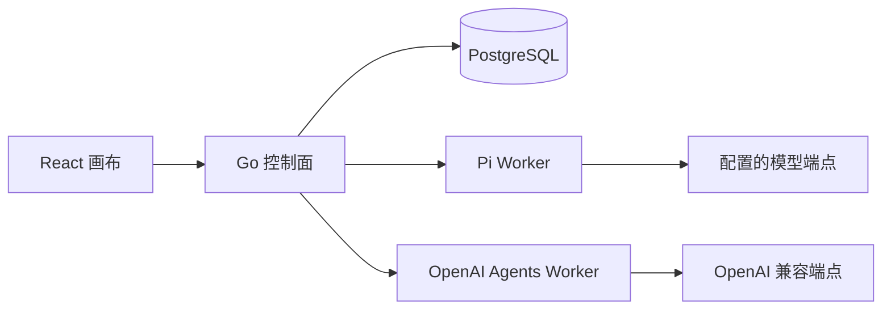

# AwwO OpenAI Agents JS 运行时

状态：本地实现候选；基线 `e05d2afd29700b07b918193432b4ba18ad6dd5ec`。合并、远端推送和生产部署分别验收，不能由本文件推定。

## 目标与边界

AwwO 在保留 Pi 的同时增加可选 `openai-agents` 执行框架。Go 继续负责登录、租户权限、画布版本、Agent/Session 身份、团队编排、配额、审计、取消和持久化。官方 `@openai/agents` JavaScript SDK 只执行 Go 已受理的一次成员调用，不接管 AwwO 的团队顺序或成员间关系。



这意味着顺序、并行、讨论和审核模式都由同一套 Go 编排器决定。每位成员的 `runtime`、模型、专属指令、上下文和工具在受理时冻结；成员 runtime 留空时继承团队 runtime。Go 将该成员的专属指令作为 `systemPrompt` 发给对应 worker，不依赖 SDK 自动 handoff，因此不会跳过前序成员或把后一位成员的指令覆盖前一位。

## 运行时与模型目录

公开标识固定为 `pi` 和 `openai-agents`。`GET /api/v1/tenants/{tenantId}/runtime` 保留 Pi 的兼容字段，并增加：

```json
{
  "runtimes": [
    {
      "id": "openai-agents",
      "name": "OpenAI Agents",
      "configured": true,
      "available": true,
      "supportsEffortSelection": true,
      "effortInputMode": "select",
      "tools": ["calculator"]
    }
  ],
  "models": [
    { "id": "model-id", "provider": "openai", "runtime": "openai-agents", "reasoningEfforts": ["low", "medium", "high"], "defaultReasoningEffort": "medium" }
  ]
}
```

前端按 runtime 过滤模型，切换 runtime 时清空旧模型和工具，防止把 Pi 模型 ID 发给 OpenAI Agents worker。不可用的旧配置会保留显示并要求修正，不会静默回退。Agent 的 runtime 写入 `agents.runtime`；迁移 011 将历史 Agent 设为 `pi`。已初始化节点切换 runtime 会创建新的 Agent/Session，保留旧历史，不把不同 SDK 的会话混在一起。

## 思考强度（reasoning effort）

思考强度与模型是平行的 Agent 字段，并且按模型发布，而不是按 runtime 发布：

- Worker 在 `/health` 的每个模型上发布 `reasoningEfforts` 与 `defaultReasoningEffort`。没有发布档位的模型不接受任何显式档位；Pi 目前不发布档位。
- Go 在探测 worker 时校验档位格式、是否重复，以及默认档位是否属于档位集合；任一不满足即整份目录无效。运行时目录的 `supportsEffortSelection` 仅在该 runtime 至少一个模型发布了档位时为 true，`effortInputMode` 固定为 `select`，前端只提供所选模型自己的档位。
- 节点初始化、团队成员解析和运行准入都按所选模型校验档位，不支持时返回 `400 invalid_node_setup`，不会静默丢弃。档位写入 `agents.effort`（迁移 016，默认空字符串），冻结进执行快照，并作为请求字段 `effort` 转发。只修改档位也会建立新的 Agent 与当前会话。团队成员留空模型而继承节点模型时，一并继承节点的思考强度；成员指定自己的模型时只使用成员自己的档位。
- Worker 再次校验：请求档位不在所选模型档位中时返回 `400 EFFORT_NOT_SUPPORTED`；通过后写入 SDK `modelSettings.reasoning.effort`。未指定档位时请求不携带任何思考设置，由供应商使用自身默认；`defaultReasoningEffort` 只用于展示，永不回填。
- OpenAI 兼容端点是否真正支持某个档位，需要按实际端点和模型验证后再配置。未配置档位时，行为与此前完全一致。

## 私有 Worker 契约

服务位于 `apps/openai-agents-worker`，默认只监听 `127.0.0.1:8098`。Go 使用独立的 `AWWO_OPENAI_AGENTS_URL` 和 `AWWO_OPENAI_AGENTS_TOKEN`。模型 base URL、API key 和额外目录仅存在 worker 服务环境中，不进入浏览器、画布 JSON、Go 执行快照、日志或命令行参数。

接口与 Pi worker 对齐：

- `GET /health`：只返回 SDK 版本、配置状态、公开模型、限制和已启用工具；不探测真实模型。
- `POST /internal/runs`：内部 bearer token 认证，接收固定的 run/tenant/session 身份、prompt、history、systemPrompt、runtime、model、可选 effort 和工具名称，返回 SSE。
- `DELETE /internal/runs/{runId}`：精确取消一个成员调用。

每次调用在独立 Node 子进程和临时目录中运行。子进程只通过私有 IPC 接收所选模型凭据及已验证输入；不继承 HOME、代理、NODE_OPTIONS、父进程凭据或用户配置。SDK tracing 和敏感模型日志关闭。进程边界不能替代容器或操作系统沙箱，公网部署仍使用只读文件系统、非 root 用户、capability drop、进程/内存上限及受控出网。

## 单次调用与配额语义

一次 AwwO 成员 turn 最多产生一次上游模型请求：SDK `maxTurns: 1`、`stop_on_first_tool`、客户端零重试，并有额外调用次数守卫。普通回复直接返回模型文本；模型选择工具时，经过校验的工具结果直接成为该成员输出，不再调用模型总结。因此 `model_invocations` 的一条准入记录对应至多一次上游请求，团队 `maxTurns` 仍表示最多模型调用次数。

将来若启用多轮工具循环，必须在每次追加模型请求前回到 Go 做配额准入，并建立可恢复的调用身份；不能只改 SDK 的 `maxTurns`。

## 安全工具

首版只有两个内置只读函数：

| ID | 输入 | 输出 |
| --- | --- | --- |
| `calculator` | 受限算术表达式 | 有界数字 JSON；自建解析器，不使用 `eval` |
| `current_time` | 可选 IANA 时区 | UTC ISO 与本地化时间 JSON |

工具需要同时出现在服务端 `AWWO_OPENAI_AGENTS_TOOLS_JSON` 和成员请求中。浏览器只能选择 worker health 已发布的固定 ID，不能提供代码、URL、schema 或 MCP 服务。畸形 JSON、额外字段、重复或未知工具、多工具调用都会明确失败。首版不开放 shell、文件、浏览器、任意网络函数、托管工具、handoff 或租户自定义 MCP。

## 配置

三个环境使用同一变量名，不共享秘密或资源：

- Go：`AWWO_OPENAI_AGENTS_URL`、`AWWO_OPENAI_AGENTS_TOKEN`。
- Worker 默认模型：`AWWO_OPENAI_AGENTS_PROVIDER=openai`、`MODEL`、`BASE_URL`、`API_KEY`、`PROTOCOL=chat_completions|responses`。
- Worker 目录：`AWWO_OPENAI_AGENTS_MODELS_JSON`，密钥通过 `apiKeyEnv` 引用。
- 思考强度：`AWWO_OPENAI_AGENTS_REASONING_EFFORTS` 为默认模型接受的档位，逗号分隔，取值是 none/minimal/low/medium/high/xhigh 的子集，留空表示不支持显式档位；`AWWO_OPENAI_AGENTS_DEFAULT_REASONING_EFFORT` 仅用于展示，可以留空，填写时必须属于上述档位。额外模型在 `MODELS_JSON` 中用 `reasoningEfforts` / `defaultReasoningEffort` 各自声明，不继承默认模型。
- 工具：`AWWO_OPENAI_AGENTS_TOOLS_JSON=[]`，显式启用时可填 `["calculator","current_time"]`。
- 限制：`CONTEXT_WINDOW`、`MAX_TOKENS`、`TIMEOUT_MS`、`CANCEL_GRACE_MS`、`MAX_CONCURRENCY`、`MAX_OUTPUT_BYTES`，完整名称均有 `AWWO_OPENAI_AGENTS_` 前缀。

`provider=openai` 表示 OpenAI 兼容协议，可连接官方或兼容 base URL；协议必须与端点能力一致。首版不直接支持 Anthropic 原生 Messages API。完整变量和约束见 `apps/openai-agents-worker/.env.example`。

从旧版本升级 Compose 配置时，必须新增一枚独立且至少 32 字符的 `AWWO_OPENAI_AGENTS_TOKEN`，即使当前租户只使用 Pi 也不能复用 `AWWO_PI_TOKEN`。未配置模型凭据时 worker 会以 `unconfigured` 启动，运行时目录会把它标为不可选，不影响已有 Pi 流程。生产部署应分别为 development、staging 和 production 生成不同 token。

## 验收要求

自动测试需分别证明配置/秘密边界、SDK 的 Chat Completions 与 Responses、SSE、取消、超时、输出上限、并发隔离、工具严格校验、单请求计数、Go 双 worker 路由、混合 runtime 团队顺序、独立 system prompt、历史隔离、运行时切换、配额和数据库迁移。外部模型验收另行记录实际端点、模型、成员 turn 和数据库证据，并且不得在报告中泄露密钥。

`/health` 的 `ready` 只表示配置有效；`modelConnectivityVerified` 为 false 时不能声称真实模型可用。容器配置解析、本地协议 fixture、真实提供商调用、浏览器交互、staging 和 production 都是独立证据层。
