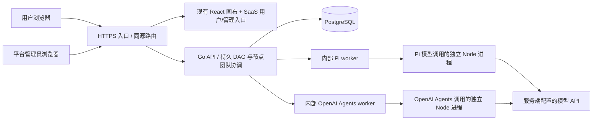

# AwwO Go 多运行时多租户 SaaS 架构

初始设计：2026-09-07；节点团队、后台整图与节点初始化更新：2026-09-08。初始基线为 Forgejo `ClawHunt-Store/AwwO` 的 `main@6e1dc158a79e2f18c7bdf82610a353883b883f31`（0.3.0）；节点初始化工作分支为 `codex/awwo-node-setup-20260908`，基于 `d0fb9a7`。本文记录实现契约，本轮最终 SHA 与实测结果由独立验收报告记录；此前结果见 [本地验收](awwo-saas-verification.md)及[真实模型验收](awwo-real-provider-acceptance-20260908.md)，不自动覆盖新增能力。

执行约束见 [设计与开发规范](awwo-saas-design-standards.md)；原页面功能、接口映射、实际覆盖与待补差距见 [前端逐项对接清单](awwo-saas-frontend-contract.md)。后端交付以现有前端的操作和数据契约为验收依据。

## 1. 产品范围与现状

AwwO 是以任务和 Agent Session 为节点的协作画布，已有七种 Agent 模板、输入输出契约、连线、会话、规划、运行、取消与恢复界面。SaaS Session 节点可选配置 1–8 个成员组成的团队，节点内协作后仍按原字段契约向下游交付。历史本机路径为 `apps/web/src/main.tsx → App.tsx → canvas/CanvasSurface.tsx → AgentWorkspace`，依赖 `apps/gateway` 和 vendored `server/`，运行引擎为本机 Codex。

0.3.0 的账户界面不等于完整的公网 SaaS。原画布及运行记录在浏览器缓存中，部分 key 没有用户、租户和画布作用域；账号、Agent 执行环境和工作目录存在本机假设。新后端必须从服务端补齐这些边界。

本次建设目标：复用现有画布，为公网产品准备独立用户入口、平台管理入口、真实身份与租户存储、Go API、Pi 执行服务以及可重复的本地验证。历史 Python、Node、桌面代码保留作原运行模式；SaaS 启动不需要启动它们。

当前 SaaS 入口为 `saas.html → saas/main.tsx → SaaSApp`，编辑模式挂载 `CloudCanvas → CanvasSurface`，reader 挂载 `ReadOnlyCanvas → CanvasSurface readOnly`，均复用原 `AgentWorkspace / SessionTile / InspectorPanel`。原 `CanvasAccountControl / AccountWorkspacePanel` 通过 `saas/accountApi.ts` 注入 Go 契约，新增外壳负责登录、租户/画布列表与云端保存；平台页 `AdminPanel`、服务状态页 `RuntimeSettings` 属于 SaaS 新增组件。原画布及账户交互的复用不代表历史外部身份或本机运行配置全部适用于公网。

## 2. 部署关系与职责

| 层 | 所有权 | 不接受的客户端权力 |
| --- | --- | --- |
| 用户端 | 编辑画布、模板、输入输出、发起/查看/取消运行 | 自行授予角色、改变资源归属、声明运行成功 |
| 平台管理端 | 经过平台角色验证后查看租户、用户、任务、审计与暂停租户 | 以租户 owner 代替平台管理员、绕过审计直接改库 |
| Go | 身份、成员权限、租户状态、资源归属、CAS、图快照与依赖调度、团队执行、逐次调用额度、数据库与事件 | 相信前端传来的 tenantId/role/cwd 就直接执行 |
| Pi / OpenAI Agents | 当前已授权成员调用的模型推理；后者可执行固定只读函数 | 加载租户代码、任意 shell/文件/网络工具或接管团队编排 |
| PostgreSQL | 已提交业务状态和事件，重启后的事实来源 | 依赖浏览器内存作为持久记录 |

选择 Go 模块化单体是为了把鉴权和状态事务放在一个可审计边界里；Pi 通过内部 HTTP/SSE 协议替换，不把 SDK 类型扩散进业务 API。首版本地实现为**单个 Go 实例**，数据库锁拒绝另一实例同时接管活跃任务。未来横向扩容必须实现租约/心跳/调度协调后再解除此限制。

请求可能在读 body、等待数据库或 Pi 健康检查时跨越运行锁丢失。租户写事务取得锁后及 run/规划提交前重新检查已知 worker 状态，失锁或关闭则返回 503 并回滚。此检查不是多副本 fencing，仍有物理失锁检测与最后检查到提交之间的窗口；不得据此扩容为多个 Go 实例。

## 3. 身份、租户与角色

用户为全局身份，租户为组织/工作区；用户通过 membership 加入租户。一名用户可属于多个租户。注册原子创建用户、租户与 owner membership；客户端传入的角色不会成为授权依据。登录使用安全密码哈希和随机 opaque session cookie；数据库只保存 session token 哈希。

租户角色为 `reader / member / admin / owner`，分别负责读取、常规业务写入、成员管理与租户所有权管理。平台角色独立，普通注册不能产生平台管理员，首位管理员通过服务端 bootstrap 配置建立。平台后台所有端点都重新验证平台角色，UI 隐藏仅改善体验。

中间件检查只用于提前拒绝。业务写事务按「租户行锁 → 当前 membership/角色及 active 状态 → 资源行」顺序再次授权，避免等待请求体期间的撤权或暂停仍允许写入。用户取消的状态、事件、审计一起提交后，再通知 Pi 中止；已完成任务的重复取消不新增取消事件或审计。

### 账户、邀请与只读交互

原账户面板通过可注入 API 连接 Go，SaaS 使用单一工作区身份并隐藏原外部账户身份卡。`PATCH /auth/profile` 只允许当前用户修改显示名称，修改写入审计，前端顶部身份随成功响应更新。成员区域保留列表、已注册邮箱添加、角色修改和移除，按后端提供的角色范围禁用不可编辑对象；owner 不可降级/移除，admin 不能授予或移除 admin。登录 cookie 不与原外部账户 token 混用。

邀请是指向指定租户、指定角色、有期限的单次凭据。数据库只存哈希；创建者复制链接交给受邀人，受邀人登录后明确确认加入。创建、撤销、成员变更和领取在同一租户锁下串行校验，避免与成员降权或租户暂停竞态。邀请发行者失去授权时，未使用邀请不能继续赋权；领取者已有角色保持不变。重复领取不得提升角色，被移除后也不得用旧链接恢复成员资格。邮件投递、邮箱验证、密码找回及 OIDC 是独立能力，不由邀请链接冒充。

reader 使用原 `CanvasSurface` 的显式只读挂载，保留图布局、选择、视图导航、历史会话切换和 JSON 导出。只读约束覆盖快捷键、拖拽、绑定、发布、规划、发送及运行恢复入口，而非只隐藏顶部按钮。服务端仍独立拒绝 reader 写入。只读挂载先读取服务端 document，再放入用户/租户/画布独立的 viewer cache；不启用 autosave，不使用编辑 journal 恢复运行，历史切换仅改变内存中的浏览状态，不覆盖编辑草稿。

语言和主题通过 `SaaSPreferencesProvider` 沿用原 `superclaw_locale`（zh/en）、`superclaw_theme`（light/dark）与画布词条，账户、邀请、运行设置、管理端和 SaaS 外壳共用同一来源并响应跨页 storage 变更。首次无有效偏好时按原语言检测和系统浅深色初始化，此后保存用户选择；不是随系统持续变更的第三种主题模式。模型连接由服务管理员通过环境配置管理，成员在节点中选择可用模型并设置人格、契约；`RuntimeSettings` 查询 `GET /api/v1/runtime` 并允许刷新。它显示服务配置状态、引擎、模型和不可用原因，不提供无效的秘密表单，也不把配置就绪表述为真实推理成功。

`AdminPanel` 的租户、用户、运行、审计列表使用 `limit/cursor`，Go 返回 `items/nextCursor/snapshot`，按 `(createdAt,id)` 降序和首次读取的时间边界分页；界面每页 50 条，JSON 导出每次 200 条遍历完整分页，失败或取消不产生标为完整的文件。游标绑定列表与当前平台管理员，进程重启使旧游标失效，需刷新重新读取。此边界按记录创建时间过滤，但晚提交的较早事务仍可能变为可见，也不会冻结既有记录的后续状态变更，因此导出属于管理查询结果，不等同数据库备份。平台可编辑并发和每日额度，配额修改立即影响后续准入，降低额度不会杀掉已受理运行；暂停租户则有明确的取消语义。

每个租户请求顺序：验证 session → 查询 membership → 检查动作权限与租户状态 → 按 tenant_id 和资源 ID 联合读取/更新。跨租户 ID 返回 404，不返回该对象存在的信息。成员变更和资源变更不能信任浏览器缓存中的角色。平台暂停租户后保留只读历史，禁止业务写入，并在事务中取消活跃任务、记录终态事件，再中止 Pi 执行。SSE 长连接定期重新验证登录和成员资格。

Cookie 为 HttpOnly、SameSite，staging/production 必须 Secure。写请求验证 Origin，生产入口保持前后端同源；不使用任意 CORS。注册/登录有速率限制，请求体和执行有上限。模型密钥、内部服务 token 不发送到浏览器，不写入前端构建变量。

## 4. 数据与一致性

核心实体：`users`、`tenants`、`memberships`、`auth_sessions`、`tenant_invites`、`canvases`、`agents`、`node_sessions`、`messages`、`runs`、`run_events`、`audit_events`、`user_appearance`。迁移 007 增加 `graph_runs`、`graph_run_nodes`、`run_turns`、`model_invocations`、`graph_operation_cancellations`，并在 runs 保存团队、执行配置与发起人快照；迁移 011 为 Agent 持久化 `pi | openai-agents` runtime，历史记录默认 Pi。具体结构以 `backend/internal/app/migrations/` 为准。

迁移 008 为 `node_sessions` 增加 `setup_snapshot`，记录初始化时的有效名称、类型、Pi runtime、模型、人格及团队。Go 的 `POST canvases/{id}/initialize` 在同一事务内完成权限复验、画布行锁/CAS、活动任务检查、Agent / Session 准备和 canonical 文档回填。配置改变时另建当前会话并保留旧 Agent、消息和会话；没有实际文档变化的重复初始化不增版本、不重复建资源。任一选中节点失败则事务回滚，跨租户或跨画布会话不能被复用。

六类租户资源列表使用与管理列表相同的签名游标机制，并绑定账号、租户及规范化查询过滤。成员在迁移 005 中增加不可变创建时间，列表按创建时间与 ID 排序，避免画布改名改变页次。前端每页 50 条并在范围切换时中止旧读取；会话恢复可以按 sessionId 精确查询。创建时间边界不是数据库一致性快照。

账号配色由迁移 006 的 `user_appearance` 持久化，使用版本 CAS，与租户业务文档分开。前端复用原配色弹窗与固定预设/token 目录，只应用当前登录账号返回的配置；切换账号清除旧样式。连续颜色输入串行写入，冲突提示重新加载，原 JSON 导入导出格式不包含身份、版本、秘密或自定义 CSS。语言与浅深主题仍属于浏览器偏好。

- 租户业务实体包含 tenant_id；跨实体引用采用复合租户外键，防止把 A 租户 session 关联到 B 租户 agent/canvas。
- 画布保留前端 document JSON；服务器外层提供 id、tenantId、version 和更新时间。更新必须携带已读取的 version，冲突返回 409；浏览器停止自动覆盖，保留可恢复/导出的本地草稿，不自动覆盖较新服务器内容。
- 加载失败不得保存一个空画布覆盖服务器。已同步数据以服务器为基准；未同步草稿按用户/租户/画布保存 document、baseVersion、dirty 和 revision，409、断网或重载后仍需明确恢复、导出或丢弃。成功响应只清理它确认的精确 revision，不能清掉等待期间产生的新编辑。viewer cache 与写草稿分开。
- 同一 session 同时至多一个活跃 run；同一租户 operationId 幂等。重复相同请求返回原运行，变更内容复用同一 key 返回冲突。
- Go 先提交事件再发 SSE。浏览器重连使用事件序号补读，不能通过重连重新执行模型。
- SSE 实时与历史批次回放共用默认 15 秒权限复验期限，检查成员关系及当前 cookie 对应会话的有效期；回放写出前释放数据库连接。注销、过期、移除成员会终止后续读取，但不能撤回已经写出的字节，也不承诺零延迟撤权。
- 对话 history 来自已授权 session 的数据库记录，worker 的临时目录不作为业务存储。
- 画布包含节点和交付物文本，首版没有独立 S3 附件服务；上传、扫描、签名下载与对象生命周期在下一阶段接入。不能把模型输出的本机文件路径当作可下载文件。

当前实现使用应用层 tenant 过滤、复合约束和越权测试。**不能据此宣称已经启用 PostgreSQL RLS**；若进一步增加 RLS，应使用非 BYPASSRLS 运行账号、transaction-local tenant context、管理员独立通路，并测试连接池复用时的上下文清理。

## 5. 多运行时执行与恢复

Pi 固定发布版本 `@earendil-works/pi-coding-agent@0.85.1`，直接依赖和 lockfile 一起管理。官方原 `badlogic/pi-mono` 已迁移至 `earendil-works/pi`。Node 要求至少 22.19.0，实际本地验证版本另外记录。

内部最小契约：Go 按 runtime 将服务器验证过的 runId、tenantId、sessionId、prompt、messages、纯文本 systemPrompt、model、runtime 和固定工具 ID 发送到对应 worker 的 `POST /internal/runs`，每个 worker 使用独立 service token。返回 SSE 增量及终态；`DELETE /internal/runs/{runId}` 精确取消。model 只能选择对应 runtime 的服务器目录 ID；base URL、密钥、工具实现与子进程环境由服务器管理，不从浏览器透传。

Go 根据 Pi health 公布的模型输入预算保留最近完整对话轮次，优先丢弃最老的整对历史；当前提示词和指令不被静默截断。Pi 再次按 UTF-8 字节保守预留输出容量，超限明确失败，不能用较大的传输体积上限冒充模型上下文容量。画布规划发送当前图快照，不不断累积过去的规划请求；模板自带的重复说明被压缩，保留用户自定义指令与实际输入。

每次实际模型调用使用独立 Node 进程和临时目录；一个团队 run 可以包含多次成员调用。Pi 使用内存凭证/设置/会话，关闭全局 model 文件、扩展、技能、模板、主题和 context 文件加载。OpenAI Agents JS 关闭 tracing，并把工具回合限制为一次模型请求和服务端固定只读函数。Pi tools 必须为空；OpenAI Agents 仅可选 health 已启用的 `calculator/current_time`。独立进程和目录不等于 OS 沙箱；开放工程执行前需建立沙箱、挂载、资源和网络隔离。详细契约见 [OpenAI Agents JS 运行时](awwo-openai-agents-runtime.md)。

完成必须以模型确实返回、无错误/中断且结果已持久化为依据；HTTP 200、请求受理或单个 agent_end 都不能单独作为成功证据。未配置模型时给出不可用状态，不能回假回复。测试替身明确仅用于测试。

取消先阻止继续派发，再中止对应 Pi 调用。Go 重启后将不确定的活跃 run、成员轮次与模型调用标记 interrupted，保留已有记录，不盲目重放。图调度读取持久节点状态：中断节点阻断其依赖，未受理且依赖已满足的等待节点可继续；不保证已接受调用无损续跑。

SaaS 整图运行由 Go 接收固定 document/version/scope，持久化 DAG 与每个节点执行快照，按依赖派发并校验最终输出。关闭浏览器后已受理图可继续启动尚未运行的下游；前端观察状态并恢复结果。原本机模式继续使用浏览器 runGraph。这是单 Go 实例的后台图执行，尚无分布式 worker 租约或多副本接管。

节点团队通过原 Inspector 手动配置 1–8 位成员，每位有独立职责、指令、上下文、runtime、模型目录和允许工具选择；空模型继承该成员有效 runtime 的默认模型，空 runtime 继承团队 runtime。四模式、审核 JSON、调用次数与超时边界见 [节点团队设计](awwo-node-teams.md)。maxTurns 是最多模型调用次数；每次准入进入 model_invocations，受租户并发和 UTC 每日次数限制，并不等于 token 或货币账单。

## 6. 用户端与平台管理端 API

公共版本前缀为 `/api/v1`。基础分组 auth、tenants/members/invites、canvases、agents、sessions/messages、runs/events/cancel、runtime 及 admin 的契约见 [API v1](awwo-saas-api.md)。新增 `canvases/{id}/graph-runs` 创建/读取/取消、按 operationId 取消和 `runs/{id}/turns` 的请求、状态及错误见 [节点团队 API](awwo-node-teams.md#5-api-与持久状态)。

用户端使用独立 SaaS 入口复用 `CanvasSurface`；`saas/graphRuns.ts` 将 Go 图快照适配为原节点状态与恢复 journal，`GraphRunPanel` 查询后台图与成员记录，原会话 transport 保持兼容。管理页面通过相同登录会话但独立平台权限访问 Go 管理端点。SaaS 编译不依赖整个历史 `server/ui` 工作区。

SaaS 节点配置采用“保存并准备运行”：在当前工作区保存草稿后，携带已确认的 `documentVersion` 和节点 scope 请求初始化，使用返回的 canonical 文档继续操作，不再要求用户另外选择公司并绑定。未指定 runtime 时默认 Pi；模型按有效 runtime 补齐。OpenAI Agents 可选服务端启用的固定只读工具，图像仍不支持。整图、局部运行及节点手动发送同样在执行前初始化，随后验证真实输入、连线、团队和身份，再受理运行。初始化只有 worker health 探测及数据库操作，没有模型调用；原本机入口保留旧绑定/浏览器调度流程。

初始化与 autosave 共用串行保存队列，CanvasSurface 使用浏览器执行所有权锁和同步关闭锁防止同页重复及跨页冲突。期间控件锁定，失败保留草稿，成功才关闭配置。响应不确定、版本冲突或工作区切换时不能把旧草稿继续 PUT 到未知的新版本，也不能按空 binding 盲建第二个 Agent；应保留本地副本、重新加载并核对云端状态。后台 CAS、租户检查和活动任务锁仍独立生效，不依赖浏览器锁授予权限。

原 AI 画布助手通过 `canvases/{id}/plan` 创建受租户配额约束、可审计的规划 run。Go 在完成并验证 JSON/操作后返回规范化计划，前端复用原规划上下文、模板 schema、JSON 解析及图结构校验；合法结果直接应用、显示“已更新画布”并提供“撤销本次更改”，没有第二个应用确认按钮。模型错误、结构错误或过期结果不能应用到当前画布。规划不是临时旁路模型调用。

`scripts/awwo-saas-browser-fixture.mjs --start` 可启动专属临时 Go/Pi/Web 与本地确定性模型协议服务，使用随机数据库 schema 和动态 loopback 端口，供原浏览器 UI 驱动真实 SDK/进程链路。`--self-test` 只检查 fixture 生成规则，不启动进程或服务。二者都不使用真实 provider、不生成工程文件，也不构成真实模型验收；运行方式和清理范围见开发说明，实际执行证据另记验收报告。

## 7. 实施与验收顺序

1. 固定真实仓库/SHA，列出现有前端和 API，明确历史本地模式与 SaaS 新入口。
2. Go + PostgreSQL 实现身份、租户、资源与运行 API，建立越权、CAS、取消/恢复测试。
3. Pi 内部服务实现真实 SDK、隔离、流式输出和取消，使用本地测试 provider 验证边界。
4. 复用用户画布，连接云端文档/会话/运行，提供平台后台。
5. 提供本地 setup/dev、环境示例、容器构建与运行手册；执行数据库、API、前端和浏览器验证。
6. 获取模型配置后验证一次真实 Pi provider 调用；公网发布前再通过下一节的上线检查。

## 8. 公网阶段的后续门槛

这是公网目标的本地开发版本，部署模板不代表已经部署或运维验收。上线前必须完成域名/HTTPS、staging 独立数据库和模型凭据、备份恢复演练、限流与监控告警、日志脱敏、secret 生命周期、真实模型配额/成本策略。自助开放注册还需要邮箱验证/找回、反滥用与邀请策略；付费 SaaS 还需支付账单/订阅/webhook 幂等，这些不以 mock 冒充交付。

下一阶段顺序：新增团队/后台图的独立验收 → 对象存储及受控业务工具 → 邮件/账号恢复/OIDC → 精确使用量与付费额度 → 任务租约及多副本 → 灰度/备份恢复/生产验收。邀请链接已在本地接入，邮件服务另行接入。自然语言 planner 尚不创建/修改 team，模型目录和团队能力 UI 也不代表真实模型已验收。保持 API v1 与内部执行契约独立，避免将单实例假设散落到前端。

## 官方接口依据

- [Pi 发布版本 SDK](https://github.com/earendil-works/pi/blob/d981de1229ef899957bbe968bc8dcda02a21f477/packages/coding-agent/docs/sdk.md)
- [模型运行时默认配置](https://github.com/earendil-works/pi/blob/d981de1229ef899957bbe968bc8dcda02a21f477/packages/coding-agent/src/core/model-runtime.ts)
- [资源加载开关](https://github.com/earendil-works/pi/blob/d981de1229ef899957bbe968bc8dcda02a21f477/packages/coding-agent/src/core/resource-loader.ts)
- [Pi 权限与容器边界](https://github.com/earendil-works/pi#permissions--containerization)
