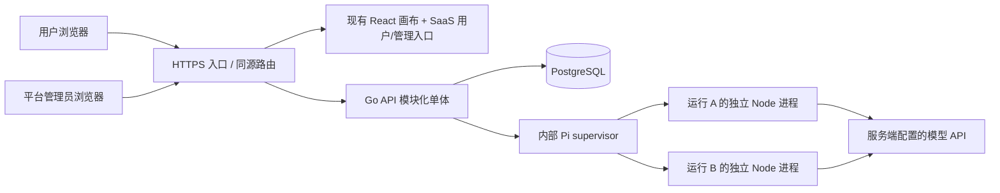

# AwwO Go + Pi 多租户 SaaS 架构

设计日期：2026-09-07。代码基线：Forgejo `ClawHunt-Store/AwwO` 的 `main@6e1dc158a79e2f18c7bdf82610a353883b883f31`（0.3.0）。工作分支：`feat/awwo-go-pi-saas`。本文中的目标架构、当前实现与后续工作分别标明；测试结果见 `awwo-saas-verification.md`。

执行约束见 [设计与开发规范](awwo-saas-design-standards.md)；原页面功能、接口映射、实际覆盖与待补差距见 [前端逐项对接清单](awwo-saas-frontend-contract.md)。后端交付以现有前端的操作和数据契约为验收依据。

## 1. 产品范围与现状

AwwO 是以独立 Agent Session 为节点的协作画布，已有七种 Agent 模板、节点输入输出契约、连线、会话、对话规划、图运行、取消与恢复界面。现役路径为 `apps/web/src/main.tsx → App.tsx → canvas/CanvasSurface.tsx → AgentWorkspace`。原链路依赖 `apps/gateway` 和 vendored `server/`，运行引擎为本机 Codex。

0.3.0 的账户界面不等于完整的公网 SaaS。原画布及运行记录在浏览器缓存中，部分 key 没有用户、租户和画布作用域；账号、Agent 执行环境和工作目录存在本机假设。新后端必须从服务端补齐这些边界。

本次建设目标：复用现有画布，为公网产品准备独立用户入口、平台管理入口、真实身份与租户存储、Go API、Pi 执行服务以及可重复的本地验证。历史 Python、Node、桌面代码保留作原运行模式；SaaS 启动不需要启动它们。

## 2. 部署关系与职责

| 层 | 所有权 | 不接受的客户端权力 |
| --- | --- | --- |
| 用户端 | 编辑画布、模板、输入输出、发起/查看/取消运行 | 自行授予角色、改变资源归属、声明运行成功 |
| 平台管理端 | 经过平台角色验证后查看租户、用户、任务、审计与暂停租户 | 以租户 owner 代替平台管理员、绕过审计直接改库 |
| Go | 身份、成员权限、租户状态、资源归属、CAS、运行幂等、并发限制、数据库与事件 | 相信前端传来的 tenantId/role/cwd 就直接执行 |
| Pi | 当前已授权任务的模型推理和对话 | 读取全局 Pi 配置、加载租户代码、任意 shell/文件/网络工具 |
| PostgreSQL | 已提交业务状态和事件，重启后的事实来源 | 依赖浏览器内存作为持久记录 |

选择 Go 模块化单体是为了把鉴权和状态事务放在一个可审计边界里；Pi 通过内部 HTTP/SSE 协议替换，不把 SDK 类型扩散进业务 API。首版本地实现为**单个 Go 实例**，数据库锁拒绝另一实例同时接管活跃任务。未来横向扩容必须实现租约/心跳/调度协调后再解除此限制。

## 3. 身份、租户与角色

用户为全局身份，租户为组织/工作区；用户通过 membership 加入租户。一名用户可属于多个租户。注册原子创建用户、租户与 owner membership；客户端传入的角色不会成为授权依据。登录使用安全密码哈希和随机 opaque session cookie；数据库只保存 session token 哈希。

租户角色为 `reader / member / admin / owner`，分别负责读取、常规业务写入、成员管理与租户所有权管理。平台角色独立，普通注册不能产生平台管理员，首位管理员通过服务端 bootstrap 配置建立。平台后台所有端点都重新验证平台角色，UI 隐藏仅改善体验。

每个租户请求顺序：验证 session → 查询 membership → 检查动作权限与租户状态 → 按 tenant_id 和资源 ID 联合读取/更新。跨租户 ID 返回 404，不返回该对象存在的信息。成员变更和资源变更不能信任浏览器缓存中的角色。平台暂停租户后保留只读历史，禁止业务写入，并在事务中取消活跃任务、记录终态事件，再中止 Pi 执行。SSE 长连接定期重新验证登录和成员资格。

Cookie 为 HttpOnly、SameSite，staging/production 必须 Secure。写请求验证 Origin，生产入口保持前后端同源；不使用任意 CORS。注册/登录有速率限制，请求体和执行有上限。模型密钥、内部服务 token 不发送到浏览器，不写入前端构建变量。

## 4. 数据与一致性

核心实体：`users`、`tenants`、`memberships`、`auth_sessions`、`canvases`、`agents`、`sessions`、`messages`、`runs`、`run_events`、`audit_events`。具体表名以迁移为准。

- 租户业务实体包含 tenant_id；跨实体引用采用复合租户外键，防止把 A 租户 session 关联到 B 租户 agent/canvas。
- 画布保留前端 document JSON；服务器外层提供 id、tenant、version 和更新时间。更新必须携带已读取的 version，冲突返回 409；浏览器停止自动覆盖并提示重新加载。
- 加载失败不得保存一个空画布覆盖服务器。缓存只用作当前用户/租户/画布的局部副本，服务器为事实来源。
- 同一 session 同时至多一个活跃 run；同一租户 operationId 幂等。重复相同请求返回原运行，变更内容复用同一 key 返回冲突。
- Go 先提交事件再发 SSE。浏览器重连使用事件序号补读，不能通过重连重新执行模型。
- 对话 history 来自已授权 session 的数据库记录，worker 的临时目录不作为业务存储。
- 画布包含节点和交付物文本，首版没有独立 S3 附件服务；上传、扫描、签名下载与对象生命周期在下一阶段接入。不能把模型输出的本机文件路径当作可下载文件。

当前实现使用应用层 tenant 过滤、复合约束和越权测试。**不能据此宣称已经启用 PostgreSQL RLS**；若进一步增加 RLS，应使用非 BYPASSRLS 运行账号、transaction-local tenant context、管理员独立通路，并测试连接池复用时的上下文清理。

## 5. Pi 运行与恢复

Pi 固定发布版本 `@earendil-works/pi-coding-agent@0.85.1`，直接依赖和 lockfile 一起管理。官方原 `badlogic/pi-mono` 已迁移至 `earendil-works/pi`。Node 要求至少 22.19.0，实际本地验证版本另外记录。

内部最小契约：Go `POST /internal/runs` 发送服务器验证过的 runId、tenantId、sessionId、prompt、history 和纯文本 systemPrompt，认证使用独立 service token。返回 SSE 文本增量及完成/失败/取消事件；`DELETE /internal/runs/{runId}` 取消。模型、provider、base URL、工具与子进程环境全部在服务端配置，不从浏览器请求透传。

Go 根据 Pi health 公布的模型输入预算保留最近完整对话轮次，优先丢弃最老的整对历史；当前提示词和指令不被静默截断。Pi 再次按 UTF-8 字节保守预留输出容量，超限明确失败，不能用较大的传输体积上限冒充模型上下文容量。画布规划发送当前图快照，不不断累积过去的规划请求；模板自带的重复说明被压缩，保留用户自定义指令与实际输入。

每个 run 使用独立 Node 进程和临时目录；Pi 使用内存凭证/设置/会话，关闭全局 model 文件、扩展、技能、模板、主题和 context 文件加载。首版不提供 read/bash/edit/write 或执行租户代码的工具。独立进程和目录不等于 OS 沙箱；容器部署还要限制挂载、资源和网络，开放工程执行工具前需另外建立执行沙箱。

完成必须以模型确实返回、无错误/中断且结果已持久化为依据；HTTP 200、请求受理或单个 agent_end 都不能单独作为成功证据。未配置模型时给出不可用状态，不能回假回复。测试替身明确仅用于测试。

取消先阻止继续派发，调用 Pi 清空队列/abort，必要时终止该 run 的专属进程。Go 重启后把不确定的活跃任务标记为 interrupted，保留部分输出和事件，由用户决定重试；首版不承诺从任意工具步骤无损续跑。

现有 `runGraph` 仍管理用户发起的画布拓扑调度，Go 管理每个实际运行的状态和幂等。关闭页面不会撤销已提交的节点运行，但首版**不承诺关闭浏览器后自动派发尚未启动的下游节点**。要实现全天候后台整图运行，需把 DAG 快照、输入输出版本、依赖就绪和调度租约迁入 Go，沿用现有节点契约与运行 API。

## 6. 用户端与平台管理端 API

公共版本前缀为 `/api/v1`。基本分组包括 auth、tenants/members、canvases、agents、sessions/messages、runs/events/cancel、runtime/models、admin summary/tenants/users/runs/audit。精确请求、响应和示例见 `awwo-saas-api.md`。

用户端使用独立 SaaS 入口复用 `CanvasSurface`；新增 transport adapter 将 Go 返回值适配为现有 runGraph/session UI 契约，不引入另一套画布。管理页面通过相同登录会话但独立平台权限访问 Go 管理端点。SaaS 编译不依赖整个历史 `server/ui` 工作区。

原 AI 画布助手通过 `canvases/{id}/plan` 创建受租户配额约束、可审计的规划 run。前端复用原规划上下文、模板 schema、JSON 解析及图结构校验；模型错误、结构错误或过期结果不能应用到当前画布。规划不是临时旁路模型调用。

## 7. 实施与验收顺序

1. 固定真实仓库/SHA，列出现有前端和 API，明确历史本地模式与 SaaS 新入口。
2. Go + PostgreSQL 实现身份、租户、资源与运行 API，建立越权、CAS、取消/恢复测试。
3. Pi 内部服务实现真实 SDK、隔离、流式输出和取消，使用本地测试 provider 验证边界。
4. 复用用户画布，连接云端文档/会话/运行，提供平台后台。
5. 提供本地 setup/dev、环境示例、容器构建与运行手册；执行数据库、API、前端和浏览器验证。
6. 获取模型配置后验证一次真实 Pi provider 调用；公网发布前再通过下一节的上线检查。

## 8. 公网阶段的后续门槛

这是公网目标的本地开发版本，部署模板不代表已经部署或运维验收。上线前必须完成域名/HTTPS、staging 独立数据库和模型凭据、备份恢复演练、限流与监控告警、日志脱敏、secret 生命周期、真实模型配额/成本策略。自助开放注册还需要邮箱验证/找回、反滥用与邀请策略；付费 SaaS 还需支付账单/订阅/webhook 幂等，这些不以 mock 冒充交付。

下一阶段顺序：后台整图调度 → 对象存储及受控业务工具 → 用户邀请/邮件/OIDC → 使用量与付费额度 → 任务租约及多副本 → 灰度/备份恢复/生产验收。保持 API v1 与执行服务契约独立，避免将本地单实例假设散落到前端。

## 官方接口依据

- [Pi 发布版本 SDK](https://github.com/earendil-works/pi/blob/d981de1229ef899957bbe968bc8dcda02a21f477/packages/coding-agent/docs/sdk.md)
- [模型运行时默认配置](https://github.com/earendil-works/pi/blob/d981de1229ef899957bbe968bc8dcda02a21f477/packages/coding-agent/src/core/model-runtime.ts)
- [资源加载开关](https://github.com/earendil-works/pi/blob/d981de1229ef899957bbe968bc8dcda02a21f477/packages/coding-agent/src/core/resource-loader.ts)
- [Pi 权限与容器边界](https://github.com/earendil-works/pi#permissions--containerization)
