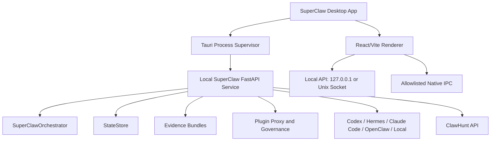

# SuperClaw Codex-Like AgentOS App Plan

Date: 2026-06-03

## Purpose

This document defines a focused plan for turning SuperClaw into a Codex-like desktop app whose long-term center of gravity is:

- a local AgentOS runtime;
- a governed plugin marketplace;
- verifiable task delivery through evidence bundles;
- integration with Codex, Hermes, Claude Code, OpenClaw, local workers, and ClawHunt.

This is not a plan to clone Codex. Codex is the strongest reference for a polished local agent app experience, but SuperClaw should own a different layer: runtime orchestration, plugin governance, marketplace trust, and delivery verification.

## Current Implementation Baseline

SuperClaw already has enough infrastructure to support an app prototype:

- Python package and CLI entrypoint: `superclaw`.
- Prompt shell using `prompt_toolkit` for interactive commands.
- FastAPI app under `apps/api` with runtime, backend, chat, run, event stream, evidence, eval, ClawHunt, plugin, entitlement, revocation, and policy endpoints.
- React/Vite web app under `apps/web`.
- Core orchestrator and state modules: `SuperClawOrchestrator`, `StateStore`, evidence models, worker backends, protocol adapter, verifier, and ClawHunt client.
- Plugin modules for manifest validation, digest/signature checks, cache, revocation, proxy invocation, MCP projection, developer upload review, local fake-cloud registry, entitlement sync, runtime policy, evidence upload, release, update, config, ports, conformance, and workflow.
- Example plugins under `examples/plugins`.
- Manifest and evidence schemas under `schemas`.

Known blocker:

- During a quick local check on 2026-06-03, plugin-related pytest runs and a minimal `import superclaw.plugins` check did not return within a reasonable time. This must be treated as a runtime health blocker before claiming the plugin system is app-ready.

## Product Positioning

SuperClaw should be positioned as:

> A local AgentOS that lets users run agent work through trusted local runtimes, install governed plugins, and verify every serious delivery with evidence.

### What SuperClaw Should Be

- A Codex-like local app surface for chat, task execution, run monitoring, evidence review, and plugin usage.
- A plugin marketplace runtime where users can install, configure, invoke, update, and revoke plugins.
- A delivery engine for ClawHunt tasks and reusable plugin packages.
- A neutral control plane over Codex, Hermes, Claude Code, OpenClaw, local workers, and future agent runtimes.

### What SuperClaw Should Not Be

- Not a direct replacement for Codex, Hermes, or Claude Code.
- Not a model provider.
- Not a generic chatbot app.
- Not a cloud marketplace before local plugin trust is proven.
- Not three UI products at once.

## Strategic Constraint

The app plan must avoid building CLI, full-screen TUI, desktop app, marketplace, billing, cloud registry, and plugin sandbox all at the same time.

Focused priority:

1. Stabilize local runtime and UI API contracts.
2. Build a Codex-like desktop app shell around the existing web app and FastAPI runtime.
3. Ship a local-first plugin marketplace MVP using the existing fake-cloud registry.
4. Add real cloud marketplace, billing, developer payouts, and public distribution later.

Gemini review outcome:

- The current codebase has a strong FastAPI and React base, but the roadmap should be narrowed.
- Avoid maintaining Electron, Tauri, Textual, and prompt shell as equal priorities.
- The immediate blocker is stable UI contracts and runtime health, especially the plugin import/test hang.
- Use the local fake-cloud registry for marketplace MVP instead of building production marketplace infrastructure too early.

## Recommended App Stack

### First Desktop Target

Use Tauri first.

Reasons:

- Smaller desktop footprint than Electron.
- Good fit for a local app that supervises a sidecar service.
- Clear native permissions, IPC, process supervision, and update boundaries.
- Lets the React/Vite app remain the main renderer.

### Strict Tauri Focus

Do not invest in Electron in the first app cycle.

Electron may be reconsidered only if Tauri specifically blocks Python sidecar orchestration for more than 30 days after a focused prototype attempt. Until then, prioritize one desktop stack and spend engineering capacity on runtime stability, plugin trust, and app UX.

### Runtime Process Model



Rules:

- The renderer never executes shell commands directly.
- The renderer never stores raw secrets.
- All privileged actions go through allowlisted API or IPC actions.
- The Python runtime owns orchestration, plugin execution, evidence, and backend adapters.
- Tauri owns window lifecycle, service supervision, app permissions, app packaging, and native OS integration.

## Performance Architecture Requirements

The proposed stack is directionally correct for performance: Tauri keeps the desktop shell light, React/Vite keeps the renderer fast to iterate on, and the Python FastAPI sidecar lets SuperClaw reuse the existing orchestration and plugin runtime instead of rewriting core logic in TypeScript or Rust.

However, the current implementation does not yet satisfy best-performance practice. It has the right stack direction, but it still needs explicit performance contracts, bounded event handling, service lifecycle guarantees, and plugin execution hardening.

### Performance Principles

- Keep the desktop shell thin: Tauri supervises and exposes IPC, but does not duplicate SuperClaw business logic.
- Keep the renderer responsive: React should render state summaries, not unbounded raw logs.
- Keep long-running work outside request handlers: agent runs, plugin invocations, verifier work, and ClawHunt sync must run through cancellable jobs.
- Keep event streams bounded: UI clients should receive incremental summaries and capped logs, not unbounded arrays.
- Keep plugin execution isolated and time-limited: every sidecar call must have startup timeout, tool timeout, output budget, memory budget, and evidence budget.
- Keep startup predictable: app launch should not block on slow plugin scans, remote network calls, or backend probes.
- Keep marketplace data lazy: registry, plugin detail, evidence detail, and run history should load on demand.

### Renderer Requirements

- Use route-level code splitting once the Web Console grows beyond the MVP shell.
- Virtualize long run logs, evidence lists, event streams, and marketplace lists.
- Cap in-memory event buffers per run; older events should be summarized or loaded from persisted state.
- Use SSE for low-to-medium-frequency run updates; add batching/backpressure if event volume grows.
- Do not append raw events to React state without bounds.
- Keep slash-command suggestions local and lightweight.
- Add a global command palette with `Cmd+K` or `Ctrl+K` for navigation, backend switching, plugin actions, run actions, and settings access.
- Keep expensive evidence parsing out of the main chat render path.

Initial renderer budgets:

- App shell first meaningful render: under 1.5 seconds after renderer load on a developer machine.
- Switching between primary routes: under 150 ms for already-loaded routes.
- Run event stream: handles 10,000 persisted events without freezing the UI by using virtualization and summaries.
- Composer input latency: no visible lag while an active run streams events.

### Local Service Requirements

- Add `superclaw service` as the desktop sidecar entrypoint.
- Bind to localhost or Unix socket by default.
- Expose `/health` and `/api/runtime/status` before slow plugin, registry, or agent probes complete.
- Run slow probes in the background and update status incrementally.
- Never let a plugin import, sidecar start, agent probe, or remote API call block service readiness indefinitely.
- Use explicit timeouts for agent probes, plugin scans, plugin smoke tests, and external HTTP calls.
- Store run state and evidence incrementally so restart recovery is possible.

Initial service budgets:

- Health endpoint available within 2 seconds of service start.
- Runtime status endpoint available within 3 seconds of service start.
- Agent readiness refresh returns partial results instead of blocking on missing or slow tools.
- Plugin cache scan is incremental and cancellable.

### Job And Event Model

- Delivery runs, plugin invocations, ClawHunt sync, registry sync, evals, and verification should be modeled as jobs.
- Jobs must support `queued`, `running`, `paused`, `completed`, `failed`, and `cancelled`.
- Jobs must write progress events to durable state, not only in-memory queues.
- SSE should stream from the durable event source when possible, so UI reconnect can replay recent events.
- Cancellation should be cooperative first, then timeout-enforced.
- Recovery should use `recovery_point` and run summary state after service restart.
- The renderer must treat the sidecar as the single source of truth.
- Initial sync should load normalized snapshots through REST endpoints.
- Live changes should arrive as SSE deltas tied to stable ids such as `run_id`, `plugin_id`, and `session_id`.
- On reconnect or restart, the renderer should discard stale optimistic state, reload the latest normalized snapshot, then resume SSE.
- Avoid CRDT-style multi-writer complexity in the MVP; use server-authoritative state plus snapshot-and-delta reconciliation.

### Plugin Performance Requirements

- `import superclaw.plugins` must complete within 2 seconds in the project venv.
- Plugin package verification must avoid unbounded filesystem traversal.
- Plugin sidecar stdout/stderr must be capped and redacted before model-visible projection.
- Plugin invocation must enforce startup timeout, tool timeout, max output bytes, and max evidence bytes from manifest limits.
- Marketplace views must never run plugin smoke tests synchronously in the renderer request path.
- Developer upload review may be slow, but it must run as a background job with progress events.

### Data And Caching Requirements

- Runtime status, agent status, plugin status, and run summary should use normalized lightweight DTOs.
- Evidence detail should be loaded lazily by artifact id.
- Plugin registry metadata should be cached locally and refreshed in the background.
- User secrets should never be cached in the renderer.
- Large evidence artifacts should remain on disk and be streamed or paginated when viewed.

### Performance Acceptance Gate

Before Phase 2 is considered complete:

- `python -c "import superclaw.plugins"` exits within 2 seconds.
- `/health` responds within 2 seconds after service start.
- `/api/runtime/status` responds within 3 seconds and does not wait for slow plugin scans.
- A dry-run can stream events while the composer remains responsive.
- A run with 10,000 synthetic events can be viewed without UI freeze.
- A missing Codex/Hermes/Claude/OpenClaw executable does not delay app startup beyond the service budget.
- A slow or hung plugin sidecar is terminated and reported as `PLUGIN_TIMEOUT`.
- The app can recover or explicitly fail a run after service restart using `recovery_point`.

## UX Model

The app should feel like a local command center, not a generic chat clone.

### Codex-Like App Shell

The desktop app should use a mature Codex-like workspace shell as the default structure. This means a persistent left sidebar, a focused right-side conversation/work area, visible runtime status, and a stable bottom input composer.

Target layout:

```text
┌─────────────────────────────────────────────────────────────────────────────┐
│ top bar: workspace / runtime health / selected backend / mode / run status  │
├───────────────────────┬─────────────────────────────────────────────────────┤
│ left sidebar           │ main work area                                      │
│                       │                                                     │
│ logo + product name    │ chat transcript / run timeline / evidence viewer   │
│ new task / new chat    │                                                     │
│ nav items              │ contextual right rail when needed:                  │
│ recent chats/runs      │ agent status / plugin permissions / evidence       │
│ plugin shortcuts       │                                                     │
│                       │                                                     │
│ bottom-left account    │ bottom composer: input / slash commands / mode     │
│ user / org / login     │                                                     │
└───────────────────────┴─────────────────────────────────────────────────────┘
```

Required shell regions:

- Left sidebar: product identity, primary navigation, recent chats/runs, pinned ClawHunt tasks, plugin shortcuts, and collapsed mode for small screens.
- Bottom-left account block: current user, ClawHunt login state, SuperClaw account state, active workspace, and settings shortcut.
- Top status bar: runtime service health, selected backend, selected mode, active run count, update warnings, and security warnings.
- Main area: chat-first surface that can transform into run cockpit, evidence viewer, plugin detail, or settings without changing the shell.
- Composer: large input box with visible mode selector, backend selector, attachment/action buttons, and slash-command suggestions.
- Context rail: optional right-side panel for selected run, selected plugin, evidence summary, or agent readiness.
- Reference viewer panel (设计中): the right rail also opens conversation references — embed a URL as a sandboxed web view (fallback to external open) and render a file's contents (markdown rendered, text/code monospaced) for paths surfaced in the conversation. Web view is presentation-only; file reading is a kernel capability (path-safety + trust + sensitivity) exposed via CLI first. Design brief: `docs/reference-viewer-panel.md`.

Visual requirements:

- The UI must look like a professional agent workspace, not a generic dashboard.
- The shell should prioritize reading and action clarity: one obvious input area, one obvious status area, one obvious navigation area.
- Use the lobster-claw identity as the product mark, but keep the main UI restrained and technical.
- Navigation should be usable without terminal knowledge.
- Dense runtime details should be progressively disclosed through panels, not dumped into the main chat stream.

### App Internationalization Requirement

Every future desktop/web app change must be i18n-ready before it is considered complete.

Rules:

- All user-facing static labels, headings, button text, placeholders, help text, empty states, and aria labels must be added to the app translation dictionary for every supported locale before merge.
- The current supported locales are English (`en`) and Chinese (`zh`).
- Technical data returned by the runtime, such as plugin ids, run ids, versions, file paths, command strings, enum values, error codes, package digests, and API-provided diagnostic details, may remain raw and unlocalized.
- New app pages must include a locale-switch regression test that proves the primary headings and critical actions render in Chinese.
- New settings, plugin, marketplace, ClawHunt, run, evidence, or desktop-operation controls must not introduce hardcoded visible English in JSX unless the string is explicitly documented as technical runtime data.
- PR review rejects new visible static copy without `en` and `zh` translations.

Acceptance:

- Switching the locale persists across reloads.
- The default chat shell, Settings workspace, Plugins workspace, and any newly added primary workspace all render localized navigation, page titles, major controls, placeholders, and empty states.
- Automated tests cover the top-level locale switch and at least one workflow-specific translated surface for each new feature area.

Desktop acceptance:

- A user can identify where to start a new chat/task within 5 seconds.
- A user can see login/account state from the bottom-left account block without opening settings.
- A user can see selected backend and runtime health without leaving the current page.
- A user can switch between Chat, Runs, Evidence, Agents, Plugins, ClawHunt, and Settings without losing the current conversation context.
- Slash commands show an inline menu when the user types `/` in the composer.
- Missing login, missing backend, missing plugin entitlement, or missing runtime service produces a visible shell-level warning.

### Primary Navigation

- Home
- Chat
- Runs
- Evidence
- Agents
- Plugins
- ClawHunt
- Settings

### Home

Purpose:

- Show whether SuperClaw is ready to work.

Required content:

- Runtime service status.
- Selected workspace.
- Selected mode: `auto`, `chat`, or `delivery`.
- Default backend.
- Agent readiness cards.
- ClawHunt auth status.
- Plugin cache and entitlement status.
- Active and recent runs.
- Critical warnings.

Acceptance:

- A fresh user can tell what is missing before running anything.
- Missing agents show exact remediation.
- Missing plugin or ClawHunt config does not expose secret values.

### Chat

Purpose:

- Provide a Codex-like natural language entrypoint.

Required behavior:

- Direct chat for simple questions.
- Delivery run creation for task-like prompts.
- Visible mode switch between `auto`, `chat`, and `delivery`.
- Streaming assistant output where available.
- Run status chips when a prompt becomes a delivery run.
- Approval prompts for governed plugin/tool actions.

Acceptance:

- `你好` routes to direct chat when a chat-capable backend is selected.
- A task-like prompt can start a delivery run.
- The UI clearly shows whether the app is chatting or executing.
- Failure reason is visible without opening logs.

### Runs

Purpose:

- Make autonomous work observable and recoverable.

Required content:

- Run list.
- Run detail timeline.
- Worker/backend used.
- Current phase.
- Event stream.
- Log tail.
- Cancel, resume, reconcile controls.
- Evidence verdict.
- Failure reason.

Acceptance:

- A dry-run can be started and monitored end to end.
- A failed run shows a concise failure reason.
- Evidence path and protocol export are visible.
- Cancel and resume are explicit user actions.

### Evidence

Purpose:

- Turn SuperClaw's delivery proof into a product feature.

Required content:

- Evidence bundle list.
- Verdict and findings.
- Worker results.
- Plugin invocation records.
- Redacted command/output summaries.
- Artifact links.
- Protocol export state.

Acceptance:

- User can inspect what happened without reading raw JSON.
- Secrets and protected plugin internals are redacted.
- Evidence can be exported for ClawHunt or dispute review.

### Agents

Purpose:

- Manage runtime backends without forcing users into shell config.

Required content:

- Codex readiness.
- Hermes readiness.
- Claude Code readiness.
- OpenClaw readiness.
- Local worker readiness.
- API-backed agents where configured.
- Executable path, version, model setting, and remediation hints.

Acceptance:

- Missing local executables are obvious.
- User can configure executable paths from the app.
- Backend selection persists.
- UI does not infer readiness from path strings alone.

### Plugins

Purpose:

- Make the plugin ecosystem usable before real cloud commerce exists.

Required content:

- Local installed plugins.
- Fake-cloud registry plugins.
- Plugin detail page.
- Manifest metadata.
- Tools exposed to agents.
- Required permissions.
- Required settings and secrets.
- Entitlement state.
- Revocation state.
- Runtime policy state.
- Evidence from recent invocations.

Acceptance:

- User can install a local/fake-cloud plugin.
- User can see why a plugin is blocked.
- Revoked plugins fail closed.
- Missing secret config is actionable but never printed.
- MCP projection hides sidecar internals from the agent.

### ClawHunt

Purpose:

- Connect task marketplace work to SuperClaw's delivery runtime.

Required content:

- Auth status.
- Task import or task detail.
- Delivery run creation.
- Protocol export.
- Submission status.
- ClawHunt-derived plugin ingestion status.

Acceptance:

- A ClawHunt task can be turned into a SuperClaw run.
- A completed run can produce a submission/protocol payload.
- Accepted delivery packages can enter plugin ingestion as a separate flow.

### Settings

Purpose:

- Centralize local runtime configuration.

Required content:

- Runtime service bind mode.
- Control token status.
- Workspace paths.
- Backend defaults.
- Plugin cache path.
- Fake-cloud path.
- ClawHunt key status.
- Secret manager status.
- Logs and diagnostics export.

Acceptance:

- No raw token or secret values are displayed.
- Settings persist and reload.
- Invalid paths or config produce explicit validation errors.

## UI API Contracts

Before heavy UI work, define stable renderer-facing contracts. These should be Pydantic models in a dedicated module, for example:

- `packages/superclaw/src/superclaw/ui_contracts.py`

The API, CLI, prompt shell, and desktop renderer should share these shapes.

### RuntimeStatus

```json
{
  "runtime_version": "0.1.0",
  "service": {
    "status": "ready",
    "pid": 123,
    "bind": "127.0.0.1",
    "control_token": "set"
  },
  "workspace": {
    "repo": "/path/to/repo",
    "state_path": ".superclaw/state.db",
    "artifact_dir": ".superclaw/artifacts"
  },
  "mode": "auto",
  "backend": "codex",
  "auth": {
    "clawhunt": "set"
  },
  "active_runs": 0,
  "warnings": []
}
```

### AgentStatus

```json
{
  "name": "codex",
  "kind": "cli",
  "status": "READY",
  "version": "codex-cli 0.133.0",
  "executable": "/opt/homebrew/bin/codex",
  "config_env": "SUPERCLAW_CODEX_EXECUTABLE",
  "model_env": "SUPERCLAW_CODEX_MODEL",
  "configure_hint": "/config set SUPERCLAW_CODEX_EXECUTABLE /path/to/codex"
}
```

### RunSummary

```json
{
  "run_id": "run_...",
  "status": "running",
  "chain_verdict": "CHAIN_PARTIAL",
  "mode": "delivery",
  "backend": "codex",
  "topology": "linear",
  "started_at": 1780000000.0,
  "updated_at": 1780000010.0,
  "failure_reason": null,
  "evidence_path": ".superclaw/artifacts/run_.../evidence.json",
  "recovery_point": ".superclaw/state/run_.../latest.snapshot.json",
  "resumable": false,
  "cancellable": true
}
```

### PluginStatus

```json
{
  "plugin_id": "dev.superclaw.hello-world",
  "version": "0.1.0",
  "status": "installed",
  "signature_status": "valid",
  "entitlement_status": "not_required",
  "revocation_status": "clear",
  "config_status": "ready",
  "runtime_policy_status": "allowed",
  "tools": ["hello_world"],
  "warnings": []
}
```

Initial allowed status values:

- Runtime: `starting`, `ready`, `degraded`, `blocked`, `stopped`.
- Agent: `READY`, `MISSING`, `ERROR`, `UNKNOWN`.
- Run: `queued`, `running`, `paused`, `completed`, `failed`, `cancelled`.
- Plugin: `available`, `installed`, `blocked`, `revoked`, `update_available`, `error`.

Contract rules:

- No raw secrets.
- No hidden UI-only state.
- All paths must be explicit.
- Mutating actions require a control token.
- Every app action must map to one API endpoint or CLI equivalent.
- API responses should be stable enough for automated UI tests.

## Core App Flows

### First Launch

1. App starts.
2. Tauri supervisor starts or connects to local SuperClaw service.
3. Renderer calls `/health` and `/api/runtime/status`.
4. Renderer calls `/api/agents` and `/api/plugins/status`.
5. Home shows readiness and setup warnings.

Acceptance:

- Double-clicking the app opens a window.
- The app starts the local service or reports why it cannot.
- No terminal is required for first launch.

### Direct Chat

1. User enters a simple message.
2. Renderer sends `chat.direct`.
3. API routes to selected chat-capable backend.
4. Renderer streams or displays output.
5. Chat record is attached to a session.

Acceptance:

- Direct questions do not create delivery runs unless the user or classifier chooses delivery.
- Unsupported backends return a clear remediation.

### Delivery Run

1. User enters a task-like prompt or selects delivery mode.
2. API creates a goal and run.
3. Run events stream to the renderer.
4. Orchestrator calls the selected backend and verifier.
5. Evidence is attached and shown in the run detail view.

Acceptance:

- A local dry-run completes through the app.
- A real backend run shows progress and failure details.
- Evidence opens from the run detail page.

### Plugin Install

1. User opens Plugins.
2. Renderer loads fake-cloud registry metadata.
3. User clicks install.
4. API verifies package digest and signature.
5. API checks revocation and stores plugin in local cache.
6. Renderer refreshes `PluginStatus`.

Acceptance:

- Unsigned or tampered plugin fails closed.
- Revoked plugin cannot be installed or invoked.
- Registry download references do not expose raw local package paths.

### Plugin Invocation

1. Agent requests a projected MCP tool or app invokes a plugin action.
2. SuperClaw proxy checks package, signature, revocation, entitlement, config, policy, and sidecar constraints.
3. Plugin sidecar runs with restricted environment.
4. Output is schema-validated and redacted.
5. Invocation evidence is stored.
6. Agent only sees projected output.

Acceptance:

- Agent never sees raw secret config.
- Agent never sees sidecar path, local entitlement files, or signing internals.
- Invocation evidence records status, digests, entitlement id, input/output digests, and artifact id.

### Developer Plugin Upload

1. Developer selects a plugin package.
2. API runs local preflight gates.
3. Gates include manifest validation, entrypoint checks, secret scan, dependency policy, documentation, pricing intent, runtime code download checks, smoke tests, and evidence fixture checks.
4. Passing packages can be locally signed for fake-cloud registry use.
5. Local fake-cloud signatures are namespaced separately from production signatures.

Acceptance:

- Failed gates are explicit.
- Passing review does not imply production marketplace approval.
- Signing requires an explicit SuperClaw signing key.
- Local fake-cloud signatures are marked as `UNTRUSTED_LOCAL_DEV`.
- Future official marketplace signatures must use a separate `SUPERCLAW_OFFICIAL` trust class.
- Runtime verification must distinguish local development trust from official marketplace trust before production plugin listing.

### ClawHunt-Derived Plugin

1. Accepted ClawHunt delivery exports a delivery package.
2. SuperClaw ingestion converts it into a plugin candidate.
3. Candidate goes through the same plugin gates as developer uploads.
4. Accepted plugin can be added to local/fake-cloud registry.

Acceptance:

- ClawHunt delivery is one plugin source, not the only source.
- ClawHunt-derived plugins use the same manifest, signing, entitlement, evidence, and revocation standards as developer-uploaded plugins.

## Security Boundaries

### Renderer

- Must not execute shell commands.
- Must not read arbitrary files.
- Must not store raw secrets.
- Must not call privileged runtime operations without a control token.

### Tauri Shell

- Owns process supervision.
- Owns native window and tray.
- Owns native update hooks after beta.
- Exposes only allowlisted IPC commands.
- Generates a single-use local session token on startup.
- Passes the token to the FastAPI sidecar through a secure parent-to-child channel, such as environment variable or stdin.
- Gives the renderer access only to the scoped local session token, never to long-lived marketplace, ClawHunt, or plugin secrets.

### Local Service

- Binds to localhost or Unix socket by default.
- Requires control token for mutating actions.
- Accepts a desktop session token only from the Tauri-supervised startup path.
- Rejects mutating calls with missing, expired, or mismatched tokens.
- Stores runtime state and evidence.
- Exposes only redacted status for secrets.
- Refuses public exposure unless explicitly configured.

### Plugins

- Must be verified before execution.
- Must fail closed on missing entitlement, revocation, invalid signature, missing config, or runtime policy denial.
- Must expose only declared tools and schemas.
- Must run through SuperClaw proxy, not direct model-to-binary calls.
- Must produce invocation evidence.
- Must not run with unrestricted primary-user privileges once marketplace installation is enabled.

Plugin isolation levels:

- L0 development: local subprocess execution is allowed only for first-party fixtures and explicit developer mode.
- L1 local app MVP: enforce subprocess preflight, restricted environment, safe PATH, timeout, output budget, declared permission checks, and no shell interpolation.
- L2 marketplace beta: require a containerized sidecar isolation boundary before paid or public third-party plugin use.

Default L2 sandbox technology:

- Docker or Podman sidecar runner is the default target.
- The runtime launches each third-party plugin in a short-lived container with explicit filesystem mounts, network allowlist, resource limits, and no inherited user shell environment.
- OS-native sandboxing is a fallback only where container runtime is unavailable and must match the same permission contract.

Marketplace rule:

- Phase 4 plugin marketplace MVP may use L1 only for local fake-cloud testing.
- Paid or public marketplace plugins require L2 isolation or an explicitly approved equivalent.
- Public marketplace plugins are not allowed to run as plain host subprocesses.
- Sidecar topology alone is not considered sufficient isolation without the L2 sandbox boundary.

Manifest-driven capability enforcement:

- SuperClaw already defines plugin permissions through manifest fields for `filesystem`, `network`, and `environment`.
- The runtime must enforce those declarations at execution time, not treat them as advisory metadata.
- Filesystem permissions map to explicit mount scopes such as workspace, artifact directory, and plugin cache.
- Network permissions map to explicit host allowlists enforced by the container runner or proxy layer.
- Environment permissions map to explicit secret or setting injection allowlists.
- Any plugin request outside declared manifest permissions fails closed and records a governed denial in invocation evidence.

### Agents

- Codex, Hermes, Claude Code, OpenClaw, and local agents should not receive marketplace credentials.
- Agents should see projected tool schemas and redacted outputs, not protected plugin internals.
- Runtime credentials stay owned by their native runtimes where possible.

## Development Cadence

### Phase 0: Runtime Health Gate

Goal:

- Make the current plugin/runtime layer safe enough for app development.

Scope:

- Diagnose and fix the plugin import/test hang.
- Add strict timeout coverage around plugin smoke tests and sidecar calls.
- Confirm `superclaw.plugins` imports quickly.
- Confirm focused plugin tests finish locally.
- Add a lightweight app preflight command.
- Add run state recovery behavior for service crash or forced app restart.

Acceptance:

- `python -c "import superclaw.plugins"` exits successfully within 2 seconds in the project venv.
- Focused plugin tests complete without hanging.
- Sidecar invocation has enforced timeout behavior.
- Runtime health failure is visible through an API endpoint.
- Killing the FastAPI service during a dry-run produces one of two safe outcomes on next launch: resumable run with a recovery point, or explicit non-resumable failure with evidence of where execution stopped.

Non-goals:

- No desktop shell yet.
- No new marketplace UI.

### Phase 1: UI Contract Hardening

Goal:

- Freeze the renderer-facing API contracts before building the app UI.

Scope:

- Add `ui_contracts.py`.
- Add `/api/runtime/status`.
- Add `/api/agents`.
- Add `/api/plugins/status`.
- Add normalized run summary endpoint.
- Add safe config read/write endpoints with allowlisted keys.
- Make existing CLI and prompt shell consume the same status contracts where practical.

Acceptance:

- Contract unit tests exist.
- API returns no raw secrets.
- Agent status uses the same readiness logic as `/agents`.
- Plugin status explains `installed`, `blocked`, `revoked`, and `missing_config`.
- Existing CLI behavior remains backward compatible.

### Phase 2: Web Console MVP

Goal:

- Turn `apps/web` into the actual app renderer before packaging it as desktop.

Scope:

- Codex-like app shell with persistent left sidebar, top runtime status bar, bottom-left account block, main chat/work area, and bottom composer.
- Home readiness dashboard.
- Chat page with mode and backend visibility.
- Runs page with SSE event streaming.
- Evidence viewer.
- Agents settings page.
- Plugins page using local/fake-cloud APIs.

Acceptance:

- Shell layout remains stable while switching between Chat, Runs, Evidence, Agents, Plugins, ClawHunt, and Settings.
- Bottom-left account block shows user/login/workspace status without exposing secrets.
- Composer supports visible mode/backend state and inline slash-command suggestions.
- Web app can connect to the local API.
- User can run direct chat where supported.
- User can start a dry-run delivery.
- User can see run events and evidence.
- User can inspect installed plugins and blockers.

### Phase 3: Tauri Desktop Prototype

Goal:

- Package the web console into a local desktop app.

Scope:

- Add `apps/desktop`.
- Tauri starts or connects to FastAPI service.
- Service lifecycle is visible in the app.
- App opens without a terminal.
- App can recover if the service is already running.

Acceptance:

- macOS `.app` prototype launches.
- App reports `Connected` after service health passes.
- App can start a dry-run and show evidence.
- App shuts down its owned service cleanly.

### Phase 4: Plugin Marketplace MVP

Goal:

- Make plugins a real app feature without production billing.

Scope:

- Fake-cloud registry browser.
- Plugin detail page.
- Install/update/revoke status.
- Entitlement sync view.
- Required config wizard.
- Invocation evidence view.
- Developer upload review UI.

Acceptance:

- User can install a signed fake-cloud plugin.
- Tampered or revoked plugin fails closed.
- User can configure required plugin secrets without seeing raw secret after save.
- Developer upload review shows gate results.

### Phase 5: ClawHunt Integration

Goal:

- Connect task marketplace and plugin ecosystem flows.

Scope:

- ClawHunt auth status.
- Task import.
- Delivery run creation.
- Submission/protocol export.
- Accepted delivery to plugin candidate ingestion.

Acceptance:

- A ClawHunt task can be executed from the app.
- Evidence can be exported for submission.
- ClawHunt-derived plugin candidate follows the same plugin gates as developer upload.

### Phase 6: Desktop Beta

Goal:

- Make the app usable by non-CLI users.

Scope:

- First-run setup.
- Agent path detection and remediation.
- Runtime diagnostics export.
- Notifications.
- Manual update path.
- Crash/log export.
- Plugin management polish.

Acceptance:

- Fresh install path is documented and tested.
- Missing Codex/Hermes/Claude Code/OpenClaw has clear remediation.
- User can complete a local chat, a dry-run delivery, and a plugin install without terminal commands.

### Phase 7: Marketplace Production Readiness

Goal:

- Prepare paid plugin commerce and public ecosystem.

Scope:

- Real cloud registry.
- Developer identity.
- Signing authority.
- Plugin ownership and revenue attribution.
- Purchase and entitlement service.
- Revocation service.
- Usage metering.
- Refund/dispute/audit workflows.
- Security incident response.

Acceptance:

- Paid plugin can be purchased, installed, invoked, metered, revoked, and audited.
- Developer upload can progress from review to signed listing.
- Revoked plugin fails before sidecar startup.
- Users can inspect what a plugin did without seeing protected internals.

## Engineering Standards

### App Actions

Every user action should have an explicit action id:

- `chat.direct`
- `delivery.start`
- `run.cancel`
- `run.resume`
- `run.reconcile`
- `run.evidence.open`
- `backend.set`
- `agent.configure`
- `plugin.install`
- `plugin.update`
- `plugin.configure`
- `plugin.verify`
- `plugin.invoke`
- `clawhunt.submit`

Rules:

- Every action maps to an API endpoint or CLI equivalent.
- Every mutating action requires authorization.
- Dangerous actions require explicit confirmation.
- Every action has an acceptance test.

### Testing

Required test groups:

- Runtime health import tests.
- UI contract serialization tests.
- API contract tests.
- Agent readiness tests.
- Plugin install and revocation tests.
- Plugin invocation timeout tests.
- Evidence redaction tests.
- Web static tests.
- Desktop service supervision tests.

### Observability

The app must expose:

- service status;
- active run count;
- latest failure reason;
- plugin blocker summary;
- backend readiness;
- local log export path;
- evidence artifact paths.

### Versioning

Desktop app releases should track:

- app version;
- runtime version;
- plugin manifest schema version;
- plugin package version;
- API contract version.

## Immediate Next Engineering Tasks

1. Fix the plugin import/test hang.
2. Add `ui_contracts.py`.
3. Add `/api/runtime/status`, `/api/agents`, and `/api/plugins/status`.
4. Convert `apps/web` from demo workbench into a Runtime Console MVP.
5. Add `apps/desktop` Tauri prototype only after the local service and Web Console are stable.

## Decision Summary

SuperClaw can become a Codex-like app, but its strongest future is not as another coding assistant. Its strongest future is as a local AgentOS with:

- a Codex-like command center;
- governed plugin runtime;
- evidence-first delivery verification;
- ClawHunt task and package integration;
- future paid plugin marketplace.

The shortest credible path is:

```text
Runtime health -> stable UI contracts -> Web Console -> Tauri App -> Plugin Marketplace MVP -> ClawHunt plugin loop -> production marketplace
```

Do not build production payments, full cloud marketplace, or a separate full-screen TUI until the local runtime, API contracts, and plugin trust loop are stable.
