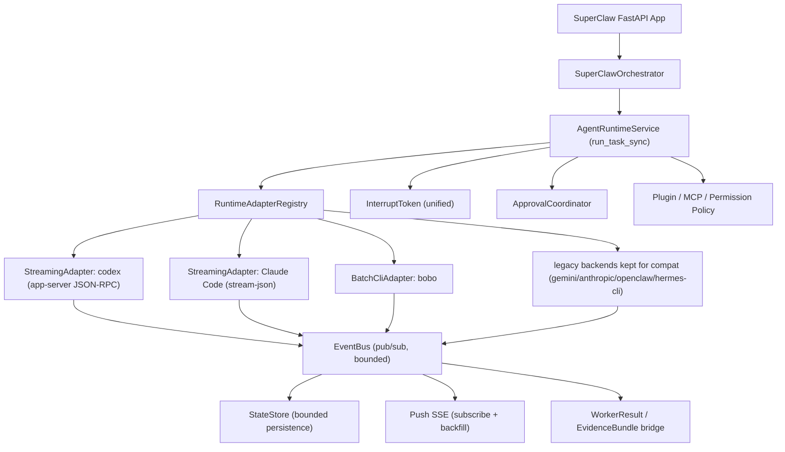

# SuperClaw Local Agent Runtime (Hermes-informed)

Date: 2026-06-06
Status: v2 (supersedes the v1 draft of this file)

## What Changed In v2 And Why

v1 was written before either codebase was verified line-by-line. v2 is written after
auditing the real SuperClaw backends and the real Hermes runtime. Three findings forced
a redesign:

1. Hermes is NOT a "call any local CLI" framework. It has exactly one local-subprocess
   runtime (`codex app-server` over JSON-RPC) plus API transports. It has no Claude Code
   CLI invocation at all. SuperClaw already calls more local CLIs than Hermes does
   (`claude`, `codex`, `bobo`, `openclaw`, `hermes`, `gemini`). So the value to import
   from Hermes is the **run lifecycle** (events, streaming, approval, interrupt), not
   CLI breadth.

2. Hermes's "unified runtime" is only partially unified (~4/10). Its clean parts are the
   `ProviderTransport` ABC and the `NormalizedResponse` type. Its dispatch, streaming,
   and provider detection are still hard `if/elif` chains, and `codex_app_server` lives
   *outside* the transport abstraction as a special-cased parallel runtime. Copy the
   clean middle; do not copy the branching edges.

3. The best adapter template already exists inside SuperClaw: `codex_app_server.py`.
   It already implements a session lifecycle, JSON-RPC streaming notifications, real
   approval request/response, and RPC-based interrupt. The new contract should be
   abstracted from it, not from Hermes.

The v2 target is therefore: a SuperClaw-owned, high-performance, **general local-CLI
invocation runtime** that fixes four concrete product problems (slow reads, no streaming,
no approval, weak interrupt) AND closes the performance gaps where SuperClaw is crude
(blocking reads, SQLite-as-bus, no WAL, no process reuse, no concurrency governor). It is
anchored on SuperClaw's own codex-app-server implementation, informed but not dictated by
Hermes, and explicitly aims to exceed Hermes — which never built a general local-CLI
runtime at all. codex, Claude Code, and bobo are the first-class validation targets; the
framework is general enough to host more.

## Local Project Addresses

SuperClaw working tree:

```text
/Users/leongong/Desktop/LeonProjects/gho_workspace/superclaw-codex-app-server-runtime
```

Local Hermes project (reference only):

```text
/Users/leongong/Desktop/LeonProjects/gho_workspace/hermes-agent
```

This plan file:

```text
/Users/leongong/Desktop/LeonProjects/gho_workspace/superclaw-codex-app-server-runtime/docs/hermes-style-agent-runtime.md
```

## The Real Problems (root-caused in code)

These are the actual user-facing problems this runtime must fix. Each is traced to a
verified location in the current codebase.

### P1. Reading agent output is slow

Root cause: the SSE endpoint polls SQLite. `GET /api/runs/{run_id}/events`
(`apps/api/main.py:1466-1491`) loops every 50 ms, calling `store.list_events(run_id)`
which runs a full `SELECT ... ORDER BY id ASC` over the `events` table every iteration
(`state.py:255-271`). There is no in-memory event bus and no push. Latency floor is the
poll interval; cost grows with event count because every poll re-reads the whole run.

### P2. No streaming / cannot watch the agent in real time

Two root causes:
- Durable events are written only at milestones, after work completes. There is no
  incremental `message.delta`.
- All CLI backends capture child-process stdout *after* the process exits
  (`LocalShellBackend.run_command`), so even if the SSE layer were push-based, there is
  nothing incremental to push for CLI agents.
- The only backend with live notifications is `codex_app_server.py` (JSON-RPC
  `item/agentMessage/delta`, `codex_app_server.py:334-402`), but those deltas are
  aggregated in memory and never surfaced as stream events.

### P3. No approval workflow

Only `codex_app_server.py` has approval, and it is self-contained: it answers JSON-RPC
server requests synchronously inside the turn loop (`_handle_server_request`,
`codex_app_server.py:449-475`). There is no runtime-level approval queue, no API surface
to resolve an approval, and no way for any other backend to request one. SuperClaw's
`WAITING_FOR_HUMAN_GATE` is a pause flag, not an interactive approve/deny channel.

### P4. Weak / inconsistent interrupt

Cancellation is cooperative and per-backend. `orchestrator.cancel_run` sets session
status and records an event but does not actively stop the worker; backends must poll
`limits.cancel_check()` and then SIGTERM→SIGKILL the subprocess. `codex_app_server.py`
is the only one with a protocol-level interrupt (`turn/interrupt`,
`codex_app_server.py:477-484`). There is no single interrupt token that propagates
uniformly across adapters and child runs.

Hermes, by contrast, has a genuinely unified interrupt: one `_interrupt_requested` flag
plus per-thread signals that fan out to tool workers, child agents, and the codex
subprocess (`run_agent.py:1762-1851`). This is the one Hermes mechanism worth copying
almost directly.

## Performance Gap Analysis (SuperClaw now vs Hermes vs target)

The explicit goal is high-performance local CLI invocation that matches Hermes and then
exceeds it. That requires fixing how SuperClaw spawns, reads, buffers, persists, and
schedules CLI work — not just adding a streaming event type. Every row below is verified in
the current code.

| Dimension | SuperClaw now (verified) | Hermes | Target (beyond Hermes) |
| --- | --- | --- | --- |
| stdout read | `stream.read()` to EOF in one call; reader thread only prevents pipe deadlock; zero incremental output (`backends.py:208`) | per-event reader fires callbacks live | one uniform incremental reader: JSONL (stream-json), JSON-RPC (codex), line (plain) -> push to bus |
| completion detect | `time.sleep(0.05)` poll loop (`backends.py:83`) | block on reader/queue | event-driven; wake on stream EOF / terminal event |
| event transport (IPC) | SQLite used as the message bus; SSE re-reads full table every 50ms (`main.py:1466-1491`) | in-process asyncio.Queue at edge | in-memory bounded ring-buffer pub/sub; SQLite for durable milestones only |
| SQLite config | no WAL, journal=DELETE, writers block readers (`state.py:29-31`) | WAL (schema v13) | WAL + synchronous=NORMAL |
| DB connections | new connection per operation (`state.py:28`) | — | per-thread connection reuse / pool |
| durable writes | one INSERT per event, autocommit per op (`state.py:255-271`) | writes per turn, not per token | batched/throttled inserts + transcript artifact for full text |
| process reuse | fresh subprocess per task for CLI; only codex-app-server reuses a session | codex session reuse | codex keep-alive (done) + Claude Code multi-turn via `--input-format stream-json` + warm worker pool |
| concurrency | ThreadPoolExecutor recreated per frontier; no global / per-adapter cap (`orchestrator.py:462,1510`) | thread-based | single managed scheduler; global + per-adapter concurrency caps; fair queue |
| capability probe | `available()` spawns `--version` (5s timeout) synchronously, uncached (`backends.py:889`) | resolution layer | cached (TTL) + parallel + non-blocking status |
| failure detect | string-match `failure_markers`, fragile | — | exit code + stream terminal event + adapter-declared error mapping |
| interrupt latency | bound by 0.05s poll + cooperative cancel | immediate signal flag | immediate token: graceful (`turn/interrupt`, close stdin) -> SIGTERM -> SIGKILL |
| observability | duration only | — | spawn time, first-token latency, tokens/sec, tool count per run |

Beyond-Hermes opportunity: Hermes never built a general local-CLI runtime — it has exactly
one local path (`codex app-server` JSON-RPC) and cannot invoke Claude Code CLI at all. The
opportunity is a uniform high-performance streaming-CLI framework that handles JSON-RPC
(codex), JSONL (Claude Code stream-json), and batch (bobo) under one reader + event bus +
scheduler. That is strictly more than Hermes provides.

## What Hermes Actually Provides (honest inventory)

Reusable as architecture reference:

- `ProviderTransport` ABC + `NormalizedResponse` value type
  (`agent/transports/base.py:16-90`, `agent/transports/types.py:90-133`). Clean way to
  normalize heterogeneous backend responses into one downstream shape.
- Unified interrupt model (`run_agent.py:1762-1851`). Cross-cutting flag + per-thread
  signal + child propagation + subprocess `turn/interrupt`.
- Blocking per-session approval queue pattern (`tools/approval.py`): tool thread blocks
  on an event, an out-of-band resolver sets the result, thread wakes. This is the right
  shape for P3.
- Edge async bridge: agent runs sync on a thread; only the HTTP/SSE edge wraps callbacks
  with an `asyncio.Queue` + `loop.call_soon_threadsafe`. This is the right shape for P1.

Do NOT copy:

- Provider/transport selection by `if/elif` on provider names and URLs
  (`agent_init.py:292-323`).
- API/streaming dispatch branching (`chat_completion_helpers.py:199-245, 1416-1493`).
- `codex_app_server` as an out-of-model special case
  (`conversation_loop.py:666`). SuperClaw should make session-style runtimes first-class,
  not a bypass.
- Hermes's exact-pinned dependency set (`openai==2.24.0`, `httpx==0.28.1`,
  `pydantic==2.13.4`). It conflicts with SuperClaw's looser ranges. No in-process import
  of the Hermes agent core.

Correction to a common assumption: Hermes is not heavily async. `AIAgent.run_conversation`
is synchronous and blocking; concurrency is thread-based (`threading.RLock`,
`threading.Event`, `ThreadPoolExecutor`). This is good news — it means SuperClaw's existing
thread/`ThreadPoolExecutor` model does not need an async rewrite. The "concurrency
impedance mismatch" feared in v1 is small.

Most important scoping fact: Hermes is fundamentally a **model-provider agent**, not a
local-CLI orchestrator. Its "unified runtime" (the `ProviderTransport` family:
`chat_completions`, `anthropic_messages`, `codex_responses`, `bedrock_converse`) exists to
format messages for model APIs, call them, and normalize responses; Hermes owns its own
tool loop (`run_conversation`). `codex_app_server` is the single exception — its only path
that delegates to a local agent process — and it lives outside that transport abstraction.

Implication for this project: do NOT port Hermes's transport / provider / NormalizedResponse
layer. It is built for model APIs and is irrelevant to invoking local CLIs. The only
Hermes pieces relevant here are (1) the codex app-server process + JSON-RPC + approval
pattern, (2) unified interrupt, (3) the blocking approval queue, (4) the edge streaming
bridge. Everything else in Hermes is out of scope. (SuperClaw's own gemini/anthropic
backends are SuperClaw's equivalent of Hermes's provider mode — also out of scope here,
kept only for compatibility.)

## Reference Anchor: SuperClaw's own codex-app-server

The new adapter contract is abstracted from `codex_app_server.py`, which already has:

- A persistent session object with spawn/initialize/reuse/retire lifecycle
  (`CodexAppServerClient`, `codex_app_server.py:51-213`; session cache in
  `backends.py:714-727`).
- Discrete event handling: JSON-RPC notifications routed by method into text/delta,
  command output, diffs, completed items, errors, turn lifecycle
  (`codex_app_server.py:334-402`).
- Real approval: server requests routed to a queue and answered with
  accept/decline/permission (`codex_app_server.py:449-475`).
- Protocol interrupt: `turn/interrupt` + `should_retire` on cancel/deadline/stale-tool
  (`codex_app_server.py:477-484`).
- A clean result + transcript projection (`backends.py:796-810`).

This is exactly the lifecycle the other backends lack. The runtime generalizes it.

## Scope: the three agents this runtime targets

The goal is to support three local agents well: **codex**, **Claude Code**, and **bobo**.
The existing API-loop backends (gemini, anthropic) are kept for backward compatibility but
are out of scope for this enhancement — they are not rewritten and not the focus.

The only distinction that matters is verified, not invented: **does the agent's binary
speak a streaming protocol, or does it only run in batch?** That single fact decides
whether the agent can give you live output, approval, and protocol-level interrupt.

| Agent | How it is invoked today | Streaming protocol? | Result |
| --- | --- | --- | --- |
| codex | `codex app-server` JSON-RPC (already built, `codex_app_server.py`) | yes | streaming delta + real approval + `turn/interrupt` |
| Claude Code | `claude --print --output-format json` (`backends.py:897`) = batch, returns only after the whole task finishes | yes, but unused | currently no live output; **upgradeable** (see below) |
| bobo | `bobo --print --full-auto run` (`backends.py:956-1022`) = batch | no | final output only; cancel via SIGTERM/SIGKILL |

### The single highest-value change: Claude Code json -> stream-json

The reason Claude Code feels slow and shows no live output is that it is invoked with
`--output-format json`, which buffers the entire run and returns once at the end. Claude
Code's headless mode supports a streaming protocol (verified against official docs):

- `--output-format stream-json --verbose --include-partial-messages` -> token-level
  `stream_event` / `text_delta` JSONL events (live output).
- `--permission-prompt-tool <mcp_tool>` -> an external program (a SuperClaw MCP tool) can
  intercept and approve/deny tool calls in non-interactive mode (real approval).
- `--input-format stream-json` -> multi-turn / injection; closing stdin is a graceful
  shutdown; SIGTERM interrupts.

So Claude Code belongs on the **same side as codex**: full streaming + approval +
interrupt. The codebase already notes this gap (`runtime.py:511`: "add backend stream-json
capture for Claude/Gemini where available").

## Two integration shapes (decided by the binary, not by us)

```text
AgentAdapter (contract: id, display_name, available, capabilities, run, interrupt)
├─ StreamingAdapter   the binary speaks a streaming protocol over stdio
│    codex        -> codex app-server JSON-RPC notifications
│    Claude Code  -> claude --output-format stream-json (+ partial messages)
│    shape: protocol events -> message.delta / tool.*; protocol approval; protocol interrupt
└─ BatchCliAdapter    the binary only runs to completion and prints once
     bobo         -> bobo --print --full-auto run
     shape: capture final output; milestone events only; cancel via SIGTERM -> SIGKILL
```

There is no third type for the targeted agents. `codex_app_server.py` is the template for
`StreamingAdapter`; the current bobo backend is the template for `BatchCliAdapter`. Claude
Code moves from the batch path it uses today onto `StreamingAdapter` via stream-json.

`capabilities()` declares, per adapter, which of {streaming, approval, interrupt, mcp} it
actually supports. The UI and API read capabilities instead of assuming, so bobo's lack of
token streaming is explicit, not a silent gap.

## Target Capabilities (acceptance-oriented)

The refactor is justified only by capabilities users gain. Each capability is bound to a
mechanism and an honest, per-agent coverage note.

| Capability | Mechanism | codex | Claude Code | bobo |
| --- | --- | --- | --- | --- |
| Real-time output (fixes P1, P2) | event bus + push SSE; `message.delta` | yes | yes (after json->stream-json) | milestone-only |
| Low-latency reads (fixes P1) | event bus replaces 50ms SQLite poll | yes | yes | yes |
| Mid-run approval (fixes P3) | approval coordinator + `/api/runs/{id}/approval` | yes (JSON-RPC request) | yes (`--permission-prompt-tool` MCP) | policy-only |
| One-click interrupt (fixes P4) | unified interrupt token | yes (`turn/interrupt`) | yes (SIGTERM / close stdin) | yes (SIGTERM/SIGKILL) |
| Capability discovery | `capabilities()` in `/api/agents`, `/api/runtime/status` | yes | yes | yes |
| No regression | `WorkerResult`/`EvidenceBundle` bridge unchanged | yes | yes | yes |

## Target Architecture

New SuperClaw-owned package:

```text
packages/superclaw/src/superclaw/agent_runtime/
  contracts.py       AgentAdapter, AgentRunRequest, AgentRunResult, capabilities
  events.py          AgentRuntimeEvent types + normalization helpers
  bus.py             in-process EventBus (pub/sub, bounded, thread-safe)
  registry.py        RuntimeAdapterRegistry
  service.py         AgentRuntimeService (orchestrator entrypoint)
  approval.py        ApprovalCoordinator (queue + resolve)
  interrupt.py       InterruptToken (unified cancel/interrupt)
  bridge.py          event/result -> WorkerResult/EvidenceBundle + StateStore
  adapters/
    streaming.py     StreamingAdapter base (abstracted from codex_app_server.py)
    codex_app_server.py   codex via app-server JSON-RPC
    claude_stream.py      Claude Code via --output-format stream-json
    batch_cli.py     BatchCliAdapter base + bobo (and legacy gemini/anthropic kept as-is)
```

### AgentAdapter contract

```text
id: str
display_name: str
available() -> Availability                # never blocks; probe has a timeout
capabilities() -> AgentRuntimeCapabilities # streaming/approval/interrupt/mcp/loop_owner
run(request, sink, interrupt) -> AgentRunResult
interrupt(run_id) -> None
```

- `sink` is a thread-safe event sink (writes to the EventBus). Adapters emit normalized
  events; they never write to API responses or SQLite directly.
- `interrupt` is the unified InterruptToken, not a per-backend flag.
- `run` stays synchronous (blocking) to match both SuperClaw and Hermes thread models.

### AgentRuntimeService

Single boundary the orchestrator calls. Responsibilities:

- Resolve adapter from registry; reject unavailable adapters with a clear reason.
- Apply `AgentRuntimePolicy` (plugin/MCP/permission) before run.
- Start the adapter run on a worker thread; hand it the sink + interrupt token.
- Subscribe the bridge to the bus; project events into StateStore (bounded) and into
  WorkerResult on terminal.
- Expose `run_task_sync(...)` so the orchestrator stays synchronous.

```text
SuperClawOrchestrator -> AgentRuntimeService.run_task_sync(...) -> adapter.run(...)
```

### Event Model

```text
run.started      run.status
message.delta    message.completed
tool.started     tool.delta     tool.completed   tool.failed
approval.request approval.resolved
run.cancel.requested  run.cancelled
run.failed       run.completed
adapter.diagnostic
```

Compatibility mapping (unchanged contract):

- `run.completed/failed/cancelled` -> `WorkerResult` (success/failed/cancelled).
- `message.delta` -> transcript stream + throttled UI events (not one row per token).
- `tool.*` -> persisted events + optional evidence.
- `approval.*` -> approval surface (see Approval Subsystem).

### Event Bus (fixes P1 — the read side v1 missed)

v1 only throttled the *write* side. The actual slowness is the *read* side (50ms poll).
Add an in-process pub/sub bus:

- One bounded ring buffer per active run, plus a subscriber set.
- `publish(event)` appends and notifies subscribers (`threading.Condition` /
  per-subscriber `queue.Queue`).
- SSE handler subscribes and blocks on the queue instead of polling SQLite. Backfill
  from StateStore on connect (for events emitted before subscription), then switch to
  live push. This removes the 50ms latency floor and the full-table re-read per poll.
- The bus is the single fan-out point: StateStore persistence, SSE push, and the
  WorkerResult bridge all consume the same stream.

### Stream Aggregation Policy (write side)

- Never persist every token delta as a durable row by default.
- Buffer deltas per run in memory; flush full text to a transcript artifact.
- Persist milestone + terminal events; emit UI deltas via the bus (ephemeral, not all
  durable).

Initial thresholds (tunable):

```text
durable message.delta: <= 4 events/second/run
durable delta payload:  <= 4 KiB/event
transcript flush:       16 KiB or terminal event
in-memory buffer:       bounded per run, spill to transcript when exceeded
```

### Performance Mechanisms (beyond Hermes)

Keep the system simple. Build the small core now; defer the rest until there is a measured
need. Items are tagged [CORE] (build now, validated on codex) or [LATER] (do not build
until needed — building them now is the "make it complex" trap to avoid).

1. [CORE] Uniform incremental reader. Replace `stream.read()`-to-EOF with one streaming reader
   that decodes as data arrives and pushes events immediately:
   - JSON-RPC framing for codex app-server (already partially present);
   - line-delimited JSON for Claude Code `stream-json`;
   - plain line buffering for batch CLIs (still no token stream, but no end-of-run stall).
   The reader runs on the worker thread and feeds the event bus directly. This is the
   single change that turns "output after exit" into "output as it happens".

2. [CORE] In-memory event bus as the IPC layer. SQLite stops being the message bus. Live deltas
   flow through a bounded ring-buffer + subscriber queues; SSE subscribes (with backfill on
   connect). Removes the 50ms poll floor and the per-poll full-table scan.

3. [CORE] StateStore made fast and non-blocking:
   - `PRAGMA journal_mode=WAL` + `PRAGMA synchronous=NORMAL` so readers never block the
     writer;
   - reuse a per-thread connection instead of opening one per operation;
   - batch + throttle durable event inserts (single transaction per flush window);
   - write full stream text to a transcript artifact, not to event rows.

4. [CORE] Reuse the existing codex session (already implemented). [LATER] Warm pool +
   Claude Code multi-turn keep-alive via `--input-format stream-json`. Reuse avoids
   per-task cold start (model load, MCP init), but the pool is only worth it once
   per-task spawn cost is shown to dominate.

5. [LATER] Managed scheduler with global / per-adapter concurrency caps and fair queueing,
   replacing per-frontier `ThreadPoolExecutor` churn. Build only when concurrent CLI runs
   actually thrash the host; the existing capped `ThreadPoolExecutor` is fine to start.

6. [LATER, cheap] Cached, parallel capability probing. `available()` results cached with a
   TTL and probed in parallel, so `/api/runtime/status` is instant instead of N x up-to-5s.
   Small change; do it when status latency becomes annoying.

7. [LATER] Run instrumentation: spawn time, first-token latency, tokens/sec, tool count.
   Add the first-token-latency metric early (it proves streaming works); defer the rest.

Performance acceptance targets (tunable, but must be measured):

```text
first event to SSE subscriber: < 50 ms after the adapter emits it (no poll floor)
first-token latency surfaced per run
durable event write: batched, not one fsync per event
runtime status latency: < 100 ms with all probes cached
no full events-table re-read per SSE poll
```

### Approval Subsystem (fixes P3 — generalize codex-app-server)

Generalize the codex-app-server pattern into a runtime-level coordinator:

- `ApprovalCoordinator` keeps per-run pending approvals (id -> pending entry with a
  `threading.Event` and a result slot), mirroring `tools/approval.py`.
- Adapter requests approval -> coordinator emits `approval.request` on the bus -> the
  requesting thread blocks on the entry event with a timeout.
- New API: `POST /api/runs/{run_id}/approval` resolves `{approval_id, decision}` where
  decision is one of `once | session | always | deny`. Coordinator sets the result and
  wakes the thread, then emits `approval.resolved`.
- Decision authority stays with SuperClaw permission policy. Bobo `--yolo`, codex
  `--approval-mode`, claude `--permission-mode` remain policy-derived, not adapter-chosen.
- Coverage: SessionAdapter maps protocol approval requests through the coordinator;
  AgentLoopAdapter calls the coordinator before `_exec_tool`; CliAdapter declares
  `approval: policy-only` (no interactive mid-run approval) in capabilities.

### Unified Interrupt (fixes P4 — copy Hermes here)

- One `InterruptToken` per run, created by the service, passed to the adapter and to any
  child runs spawned under it.
- `token.interrupt()` sets the flag and runs registered hooks: SIGTERM for CLI
  subprocesses, `turn/interrupt` for session protocols, between-iteration break for
  agent loops, and fan-out to child run tokens (mirrors `run_agent.py:1820-1826`).
- `orchestrator.cancel_run` and `POST /api/runs/{id}/cancel` call `token.interrupt()`
  instead of only setting status. Terminal result still records
  `cancelled/forced_kill`, preserving current WorkerResult fields.

### Concurrency Policy (corrected, simpler than v1)

Because Hermes is thread-based, not async-first, SuperClaw keeps its model:

- Orchestrator stays synchronous; adapters run on worker threads (existing
  `ThreadPoolExecutor` path).
- The event sink and bus are thread-safe.
- The async bridge exists only at the SSE edge: the SSE coroutine drains a per-subscriber
  queue fed by `loop.call_soon_threadsafe`, exactly the Hermes edge pattern.
- No adapter calls `asyncio.run(...)` inside a running loop. No "managed async loop
  runner" subsystem is needed (removed from v1).

### Security / Plugin / MCP Policy (unchanged from v1, still binding)

- SuperClaw remains policy owner. Adapters receive a normalized `AgentRuntimePolicy`.
- Adapters do not read plugin dirs or project MCP configs except through SuperClaw's
  existing projection layer.
- Secrets never appear in `/api/backends`, `/api/agents`, `/api/runtime/status`, logs, or
  events. `adapter.diagnostic` is redacted.
- Missing/invalid policy fails closed.
- Approval bypass flags are controlled only by SuperClaw permission policy.

## Migration Plan

### Stage 1: Contracts, registry, event bus, bridge

Add `agent_runtime/` with contracts, registry, events, bus, and the WorkerResult bridge.
No behavior change yet; nothing is routed through it.

Acceptance: existing backend tests pass; registry lists adapters and maps current backend
names; bridge reproduces today's `WorkerResult` exactly for a recorded fixture.

### Stage 2: Read-side cutover + StateStore performance (event bus + push SSE)

Route StateStore persistence and SSE through the bus. SSE subscribes + backfills instead
of polling. In the same stage, fix the StateStore engine: enable WAL +
synchronous=NORMAL, reuse a per-thread connection, and batch durable event writes. This
delivers P1 and the DB-layer performance gains before any adapter rewrite.

Acceptance: `/api/runs/{id}/events` returns identical event sequences as today; terminal
event always delivered; no 50ms poll; no full-table re-read per event; WAL active;
no connection-per-operation; durable writes batched; existing API tests pass.

### Stage 3: codex streaming adapter through the runtime

Abstract `StreamingAdapter` from `codex_app_server.py` and route codex's live JSON-RPC
notifications onto the event bus as `message.delta`/`tool.*`, with approval through the
coordinator. codex is the lowest-risk streaming agent because it already works; doing it
first proves the StreamingAdapter contract.

Acceptance: codex emits live deltas + `approval.request` through the runtime;
`/api/runs/{id}/approval` resolves and unblocks; WorkerResult/EvidenceBundle unchanged.

### Stage 4: Claude Code streaming adapter (the headline change)

Add `claude_stream.py`: invoke `claude --print --output-format stream-json --verbose
--include-partial-messages`, parse the JSONL event stream, and project it onto the bus.
Wire approval via `--permission-prompt-tool` pointing at a SuperClaw MCP tool routed
through the approval coordinator. This delivers live Claude Code output (the main P2 win).
Keep the old `--output-format json` path as a fallback if stream-json parsing fails.

Acceptance: Claude Code shows token-level live output; tool events surface; approval via
permission-prompt-tool resolves through `/api/runs/{id}/approval`; SIGTERM/stdin-close
interrupts; fallback to batch json on parse error; WorkerResult unchanged.

### Stage 5: bobo (and legacy CLIs) behind BatchCliAdapter (no regression)

Move bobo behind `BatchCliAdapter`, declaring `streaming: milestone-only`,
`approval: policy-only` honestly. Keep gemini/anthropic/openclaw/hermes-cli/local wrapped
as-is for compatibility (not the focus).

Acceptance: bobo command order `--print --full-auto [--yolo] run` and the four
`SUPERCLAW_BOBO_*` env vars unchanged; `--yolo` only under bypass/dontAsk;
`tests/test_worker_backends.py` passes; cancellation records `cancelled`/`forced_kill`.

### Stage 6: Orchestrator + interrupt cutover

Orchestrator calls `AgentRuntimeService.run_task_sync(...)`. `cancel_run` and the cancel
API drive the unified `InterruptToken`. Delivers P4.

Acceptance: serial + parallel runs work; no deadlock; cancel from API actually stops
active CLI subprocess and session turn and agent loop; child runs interrupt too.

### Stage 7: API runtime projection + capabilities

`/api/backends`, `/api/agents`, `/api/runtime/status` read the registry and expose
`capabilities()`. Response shape stays backward compatible (additive only).

Acceptance: API contract tests pass; status is secret-safe; capabilities exposed without
leaking config.

### Stage 8 (optional, gated): HermesLocalAgentAdapter

Only if there is a concrete need beyond the existing `hermes` CLI backend. Modes:
`disabled` (default) -> `subprocess` (preferred, dependency-isolated) -> `direct-import`
(only if dependency checks pass). Lower priority than P1-P4; the dependency conflict makes
direct-import high-cost/low-ROI.

Acceptance: SuperClaw works when Hermes is not importable; `available()` explains missing
deps without crashing; fake-agent tests prove event mapping before real integration.

## Test Plan

Existing (must keep passing):

```text
pytest tests/test_worker_backends.py
pytest tests/test_api.py
pytest tests/test_codex_app_server_runtime.py
```

New, mapped to the four problems:

- P1 read latency: SSE delivers an event without a 50ms poll; no full `list_events`
  re-read per event; backfill-then-live has no gaps or duplicates.
- P2 streaming: session + agent-loop adapters emit ordered `message.delta`; full text
  recoverable from transcript; high-frequency deltas do not create one SQLite row per
  token; CLI adapters report `streaming: milestone-only` (and tests assert that, rather
  than asserting nonexistent streaming).
- P3 approval: `approval.request` emitted; run thread blocks; `/api/runs/{id}/approval`
  resolves `once/session/always/deny`; timeout path defined; policy authority enforced.
- P4 interrupt: one token cancels CLI subprocess (SIGTERM/SIGKILL), session
  (`turn/interrupt`), and agent loop (between iterations); propagates to child runs;
  WorkerResult records cancellation.

Performance (the explicit goal — must be measured, not assumed):

- SSE delivers an adapter-emitted event to a subscriber in < 50 ms with no poll floor.
- No full events-table re-read per SSE poll (assert query/scan count).
- StateStore runs in WAL; durable event writes are batched (not one fsync per event).
- Incremental reader surfaces partial output before process exit (assert first-byte time
  << process-exit time for a streaming agent).
- `/api/runtime/status` returns < 100 ms with probes cached (no N x 5s synchronous spawn).
- First-token latency and tokens/sec are recorded per run.

Cross-cutting:

- Bobo regression (command order, four env vars, `--yolo` gating).
- Concurrency: parallel adapter runs, no cross-run event leakage, terminal event never
  lost.
- Dependency neutrality: full suite passes with Hermes not installed; no import-time
  crash.
- Security: plugin/MCP governed by SuperClaw policy; missing policy fails closed; secrets
  redacted from status and events and diagnostics.

## Scope Discipline (keep it simple)

This is a focused local-CLI runtime, not a platform. The whole point is high-performance
local CLI invocation with an easy path to add more CLIs later — not a large framework.

- The core is five things only: a tiny `AgentAdapter` contract, the incremental reader,
  the event bus, WAL + connection reuse, and the unified interrupt token. Everything tagged
  [LATER] above stays unbuilt until measured need.
- Extensibility means one thing: adding a new CLI = writing one adapter class against the
  contract. No new subsystems per CLI.
- codex is the first end-to-end milestone. `codex_app_server.py` already runs, so the first
  vertical slice is: wrap it on the contract + incremental reader + event bus. Once codex
  streams through the runtime, Claude Code is just a second adapter.
- Do NOT port Hermes's model-provider / transport layer. It is the wrong tool for this goal.

## Non-Goals / Constraints

- Do not remove `WorkerResult` or break `/api/runs` and `/api/runs/{id}/events` shapes.
- Do not require a standalone Hermes daemon for normal usage.
- Do not make Hermes dependencies mandatory in the base install; no in-process Hermes
  agent-core import.
- Do not weaken bobo-cli behavior.
- Do not bypass plugin/MCP governance.
- Do not persist every stream token as a durable event.
- Do not claim token-level streaming for CLI adapters that cannot produce it.

## Final Target State



The runtime is SuperClaw-owned. It is anchored on SuperClaw's own codex-app-server
implementation, adopts Hermes's interrupt and edge-bridge patterns, and explicitly fixes
the four real problems (slow reads, no streaming, no approval, weak interrupt) instead of
chasing a "unified" abstraction Hermes itself only half-achieves.
