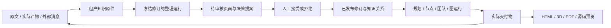

# 知识与产物工作台

本功能把 AwwO 的资料、知识修订、画布任务和交付物串成一个可追溯的流程：保存原文，整理为提案，审核发布，再把指定版本带入下一次任务。HTML、3D、PDF 和源码窗口常驻画布，直接预览已有产物或本地文件。

本文说明当前实现与使用方式。测试结果、浏览器截图和实际连接的验收范围应另记在本轮验收报告中；启动成功、示例显示、模拟服务通过，分别只能证明各自范围。

## 启动与入口

使用仓库根目录的 SaaS 入口。要求 Node `^22.19.0 || >=24.0.0`、npm、可用的 Go toolchain，以及 PostgreSQL 的 `initdb`、`pg_ctl`、`psql`、`createdb`。

```sh
# 首次安装 SaaS 所需依赖
npm run setup:saas

# 启动本项目数据库、Go API、worker 与 Web
npm run dev:saas
```

默认打开 `http://127.0.0.1:5189/`。启动器读取当前 checkout 的 `.local/awwo-saas/.env`，初始账号及秘密保存在该本地文件中。端口、模型连接、账号初始化和服务生命周期详见 [SaaS 本地开发指南](awwo-saas-development.md)。修改服务端连接配置后须重启对应服务。

登录后进入工作区并打开画布，在画布预览区可以使用：

- **知识地图**：浏览资料、页面、决策及其关系，导入资料，创建或审核提案，查看修订历史。
- **OpenMaus**：查看可选外部执行连接，选择已有 Bot 与任务，明确发送任务或读取消息。
- **聚焦预览**：扩大四个预览窗口所在区域；每个窗口还可单独放大。
- **文件选择／上传／示例**：读取当前画布产物、选择本地文件，或生成明确标记的本地演示文件。

reader 可以查看知识和产物，不能导入、审核、恢复、发起整理、带入新任务或发送外部任务。写权限同时由 Go API 校验。

## 使用流程

### 1. 保留原始资料

在“知识地图”导入 UTF-8 文本或 Markdown，可填写来源地址。地址是来源描述，保存时不会自动访问该 URL 或抓取网页。单份知识正文最大 256 KiB，标题最大 200 个 UTF-8 字节。

“产物入库”从当前画布的实际 artifact 读取文本并复制到知识存储，保存 artifact、run、node、canvas 和内容哈希等来源信息。入库的知识原件独立于 artifact 生命周期；删除旧画布不会删除这份资料。PDF、3D、ZIP 的可视预览不会自动进行 OCR、模型分析或知识入库。

原件类型为 `source`，正文不能修订或覆盖。需要记录不同内容时导入新原件。同一租户按内容哈希去重正文；相同正文从不同 URL、artifact 或 OpenMaus 消息再次导入时，另存来源记录，保留新来源身份，不修改最初修订。相同标题不代表相同原件。

### 2. 整理与审核

可以手工创建 `page`（知识页面）或 `decision`（决策）提案，也可以选择 1–8 份资料点击“整理知识”。整理会创建可查询的持久运行，使用当前租户允许且实际可用的模型配置。

编译器输出 1–8 个待审核页面，每页显式列出所用 `sourceRevisionIds`。服务端校验输出结构、文本容量、来源是否属于本次冻结资料，以及正文是否包含对应 document/revision 身份；不合法输出标记为失败，不发布知识。该检查只验证引用身份和格式，不能证明每条自然语言结论都得到原文支持，仍需人工核对。

在提案面板检查正文、来源与关系，然后接受或拒绝。接受会原子创建新修订、更新当前关系，并记录操作人及审计信息；拒绝不修改已发布页面。并发修改导致版本冲突时，要读取新版本后重新整理，不能覆盖他人的修改。

“历史整理任务”可以查看近期整理运行并恢复提案接收。每个页面使用稳定的操作身份，重复接收不会重复创建同一提案。关闭面板不会取消已受理的后台运行；运行仍有自己的状态、超时和配额限制。

### 3. 把固定版本带回任务

选中资料或页面后点击“加入任务”，所选修订会用于接下来的画布规划、节点任务或图运行。每次最多 8 个修订，冻结资料的 JSON 总量最多 64 KiB，还必须满足所选模型的上下文预算。

运行保存 `documentId`、`revisionId`、`contentHash` 及当时正文；后续知识修订不会改变已受理任务的证据。服务端重新读取并验证修订，前端不能凭传入正文替换服务端原件。知识内容以引用数据进入用户消息，系统层只提供固定的证据使用规则。资料中出现的指令不因此获得系统指令权限。

知识关系与执行图的依赖边分开保存。`cites`、`supports`、`contradicts`、`derived_from`、`links_to` 表示知识关系，允许知识形成循环；这些边不会自动启动 Agent 或改变执行 DAG。

### 4. 查看历史与恢复

知识页面保留修订内容及当时关系。恢复旧版本会创建一个新修订，并恢复该版本的关系，已有历史继续保留。原始资料没有覆盖式恢复入口。

列表和历史都受服务端容量限制：知识快照按序列化后的 4 MiB 总预算分配各部分，单次历史最多 2 MiB。界面出现截断提示时，不应把当前可见列表当成完整知识库；可缩小搜索范围，历史通过“读取更早版本”继续加载。固定引用可以按修订 ID 读取原版本，完整读取契约以 `knowledge.go` 与 `knowledgeApi.ts` 为准。

## 四类画布预览

桌面同时保留四个窗口，窄屏可纵向排列。窗口可以为空；没有真实产物时，不会把示例伪装为任务结果。选择本地文件只在浏览器内读取，不会自动上传、保存到知识库或交给模型；切换工作区或画布会清除当前预览选择。

| 窗口 | 支持内容与交互 | 主要边界 |
| --- | --- | --- |
| HTML | `.html` / `.htm`；静态预览、查看源码，明确开启页面交互 | 最大 2 MiB；默认禁止脚本；交互仅允许隔离 iframe 内联脚本，不能获得 AwwO 同源身份或存储权限 |
| 3D | `.glb`、内嵌资源的 glTF 2.0、`.obj`；真实 WebGL、拖动旋转、滚轮缩放、重置视角 | 最大 20 MiB；拒绝任意外链、OBJ 外部材质及不支持的贴图；几何、实例、节点与贴图另有预算 |
| PDF | `.pdf`；真实页面画布、上一页／下一页、缩放 | 最大 20 MiB、500 页；不支持密码文档；不开启 PDF 脚本、表单/XFA 或注释交互层 |
| IDE | `workspace.zip`、常见 UTF-8 源文件；文件树、文件切换、行号、当前文件搜索 | ZIP 最大 8 MiB；最多 200 个条目；单文件 2 MiB、解压后源码共 16 MiB；每文件显示前 20,000 行；只读，不执行终端命令 |

HTML 清理器与 CSP 限制外部资源、表单提交和嵌套页面。开启脚本交互后仍使用不含 `allow-same-origin` 的 iframe；浏览器 iframe 自导航等边界使它不能被描述为完整网络隔离沙箱。需要外部 CDN、联网接口或 AwwO 登录状态的网页可能无法正常工作。

3D 在加载前检查 glTF 的内嵌资源、树结构和 accessor 数量，按实际节点与实例计算几何预算；OBJ 按三角化后的数量限制。纹理只接受经尺寸检查的内嵌 PNG/JPEG/WebP。外部纹理、`.mtl` 或依赖外部解码器的模型应先在原制作工具导出为受支持的自包含文件。无法创建 WebGL 或文件无效时显示错误，不用静态图片冒充渲染成功。

PDF.js 使用随构建分发的 worker、CMap 与标准字体资源，逐页渲染；读取和单页渲染各有 15 秒期限。下载、字体授权和不支持的格式应以窗口提示为准。源码 ZIP 不解压到服务器文件系统；拒绝路径穿越、绝对路径、重复路径、超量条目及实际解压膨胀。

预览切换和组件卸载会取消读取、撤销对象 URL，并销毁 PDF worker、WebGL 资源和控制器。上传成功或扩展名正确并不保证文件可渲染，内容校验和渲染错误会在对应窗口显示。

## OpenMaus 可选连接

该连接是由 AwwO 服务端代理的外部 Bot 接口。默认关闭，AwwO 不会自动安装、启动或配置 OpenMaus，也不会把其电脑控制、浏览器、MCP 或技能执行能力复制进 AwwO 后端。

管理员在当前部署的服务端环境配置以下形状，值仅为占位示例：

```dotenv
AWWO_OPENMAUS_CONNECTIONS_JSON=[{"tenantId":"YOUR_AWWO_TENANT_ID","url":"https://maus.example.test","token":"REPLACE_WITH_PAIRED_SERVICE_TOKEN"}]
```

配置项为 `tenantId`、`url`、`token`；token 留在服务端，不返回给浏览器。URL 必须是明确的 HTTPS origin，或 loopback HTTP origin，不接受路径、查询、内嵌凭据或浏览器传入的新地址。远程部署还需保证 AwwO API 实际可达该 origin，loopback 指 API 所在网络环境。

**一个 OpenMaus 实例必须独占对应一个 AwwO 租户。** 服务端拒绝重复租户或重复规范 origin；运营方还必须保证不同域名、端口、反向代理别名没有指向同一个共享实例。此约束来自 OpenMaus 的共享实例信任模型，AwwO 的 `tenantId` 参数不会使上游自动具备租户隔离。不要把含其他租户 Bot 或个人会话的服务接入当前工作区。

连接成功后，操作顺序为：

1. 在 OpenMaus 自身完成服务配对、Bot、执行凭证和工具配置。
2. 在 AwwO 打开 OpenMaus 面板，刷新状态，选择实际存在的 Bot 与其所属任务。
3. 明确填写任务并点击“发送任务”。发送可能触发外部执行；上游需要的审批、输入或执行策略变更仍在 OpenMaus 处理。
4. 读取任务消息并核对结果。选择某条完整消息“存为原始资料”，再回知识地图创建和审核知识提案。

桥接会先持久记录发送操作，再调用上游；相同操作身份可查询结果。`sent` 只说明请求获得响应，不代表 Bot 已完成任务。断连、超时或回执保存失败可能标记 `unknown`，此时先查消息，不会自动重新发送。桥接不开放自动批准权限、修改审批策略或任意上游 URL 的入口。

单次上游请求限制 12 秒、响应限制 2 MiB。面板只投影 Bot、任务及文本消息；图片、被截断的内容与完整历史须到 OpenMaus 查看。入库时服务端再次读取对应消息，保存上游身份和实际文本，不信任浏览器自行提交的消息正文。

## 实现位置与数据契约



| 层 | 主要文件 | 责任 |
| --- | --- | --- |
| 画布整合 | `apps/web/src/saas/CanvasKnowledgeDock.tsx`、`SaaSApp.tsx` | 当前租户/画布作用域、四窗入口、产物列表、整理恢复与带入任务 |
| 知识界面 | `apps/web/src/saas/KnowledgeWorkbench.tsx`、`knowledgeApi.ts` | 地图、正文、搜索、导入、提案审核、历史；解析并校验 API 返回值 |
| 预览 | `apps/web/src/canvas/CanvasPreviewDesk.tsx`、`ArtifactPreview.tsx`、各 `*Preview.tsx`、`previewData.ts` | 实际字节读取、格式分流、资源预算、渲染和清理；节点交付物复用同类渲染器 |
| 知识持久化 | `backend/internal/app/knowledge.go`、`migrations/019_knowledge.sql`、`migrations/021_knowledge_source_origins.sql` | 租户隔离、原件、不可变修订、追加来源、当前关系、提案、幂等操作和审计 |
| 执行证据 | `knowledge_context.go`、`wiki_compiler.go`、`runs.go`、`team_context.go`、`graph_runs.go` | 固定版本上下文、编译输出校验、配额和预算、各运行路径的证据传递 |
| 外部连接 | `openmaus_bridge.go`、`migrations/020_openmaus_dispatch.sql`、前端 `OpenMausBridgePanel.tsx` | 服务端配置、归属校验、显式发送、回执查询、消息入库 |

知识存于 PostgreSQL，不依赖本地 Obsidian vault。知识路由位于 `/api/v1/tenants/{tenantId}/knowledge`，画布整理位于 `/canvases/{canvasId}/knowledge-compile`，桥接位于同租户下 `/openmaus`。所有写入遵循工作区权限；复合外键及查询条件保留租户边界。

知识写入的操作身份、请求哈希、发布变更和审计记录在同一事务内处理。重放同一请求返回先前结果；同身份不同参数返回冲突。接受与恢复还检查文档版本。知识原件及修订不采用“最后写入者覆盖”的更新方式。

## 验证与真实连接的区别

以下命令均从仓库根执行：

```sh
# 预览格式、安全边界与基础交互
npm run test:previews --prefix apps/web

# SaaS 前端（包含知识、OpenMaus 面板、画布集成与预览测试）
npm run test:saas --prefix apps/web
npm run typecheck:saas --prefix apps/web
npm run build:saas

# 后端：本项目独立 PostgreSQL schema、race 检查与 vet
npm run test:saas:backend

# 启动脚本与协议服务链路
npm run test:saas:scripts
npm run test:saas:stack
```

后端测试覆盖租户隔离、原件保留、CAS、幂等、恢复、上下文冻结、整理和 OpenMaus 消息协议。前端测试覆盖作用域切换、文件读取、源码选择、错误恢复和只读边界。WebGL/PDF 的浏览器真实渲染、模型实际输出及真实 OpenMaus Bot 执行，需要分别做交互验收。

可以使用现有本地模型协议 fixture 启动独立验收实例，命令和生命周期见 [浏览器协议 fixture](awwo-saas-development.md#原画布浏览器协议-fixture)。确定性模型响应和模拟 OpenMaus HTTP 服务可验证请求、状态、幂等和 UI 流程，但不能证明上游模型推理、电脑操作或外部任务完成。

四窗“示例”只用于验证浏览器渲染，文件明确标为本地演示。即使没有任何模型或 OpenMaus 凭证，这些演示和本地预览也可以工作。

模型未配置、凭证无效或模型不在允许目录时，整理与执行应显示真实不可用原因；不能从按钮可见推断任务可执行。OpenMaus 未配置时状态为 disabled，不展示虚构 Bot。配置齐备或健康检查通过之后，仍须明确发起一次范围有限的真实任务并核对结果，才算对应连接验收通过。

## 参考设计快照

本实现参考了以下固定版本的产品思路，沿用 AwwO 的认证、PostgreSQL、画布、执行配额和 worker 架构；没有整体移植这两个仓库，也不把 AwwO 描述为它们的 fork。

- [claude-obsidian，`32ac5a02c4e082e4a5628ca810776375e134708e`](https://github.com/AgriciDaniel/claude-obsidian/tree/32ac5a02c4e082e4a5628ca810776375e134708e)：参考原始资料保留、带来源的知识整理、提案检查与再次利用的循环。本实现没有安装其 Claude 插件或同步 Obsidian 文件夹。[该版本 README](https://github.com/AgriciDaniel/claude-obsidian/blob/32ac5a02c4e082e4a5628ca810776375e134708e/README.md)
- [OpenMausBot，`104fd17b8f7767e71ba3cf40f27f9c6279b507bd`](https://github.com/milind-soni/OpenMausBot/tree/104fd17b8f7767e71ba3cf40f27f9c6279b507bd)：参考外部 Bot、任务与消息协议，采用可选 HTTP 桥接。上游核心与 `enterprise/` 有不同许可范围，部署上游应核对所使用版本的[许可说明](https://github.com/milind-soni/OpenMausBot/blob/104fd17b8f7767e71ba3cf40f27f9c6279b507bd/LICENSING.md)；本功能没有引入其 enterprise 实现。

预览使用锁定版本的 Three.js、PDF.js 与 fflate；依赖和各自许可证以 `apps/web/package-lock.json`、包内容及 PDF 窗口中的授权链接为准。
