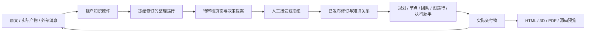

# 知识与产物工作台

本功能把 AwwO 的资料、知识修订、画布任务和交付物串成一个可追溯的流程：保存原文，整理为提案，审核发布，再把指定版本带入下一次任务。HTML、3D、PDF 和源码窗口常驻画布，直接预览已有产物或本地文件。

本文说明当前实现与使用方式。测试结果、浏览器截图和实际连接的验收范围应另记在本轮验收报告中；启动成功、示例显示、模拟服务通过，分别只能证明各自范围。

## 启动与入口

使用仓库根目录的 SaaS 入口。包含内置执行助手的完整开发环境要求 Node 24 或更新版本、npm、Git、可用的 Go toolchain，以及 PostgreSQL 的 `initdb`、`pg_ctl`、`psql`、`createdb`。执行工作区命令还需要可用的 Docker daemon 和 workspace 镜像；部署准备见下文，最终用户只使用 AwwO。

```sh
# 首次安装 SaaS 所需依赖
npm run setup:saas

# 启动本项目数据库、Go API、worker 与 Web
npm run dev:saas
```

默认打开 `http://127.0.0.1:5189/`。启动器读取当前 checkout 的 `.local/awwo-saas/.env`，初始账号及秘密保存在该本地文件中。端口、模型连接、账号初始化和服务生命周期详见 [SaaS 本地开发指南](awwo-saas-development.md)。修改服务端连接配置后须重启对应服务。

登录后进入工作区并打开画布，在画布预览区可以使用：

- **知识地图**：浏览资料、页面、决策及其关系，导入资料，创建或审核提案，查看修订历史。
- **执行助手**：使用 AwwO「我的引擎」中的模型创建工作区任务，查看历史、审批工具调用、回复问题、停止任务并保存真实产物。
- **聚焦预览**：扩大四个预览窗口所在区域；每个窗口还可单独放大。
- **文件选择／上传／示例**：读取当前画布产物、选择本地文件，或生成明确标记的本地演示文件。

reader 可以查看知识、执行历史和产物，不能导入、审核、恢复、发起整理、带入新任务或创建执行任务。审批、回答问题和停止任务还要求当前用户是该运行的发起人。权限由 Go API 再次校验。

## 使用流程

### 1. 保留原始资料

在“知识地图”导入 UTF-8 文本或 Markdown，可填写来源地址。地址是来源描述，保存时不会自动访问该 URL 或抓取网页。单份知识正文最大 256 KiB，标题最大 200 个 UTF-8 字节。

“产物入库”从当前画布的实际 artifact 读取文本并复制到知识存储，保存 artifact、run、node、canvas 和内容哈希等来源信息。入库的知识原件独立于 artifact 生命周期；删除旧画布不会删除这份资料。PDF、3D、ZIP 的可视预览不会自动进行 OCR、模型分析或知识入库。

原件类型为 `source`，正文不能修订或覆盖。需要记录不同内容时导入新原件。同一租户按内容哈希去重正文；相同正文从不同 URL、artifact 或 OpenMaus 消息再次导入时，另存来源记录，保留新来源身份，不修改最初修订。相同标题不代表相同原件。

### 2. 整理与审核

可以手工创建 `page`（知识页面）或 `decision`（决策）提案，也可以选择 1–8 份资料点击“整理知识”。整理会创建可查询的持久运行，使用当前租户允许且实际可用的模型配置。

编译器输出 1–8 个待审核页面，每页显式列出所用 `sourceRevisionIds`。服务端校验输出结构、文本容量、来源是否属于本次冻结资料，以及正文是否包含对应 document/revision 身份；不合法输出标记为失败，不发布知识。该检查只验证引用身份和格式，不能证明每条自然语言结论都得到原文支持，仍需人工核对。

在提案面板检查正文、来源与关系，然后接受或拒绝。接受会原子创建新修订、更新当前关系，并记录操作人及审计信息；拒绝不修改已发布页面。并发修改导致版本冲突时，要读取新版本后重新整理，不能覆盖他人的修改。

“历史整理任务”可以查看近期整理运行并恢复提案接收。每个页面使用稳定的操作身份，重复接收不会重复创建同一提案。关闭面板不会取消已受理的后台运行；运行仍有自己的状态、超时和配额限制。

### 3. 把固定版本带回任务

选中资料或页面后点击“加入任务”，所选修订会用于接下来的画布规划、节点任务或图运行。每次最多 8 个修订，冻结资料的 JSON 总量最多 64 KiB，还必须满足所选模型的上下文预算。

运行保存 `documentId`、`revisionId`、`contentHash` 及当时正文；后续知识修订不会改变已受理任务的证据。服务端重新读取并验证修订，前端不能凭传入正文替换服务端原件。知识内容以引用数据进入用户消息，系统层只提供固定的证据使用规则。资料中出现的指令不因此获得系统指令权限。

知识关系与执行图的依赖边分开保存。`cites`、`supports`、`contradicts`、`derived_from`、`links_to` 表示知识关系，允许知识形成循环；这些边不会自动启动 Agent 或改变执行 DAG。

### 4. 查看历史与恢复

知识页面保留修订内容及当时关系。恢复旧版本会创建一个新修订，并恢复该版本的关系，已有历史继续保留。原始资料没有覆盖式恢复入口。

列表和历史都受服务端容量限制：知识快照按序列化后的 4 MiB 总预算分配各部分，单次历史最多 2 MiB。界面出现截断提示时，不应把当前可见列表当成完整知识库；可缩小搜索范围，历史通过“读取更早版本”继续加载。固定引用可以按修订 ID 读取原版本，完整读取契约以 `knowledge.go` 与 `knowledgeApi.ts` 为准。

## 四类画布预览

桌面同时保留四个窗口，窄屏可纵向排列。窗口可以为空；没有真实产物时，不会把示例伪装为任务结果。选择本地文件只在浏览器内读取，不会自动上传、保存到知识库或交给模型；切换工作区或画布会清除当前预览选择。

| 窗口 | 支持内容与交互 | 主要边界 |
| --- | --- | --- |
| HTML | `.html` / `.htm`；静态预览、查看源码，明确开启页面交互 | 最大 2 MiB；默认禁止脚本；交互仅允许隔离 iframe 内联脚本，不能获得 AwwO 同源身份或存储权限 |
| 3D | `.glb`、内嵌资源的 glTF 2.0、`.obj`；真实 WebGL、拖动旋转、滚轮缩放、重置视角 | 最大 20 MiB；拒绝任意外链、OBJ 外部材质及不支持的贴图；几何、实例、节点与贴图另有预算 |
| PDF | `.pdf`；真实页面画布、上一页／下一页、缩放 | 最大 20 MiB、500 页；不支持密码文档；不开启 PDF 脚本、表单/XFA 或注释交互层 |
| IDE | `workspace.zip`、常见 UTF-8 源文件；文件树、文件切换、行号、当前文件搜索 | ZIP 最大 8 MiB；最多 200 个条目；单文件 2 MiB、解压后源码共 16 MiB；每文件显示前 20,000 行；只读，不执行终端命令 |

HTML 清理器与 CSP 限制外部资源、表单提交和嵌套页面。开启脚本交互后仍使用不含 `allow-same-origin` 的 iframe；浏览器 iframe 自导航等边界使它不能被描述为完整网络隔离沙箱。需要外部 CDN、联网接口或 AwwO 登录状态的网页可能无法正常工作。

3D 在加载前检查 glTF 的内嵌资源、树结构和 accessor 数量，按实际节点与实例计算几何预算；OBJ 按三角化后的数量限制。纹理只接受经尺寸检查的内嵌 PNG/JPEG/WebP。外部纹理、`.mtl` 或依赖外部解码器的模型应先在原制作工具导出为受支持的自包含文件。无法创建 WebGL 或文件无效时显示错误，不用静态图片冒充渲染成功。

PDF.js 使用随构建分发的 worker、CMap 与标准字体资源，逐页渲染；读取和单页渲染各有 15 秒期限。下载、字体授权和不支持的格式应以窗口提示为准。源码 ZIP 不解压到服务器文件系统；拒绝路径穿越、绝对路径、重复路径、超量条目及实际解压膨胀。

预览切换和组件卸载会取消读取、撤销对象 URL，并销毁 PDF worker、WebGL 资源和控制器。上传成功或扩展名正确并不保证文件可渲染，内容校验和渲染错误会在对应窗口显示。

## 内置执行助手

默认入口使用 AwwO 托管的真实 OpenMaus 开源核心，固定提交为 `104fd17b8f7767e71ba3cf40f27f9c6279b507bd`。每个运行自动建立独立核心进程、Bot 会话和 Docker 工作区；用户不需要在另一个 OpenMaus 界面创建 Bot、配对服务或再次录入模型密钥。

模型直接来自 AwwO「我的引擎」的实际可用目录。用户选择模型、填写本次角色与任务即可开始；当前画布已选中的知识修订可以随任务冻结。提供商凭证仍由 AwwO 的模型连接管理，核心只获得本次运行的代理凭证。没有可用模型时，界面引导回「我的引擎」；执行服务或 Docker 不可用时，显示真实未就绪状态。

### 从任务到知识归档

1. 在画布打开“执行助手”，选择现有模型并提交任务。任务历史可以重新打开，关闭面板不会自动取消已经受理的运行。
2. 遇到工具审批时，核对动作说明与完整 JSON 参数，明确选择本次允许或拒绝；遇到问题时填写回答。服务端只接受原发起人且具有写权限的响应，不提供自动批准入口。
3. 需要中止时点击“停止任务”，继续读取服务端状态直到确认终态；取消请求被受理不等于资源已经清理。拒绝、执行失败或超限不会被最终回复伪装成成功。
4. 查看真实消息和已发布文件。新产物会刷新当前画布的 HTML、3D、PDF、源码四窗候选列表；各窗口按文件格式和预算实际加载，发布成功不保证所有文件都能渲染。
5. 对支持的 UTF-8 文本产物选择“存为原始资料”。服务端读取 artifact 的实际字节并保留运行来源，再进入知识地图整理、审核和发布。PDF、3D、ZIP 仍不自动进行语义入库。

创建任务和审批响应都带持久操作身份。不确定的回执显示为“待核对”，界面不自动重发；用户核对时复用原操作身份，不创建第二个任务或换一个身份重试工具批准。运行历史、消息及产物来自服务端，页面刷新不会把本地状态当成执行结果。消息、结果或列表被容量限制截断时会明确提示。

### 当前执行范围

固定工具为工作区 `list/read/write/exec/publish/archive`，另有核心原生问题询问。文件操作和命令在真实 Docker 容器中执行：无网络、只读根文件系统、非 root、无宿主目录挂载，具有资源和时间限制。模型与任务容器不能访问 Docker socket 或提供商密钥。

**当前能力是工作区命令与文件执行，不包含宿主桌面、鼠标键盘、浏览器 GUI 或任意主机 shell 控制。** 构建时关闭上游 computer use，仅挂载固定的 `awwo_workspace` MCP，禁用额外 Agent 和连接器能力。本实现不引入上游 `enterprise/`。

用户任务上限 32 KiB UTF-8，问题回答上限 8 KiB UTF-8，每次最多带入 8 个知识修订。完整审批参数最多 512 KiB；消息与最终输出各有独立容量限制。worker 单文件或 ZIP 最多 2 MiB，产物总计最多 8 MiB、16 个；默认运行期限 5 分钟、模型请求 16 次，具体部署可在受限范围内调整。详情见 [托管 worker 契约与限制](../apps/openmaus-worker/README.md)。

### 部署人员：服务与 Docker 准备

这些是 AwwO 部署要求，不是产品用户的第二套配置。`npm run setup:saas` 安装并构建固定提交的开源核心，并尝试构建 `awwo-workspace:20261001`；`npm run dev:saas` 启动托管 worker，生成本地内部令牌，并连接现有 API 模型代理。Docker 或镜像缺失时，其他 AwwO 页面仍可运行，但执行助手不能报告可执行。

容器部署使用 `deploy/saas/openmaus.Dockerfile` 和 `deploy/saas/compose.yml`。部署人员需要预先构建 workspace 镜像、给受信任 worker 配置 Docker socket 及其组权限，设置专用 `AWWO_OPENMAUS_TOKEN`，并确保 API 与 worker 的内部地址互通。不要把 worker 端口公开给浏览器或公网，也不要把 Docker socket 挂入任务容器。

| 服务设置 | 用途 |
| --- | --- |
| `AWWO_OPENMAUS_URL` / `AWWO_OPENMAUS_TOKEN` | API 到内部 worker 的地址与专用鉴权；令牌至少 32 字符 |
| `AWWO_COMPUTER_MODEL_PROXY_URL` | worker 访问 AwwO 模型代理的地址 |
| `AWWO_OPENMAUS_MODEL_PROXY_ORIGINS` | worker 允许的代理 origin；Compose 配为内部 API origin |
| `AWWO_OPENMAUS_DOCKER` / `AWWO_OPENMAUS_DOCKER_CONTEXT` | 受信任 Docker CLI 的绝对路径及可选 context |
| `AWWO_OPENMAUS_WORKSPACE_IMAGE` | 已有 workspace 镜像，建议固定 digest 或 image ID；运行时不会自动拉取 |

带内部鉴权的 `/health` 在核心或工作区不可用时返回 HTTP 503。启动器识别这一状态，但不会把它当成任务执行成功。正常结束等待核心进程和容器清理；机器掉电或 SIGKILL 后，应由部署监督器核查孤立任务容器，不能假定已经回收。

### 旧外部桥接的兼容范围

旧 `/openmaus` 路由和 `OpenMausBridgePanel.tsx` 保留为高级 API 兼容，不再是默认用户入口，也不参与内置助手模型连接。只有维护既有外部部署时，运营方才使用 `AWWO_OPENMAUS_CONNECTIONS_JSON` 配置 `tenantId`、HTTPS/loopback origin 和服务 token。

外部实例必须独占一个 AwwO 租户，不能通过不同域名或代理别名将同一共享实例绑定给多个租户。旧桥接只支持显式发送、回执查询、读取消息和复制实际消息入库；`sent` 不代表完成，`unknown` 不自动重发，上游审批策略仍归外部实例处理。其单次上游请求 12 秒、响应 2 MiB 的限制只适用于此兼容桥接。

## 实现位置与数据契约



| 层 | 主要文件 | 责任 |
| --- | --- | --- |
| 画布整合 | `apps/web/src/saas/CanvasKnowledgeDock.tsx`、`SaaSApp.tsx` | 当前租户/画布作用域、四窗入口、产物列表、整理恢复与带入任务 |
| 知识界面 | `apps/web/src/saas/KnowledgeWorkbench.tsx`、`knowledgeApi.ts` | 地图、正文、搜索、导入、提案审核、历史；解析并校验 API 返回值 |
| 预览 | `apps/web/src/canvas/CanvasPreviewDesk.tsx`、`ArtifactPreview.tsx`、各 `*Preview.tsx`、`previewData.ts` | 实际字节读取、格式分流、资源预算、渲染和清理；节点交付物复用同类渲染器 |
| 知识持久化 | `backend/internal/app/knowledge.go`、`migrations/019_knowledge.sql`、`migrations/021_knowledge_source_origins.sql` | 租户隔离、原件、不可变修订、追加来源、当前关系、提案、幂等操作和审计 |
| 执行证据 | `knowledge_context.go`、`wiki_compiler.go`、`runs.go`、`team_context.go`、`graph_runs.go` | 固定版本上下文、编译输出校验、配额和预算、各运行路径的证据传递 |
| 内置执行界面 | `ManagedExecutionPanel.tsx`、`managedExecutionApi.ts` | 同一模型目录、任务历史、审批和问题、停止、产物归档与刷新 |
| 内置执行后端 | `computer_execution.go`、`computer_model_proxy.go`、`migrations/022_computer_execution.sql` | 运行授权、持久审批、幂等回执、个人模型代理、产物与配额 |
| 托管核心与沙箱 | `apps/openmaus-worker/`、`apps/computer-model.ts`、`workspace-sandbox.ts` | 固定上游核心、原生工具审批、隔离工作区、模型协议转换和资源清理 |
| 外部兼容 API | `openmaus_bridge.go`、`migrations/020_openmaus_dispatch.sql`、`OpenMausBridgePanel.tsx` | 旧外部实例的租户绑定、显式发送、回执查询、消息入库 |

知识存于 PostgreSQL，不依赖本地 Obsidian vault。知识路由位于 `/api/v1/tenants/{tenantId}/knowledge`；同租户内的画布整理使用 `/canvases/{canvasId}/knowledge-compile`，执行助手通过 `/computer-runtime` 获取实际能力和模型，通过 `/canvases/{canvasId}/computer-runs` 创建或列出运行，通过 `/computer-runs/{runId}` 读取详情，审批使用其 `/respond`，停止复用 `/runs/{runId}/cancel`。旧桥接保留在 `/openmaus`。所有写入遵循工作区权限；复合外键及查询条件保留租户边界。

知识写入的操作身份、请求哈希、发布变更和审计记录在同一事务内处理。重放同一请求返回先前结果；同身份不同参数返回冲突。接受与恢复还检查文档版本。知识原件及修订不采用“最后写入者覆盖”的更新方式。

## 验证与真实连接的区别

以下命令均从仓库根执行：

```sh
# 预览格式、安全边界与基础交互
npm run test:previews --prefix apps/web

# SaaS 前端（包含知识、执行助手、旧桥接、画布集成与预览测试）
npm run test:saas --prefix apps/web
npm run typecheck:saas --prefix apps/web
npm run build:saas

# 后端：本项目独立 PostgreSQL schema、race 检查与 vet
npm run test:saas:backend

# 启动脚本与协议服务链路
npm run test:saas:scripts
npm run test:saas:stack

# 内置执行核心与模型代理；真实 Docker 测试的显式开关见 worker README
npm run test:saas:openmaus
npm run test:saas:computer-model
```

后端测试覆盖租户隔离、原件保留、CAS、幂等、恢复、上下文冻结、整理，以及内置执行的授权、审批、模型代理和产物记录。前端测试覆盖作用域切换、文件读取、错误恢复、原操作核对和只读边界。WebGL/PDF 的浏览器真实渲染、真实核心与 Docker 执行、实际提供商模型输出，需要分别验收；定向检查通过不代表全后端竞态测试完成。

可以使用现有本地模型协议 fixture 启动独立验收实例，命令和生命周期见 [浏览器协议 fixture](awwo-saas-development.md#原画布浏览器协议-fixture)。托管 worker 的真实集成测试启动固定提交的核心与真实 Docker，仅模型 HTTP 响应使用确定性 fixture；它能够验证实际工作区命令、文件和审批协议，但不证明真实提供商的推理质量。旧桥接的模拟 HTTP 测试只覆盖桥接协议。

四窗“示例”只用于验证浏览器渲染，文件明确标为本地演示。即使没有任何模型或 OpenMaus 凭证，这些演示和本地预览也可以工作。

模型未配置、凭证无效或模型不在允许目录时，整理与执行应显示真实不可用原因；不能从按钮可见推断任务可执行。执行助手在无模型时仅引导用户连接 AwwO「我的引擎」，核心或 Docker 不可用时显示服务未就绪。配置齐备或健康检查通过之后，仍须明确发起一次范围有限的任务并核对实际结果，才算对应连接验收通过。

## 参考设计快照

本实现沿用 AwwO 的认证、PostgreSQL、画布、执行配额和 worker 架构。知识工作流参考 claude-obsidian，执行助手构建并运行固定提交的 OpenMaus 开源核心；没有整体移植它们的用户界面，也不把 AwwO 描述为它们的 fork。

- [claude-obsidian，`32ac5a02c4e082e4a5628ca810776375e134708e`](https://github.com/AgriciDaniel/claude-obsidian/tree/32ac5a02c4e082e4a5628ca810776375e134708e)：参考原始资料保留、带来源的知识整理、提案检查与再次利用的循环。本实现没有安装其 Claude 插件或同步 Obsidian 文件夹。[该版本 README](https://github.com/AgriciDaniel/claude-obsidian/blob/32ac5a02c4e082e4a5628ca810776375e134708e/README.md)
- [OpenMausBot，`104fd17b8f7767e71ba3cf40f27f9c6279b507bd`](https://github.com/milind-soni/OpenMausBot/tree/104fd17b8f7767e71ba3cf40f27f9c6279b507bd)：内置使用固定提交的 Apache-2.0 开源核心，构建保留 LICENSE、NOTICE 与第三方许可，并记录 AwwO 的限制性修改。上游核心与 `enterprise/` 有不同许可范围，详见该版本[许可说明](https://github.com/milind-soni/OpenMausBot/blob/104fd17b8f7767e71ba3cf40f27f9c6279b507bd/LICENSING.md)及仓库 `third_party/openmaus-core/`；本功能没有引入 enterprise 实现。

预览使用锁定版本的 Three.js、PDF.js 与 fflate；依赖和各自许可证以 `apps/web/package-lock.json`、包内容及 PDF 窗口中的授权链接为准。
