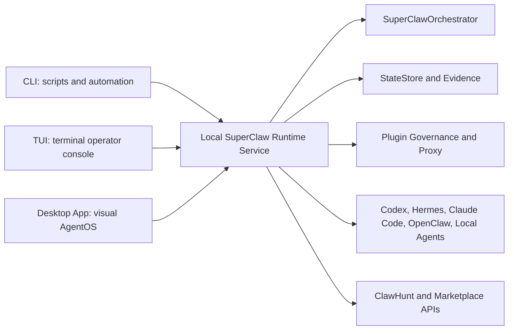
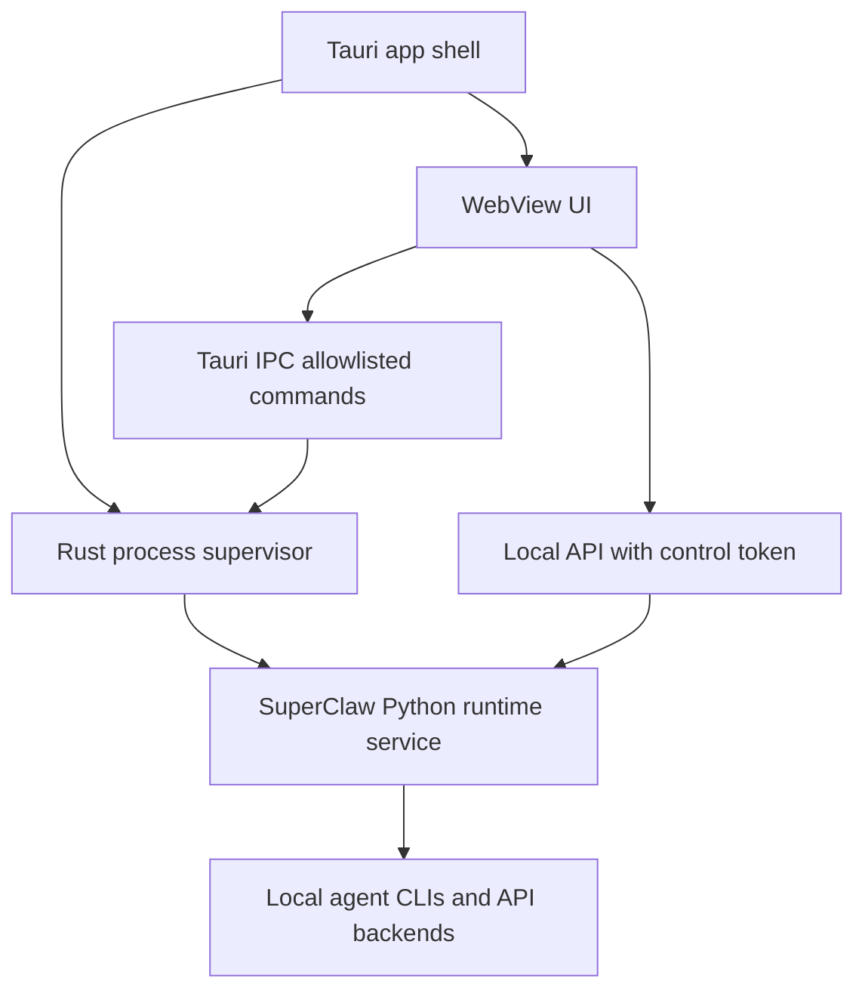

# SuperClaw TUI And Desktop App Roadmap

Date: 2026-06-03

## Purpose

This document defines how SuperClaw should evolve from the current Runtime Shell into a stronger TUI and, later, a distributable desktop app.

The goal is not to replace the current CLI. The goal is to keep the delivery harness, evidence model, plugin runtime, and local agent backends stable, then add better operator surfaces on top.

## Current Baseline

SuperClaw currently has:

- A Python/Typer CLI entrypoint: `superclaw`.
- A `prompt_toolkit` Runtime Shell with slash commands, command completion, backend configuration, mode persistence, Codex direct chat, and delivery orchestration.
- A FastAPI app under `apps/api` with run, chat, evidence, event stream, plugin, ClawHunt, and runtime endpoints.
- A Vite web app under `apps/web`.
- A shared Python control plane around `SuperClawOrchestrator`, `StateStore`, evidence bundles, plugin governance, and worker backends.

Important boundary:

- The shell is currently a prompt loop, not a full-screen TUI.
- The desktop app should not reimplement orchestration logic in TypeScript/Rust.
- All serious UI surfaces should call a local SuperClaw runtime service or shared Python API, not duplicate business logic.

## External Architecture Notes

The current shell already uses `prompt_toolkit`, which is suitable for prompt-based shells. The official `prompt_toolkit` documentation also supports full-screen applications composed from layouts, styles, key bindings, and widgets, but building a large multi-pane product this way will become custom-heavy. See [prompt_toolkit full-screen apps](https://python-prompt-toolkit.readthedocs.io/en/3.0.40/pages/full_screen_apps.html).

Textual is a stronger candidate for a modern terminal application because it provides higher-level widgets, layout, styling, themes, command palette patterns, workers, and testing support. See [Textual documentation](https://textual.textualize.io/).

For desktop, Tauri is the preferred first path because its official docs frame it around a Rust backend, system WebView, IPC, permissions, command scopes, capabilities, CSP, app size, and process model. See [Tauri Core Concepts](https://v2.tauri.app/concept/). Electron remains a valid fallback for speed and ecosystem, but its official process model requires careful main/renderer/preload separation, IPC, context isolation, and utility processes. See [Electron Process Model](https://www.electronjs.org/docs/latest/tutorial/process-model).

Gemini review outcome:

- Use Textual for the serious TUI layer rather than forcing the existing prompt loop into a dashboard.
- Use Tauri for the desktop shell first, with Electron only as a fallback if Python sidecar packaging or frontend velocity becomes the dominant constraint.
- Keep all CLI, TUI, web, and desktop surfaces pointed at the same orchestrator/state/evidence API.

## Product Direction

SuperClaw should expose three operator surfaces over one runtime:



### Surface Roles

CLI:

- Best for automation, CI, scripting, regression tests, and headless runs.
- Must remain stable and backward compatible.

Prompt Shell:

- Best for lightweight interactive use, quick config, direct chat, and delivery commands.
- Should remain the default `superclaw` experience until the full TUI is proven.

Full TUI:

- Best for power users who need a live run cockpit, task graph visibility, logs, evidence review, backend readiness, and plugin status inside a terminal.
- Should be a new command, likely `superclaw tui`.

Desktop App:

- Best for non-CLI users, plugin marketplace usage, evidence inspection, ClawHunt task browsing, visual configuration, notifications, and paid plugin workflows.
- Should be built as a local-first app that supervises a SuperClaw runtime service.

## Design Principles

1. One runtime, multiple clients.
2. UI never owns delivery truth; `StateStore`, evidence bundles, and orchestrator events own delivery truth.
3. Desktop renderer never gets raw secrets or unrestricted shell access.
4. Agent backends remain replaceable runtime adapters.
5. Every UI action must map to a public command/API contract.
6. Every phase must be testable without a human watching the UI.
7. Desktop must start local-first before adding cloud sync, billing, and marketplace flows.

## Recommended Technical Strategy

### Short Term

Keep the existing `prompt_toolkit` shell and improve it in place for low-risk wins:

- Better slash-command grouping and descriptions.
- More visible mode/backend/agent status.
- Config wizard for `codex`, `claude`, `hermes`, `openclaw`, ClawHunt key, and plugin paths.
- Run status summaries that show lifecycle, failure reason, and evidence path.
- Command history and session resume UX.
- Safer copyable commands for troubleshooting.

Add a separate `superclaw tui` proof of concept only after the shell contracts are stable.

### Medium Term

Build `superclaw tui` with Textual:

- Python-native.
- Can reuse local modules directly.
- Better for multi-pane terminal UI than extending the prompt loop.
- Easier to test with snapshot-like widget tests than raw terminal control output.

### Desktop Term

Build `apps/desktop` with Tauri first:

- Tauri shell starts or connects to a local SuperClaw runtime service.
- UI can reuse `apps/web` components or a shared frontend package.
- Rust side handles native window, tray, update hooks, local process supervision, and IPC boundaries.
- Python side remains the delivery runtime.

Electron fallback conditions:

- Choose Electron only if Tauri sidecar packaging blocks progress for too long.
- Choose Electron if the web app must use complex Node-native desktop integrations quickly.
- If using Electron, enforce context isolation, preload-only IPC, and renderer sandboxing.

## Target User Experience

### TUI Home

The TUI home should show:

- Current workspace/repo.
- Selected mode: `auto`, `chat`, or `delivery`.
- Selected backend and readiness.
- ClawHunt authentication status.
- Active run count and last run.
- Plugin cache/entitlement status.
- Warnings for missing required local agents.

Acceptance:

- User can see whether they are about to chat or run delivery.
- User can configure missing agents from the TUI.
- User can launch a chat or delivery task without leaving the screen.

### TUI Run Cockpit

Run cockpit should show:

- Run timeline.
- Task graph or topology.
- Current worker role.
- Backend being used.
- Live event stream.
- Worker log tail.
- Evidence verdict.
- Failure reason.
- Resume/cancel/reconcile controls.

Acceptance:

- A local dry-run and a real local backend run can be started and monitored.
- Cancel and reconcile actions are visible and tested.
- Evidence path and protocol export path are discoverable.

### TUI Plugin Center

Plugin center should show:

- Cached plugins.
- Verification status.
- Required settings/secrets without printing secret values.
- Entitlement/revocation state.
- Runtime diagnostics.

Acceptance:

- User can inspect plugin readiness without opening JSON.
- Missing config produces actionable commands.
- Secret values are never printed.

### Desktop App Home

Desktop home should show:

- Runtime health.
- Agent readiness cards.
- Active/recent runs.
- ClawHunt account status.
- Plugin marketplace status.
- Evidence review shortcuts.

Acceptance:

- Fresh install can launch the app and detect missing local runtimes.
- User can configure Codex/Hermes/Claude Code/OpenClaw paths.
- User can run a local dry-run delivery and see results visually.

## Phased Roadmap

### Phase 0: UI Contract Hardening

Goal:

- Make sure every current shell action has a stable command/API contract before building more UI.

Scope:

- Define a normalized `RuntimeStatus` payload.
- Define a normalized `AgentStatus` payload.
- Define a normalized `RunSummary` payload.
- Define a normalized `PluginStatus` payload.
- Add a shared renderer-neutral formatting layer for status summaries.

Implementation candidates:

- `packages/superclaw/src/superclaw/ui_contracts.py`
- API routes reuse these contracts.
- CLI/TUI/Desktop all consume the same shapes.

Acceptance:

- Tests prove CLI status, API status, and shell status expose the same backend/mode/auth/run fields.
- No UI-only hidden state for backend, mode, repo, run id, or auth status.
- `git diff --check` and targeted CLI/API tests pass.

Non-goals:

- No new desktop app.
- No Textual dependency yet unless needed for a prototype.

### Phase 1: Prompt Shell Polish

Goal:

- Make the existing `superclaw` shell feel intentional and usable before adding a second TUI.

Scope:

- Add `/setup` guided configuration.
- Add `/status` high-signal runtime summary.
- Add `/runs` and `/run RUN_ID` inspection.
- Add `/evidence RUN_ID` shortcut.
- Add `/plugins doctor`.
- Add better `/help` grouping.
- Add persistent shell history if safe.
- Add clearer working states for chat vs delivery.

Acceptance:

- User can configure the selected backend without reading docs.
- `你好` still routes to direct chat in `auto` mode.
- `修复测试失败` still routes to delivery in `auto` mode.
- `/mode`, `/backend`, `/config`, and `/agents` remain backward compatible.
- Scripted shell output remains plain and testable.

Non-goals:

- No full-screen UI.
- No desktop app packaging.

### Phase 2: Textual TUI Proof Of Concept

Goal:

- Prove a full-screen terminal cockpit without destabilizing the prompt shell.

Command:

- `superclaw tui`

Layout:

- Left sidebar: sessions/runs.
- Top bar: backend, mode, repo, auth, runtime health.
- Main panel: chat or run detail.
- Bottom panel: input box and command palette.
- Right panel: evidence/plugin/agent status.

Core interactions:

- Start direct chat.
- Start delivery dry-run.
- Start local backend run.
- View run events from `/api/runs/{run_id}/events` or direct state subscription.
- Open evidence summary.
- Cancel/reconcile a run.

Acceptance:

- TUI can run in a terminal without breaking `superclaw` prompt shell.
- TUI has automated tests for mode display, backend display, command dispatch, and run event rendering.
- A demo run can be recorded or snapshotted as evidence.

Non-goals:

- No marketplace purchase flow.
- No cloud sync.
- No desktop packaging.

### Phase 3: Local Runtime Service For UI Clients

Goal:

- Turn the existing API into the stable local backend for TUI and desktop.

Scope:

- Add a `superclaw service` command.
- Bind to `127.0.0.1` by default or Unix domain socket where supported.
- Require `SUPERCLAW_CONTROL_TOKEN` or generated local token.
- Add service lifecycle metadata.
- Add `/api/runtime/status` as the UI home contract.
- Add `/api/agents`, `/api/config`, `/api/config/set` with safe allowlist.
- Add event streams for runs and plugin diagnostics.

Acceptance:

- UI can start service, call health, create a dry-run, stream events, and fetch evidence.
- Service refuses unauthenticated control calls.
- Service does not expose raw secrets.
- Service can recover if a run is already in progress.

Non-goals:

- No public remote server exposure.
- No multi-user auth.
- No production billing.

### Phase 4: Desktop App Prototype

Goal:

- Ship a local desktop prototype that wraps the SuperClaw runtime service.

Recommended stack:

- Tauri shell.
- Existing `apps/web` or shared web UI components.
- Python runtime sidecar or separately installed `superclaw` binary.
- Local API/IPC bridge.

Desktop process model:



Acceptance:

- macOS `.app` prototype launches.
- App starts or connects to local SuperClaw service.
- App shows runtime health and agent readiness.
- App can run direct Codex chat.
- App can run delivery dry-run and display evidence.
- App can shut down its owned runtime service cleanly.

Non-goals:

- No signed public release yet.
- No auto-updater yet.
- No paid marketplace yet.

### Phase 5: Desktop Beta

Goal:

- Make desktop usable by non-CLI users.

Scope:

- Installer and first-run setup.
- Runtime dependency detection.
- ClawHunt login.
- Plugin browser.
- Evidence viewer.
- Notifications for run completion/failure.
- Crash/log collection with local export.
- Manual update path.

Acceptance:

- Fresh machine install path is documented and tested.
- Missing Codex/Hermes/Claude Code/OpenClaw has clear remediation.
- User can browse ClawHunt tasks, run a delivery, and inspect evidence.
- User can install a local verified plugin and see its required configuration.

Non-goals:

- No public marketplace payments unless entitlement and security gates are complete.

### Phase 6: Marketplace-Ready Desktop

Goal:

- Support plugin commerce and governed local execution.

Scope:

- Marketplace listing UI.
- Purchase/entitlement sync.
- Revocation sync.
- Plugin install/update/uninstall.
- Secret/config manager UI.
- Runtime policy viewer.
- Evidence/audit export.
- Developer upload/review UI.

Acceptance:

- User can install an entitled plugin.
- Revoked plugin fails closed.
- Missing plugin config is shown without leaking secrets.
- Developer upload flow has verification status.
- Evidence can be exported for audit/dispute review.

## Specification Details

### Runtime Status Contract

Minimum fields:

```json
{
  "runtime_version": "0.1.0",
  "repo": "/path/to/repo",
  "state_path": ".superclaw/state.db",
  "artifact_dir": ".superclaw/artifacts",
  "backend": "codex",
  "mode": "auto",
  "auth": {
    "clawhunt": "set|unset"
  },
  "service": {
    "pid": 123,
    "bind": "127.0.0.1",
    "control_token": "set|unset"
  }
}
```

Rules:

- No raw token values.
- No raw plugin secrets.
- All paths must be explicit.
- Fields used by CLI/TUI/Desktop must have tests.

### Agent Status Contract

Minimum fields:

```json
{
  "name": "codex",
  "kind": "cli",
  "status": "READY",
  "version": "codex-cli 0.133.0",
  "executable": "/opt/homebrew/bin/codex",
  "config_env": "SUPERCLAW_CODEX_EXECUTABLE",
  "model_env": "SUPERCLAW_CODEX_MODEL",
  "configure_hint": "/config set SUPERCLAW_CODEX_EXECUTABLE /path/to/codex"
}
```

Rules:

- `READY`, `MISSING`, `ERROR`, and `UNKNOWN` are the only initial statuses.
- Missing agents must include a remediation hint.
- UI must not infer readiness from path strings alone.

### Run Summary Contract

Minimum fields:

```json
{
  "run_id": "run_...",
  "status": "completed|failed|running|paused|cancelled",
  "chain_verdict": "PASS|FAIL|CHAIN_PARTIAL",
  "backend": "codex",
  "topology": "linear",
  "started_at": 1780000000.0,
  "updated_at": 1780000010.0,
  "failure_reason": null,
  "evidence_path": ".superclaw/artifacts/run_.../evidence.json"
}
```

Rules:

- UI must show `failure_reason` when present.
- UI must show whether a run is resumable or cancellable.
- Evidence path should be copyable locally but never uploaded raw to cloud endpoints.

### UI Command Dispatch

All UI clients should dispatch through explicit action names:

- `chat.direct`
- `delivery.start`
- `run.cancel`
- `run.resume`
- `run.reconcile`
- `run.evidence.open`
- `backend.set`
- `mode.set`
- `agent.configure`
- `plugin.install`
- `plugin.configure`
- `plugin.verify`

Rules:

- Every action needs one CLI command or API endpoint equivalent.
- Every action needs an acceptance test.
- Dangerous actions need explicit confirmation.

## TUI Visual Direction

Identity:

- Keep the lobster-claw motif.
- Make it less ASCII-banner-only over time.
- Use a clear red/coral shell accent, deep ink background, sand/foam neutral text, and cyan only for status highlights.

Layout mood:

- Operator cockpit, not chatbot clone.
- Evidence-first and status-forward.
- The input box should remain obvious and stable.

Components:

- Run card.
- Agent readiness card.
- Evidence verdict badge.
- Plugin status badge.
- Event stream panel.
- Command palette.
- Config wizard modal.

## Desktop Visual Direction

Primary navigation:

- Home
- Chat
- Runs
- Evidence
- Agents
- Plugins
- ClawHunt
- Settings

Key screens:

- First-run setup
- Agent setup
- Runtime service health
- Run detail timeline
- Evidence bundle viewer
- Plugin marketplace listing
- Plugin configuration
- ClawHunt task detail
- Developer upload/review

Desktop should feel like a local control center for agent work, not a generic chat app.

## Security And Privacy Requirements

Local runtime:

- Bind to localhost or Unix socket by default.
- Require control token for mutating API calls.
- Rotate generated local token on request.
- Do not expose service publicly without explicit advanced configuration.

Renderer:

- No direct shell execution from desktop renderer.
- No raw secrets in renderer logs.
- No unrestricted filesystem access.
- All privileged calls go through allowlisted IPC/API actions.

Agents:

- Codex/Hermes/Claude Code/OpenClaw credentials remain owned by their runtimes.
- SuperClaw stores only explicit paths and safe status metadata unless a secret manager path is implemented.

Plugins:

- Use entitlement/revocation/policy gates before exposing plugin tools.
- Missing config must fail closed.
- Plugin evidence and logs must redact secrets.

Packaging:

- Desktop release must define how Python runtime is bundled, installed, or discovered.
- Desktop release must define update and rollback policy before public distribution.

## Test Strategy

Unit tests:

- Status contracts.
- Agent readiness serialization.
- Mode/backend persistence.
- UI action dispatch mapping.
- Secret redaction.

Integration tests:

- CLI starts run and API sees it.
- API starts run and TUI sees events.
- Desktop service starts and health check passes.
- Evidence viewer can load a known bundle.
- Plugin config UI never prints secrets.

E2E tests:

- Fresh setup, configure Codex, ask direct chat.
- Fresh setup, run local dry-run delivery, inspect evidence.
- Missing agent path, configure path, readiness changes to `READY`.
- Plugin install, missing config, set config, verify plugin.

Release gates:

- `pytest -q`.
- TUI snapshot or event-render tests.
- Desktop smoke on macOS first.
- No raw secret in logs.
- App can shut down owned runtime service.

## Open Questions

- Should `superclaw tui` depend on Textual immediately, or should Textual stay optional under `superclaw[tui]`?
- Should desktop bundle Python as a sidecar, require an installed `superclaw`, or support both?
- Should desktop use localhost HTTP first or Unix socket first on macOS?
- Should `apps/web` become the desktop UI directly, or should desktop have a new web package with shared components?
- What is the minimum marketplace UI needed before paid plugin workflows are useful?

## Recommended Next PRs

1. Add UI contracts:

   - `RuntimeStatus`
   - `AgentStatus`
   - `RunSummary`
   - `PluginStatus`

2. Add prompt shell commands:

   - `/status`
   - `/runs`
   - `/run RUN_ID`
   - `/evidence RUN_ID`
   - `/setup`

3. Add `superclaw service`:

   - local bind
   - token enforcement
   - health/status endpoints
   - lifecycle metadata

4. Add `superclaw tui` POC:

   - optional Textual dependency
   - run list
   - event stream
   - input panel
   - status bar

5. Add desktop spike:

   - `apps/desktop`
   - Tauri shell
   - local runtime service launcher
   - runtime health screen
   - direct chat and dry-run delivery smoke

## Decision

The best path is:

1. Harden shared UI/runtime contracts.
2. Improve the existing prompt shell.
3. Add a Textual TUI as a separate power-user surface.
4. Add a Tauri desktop shell over the same local runtime service.
5. Add marketplace and paid plugin UX only after local runtime, security, entitlement, and evidence viewing are proven.

This preserves the current SuperClaw delivery system while making the product progressively easier to operate.
