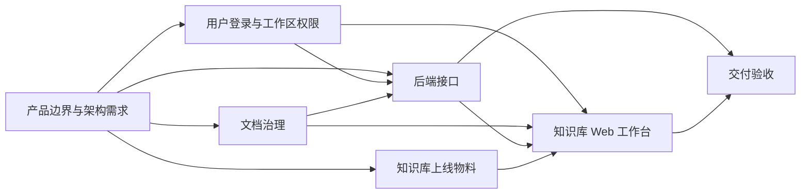

# 团队知识库 SaaS：产品边界与架构需求 v1.1

来源：AWW-2 当前任务说明，读取日期：2026-09-04；输入快照见 issue-source.json。参考资料未提供。本修订复用已有产品与架构定义，修正为用户指定的七节点、十二条连接；替代旧版身份/权限拆分及二十条连接的说明。本文是本节点的契约交付，不代表其余节点或业务系统已经运行。

## 1. 本轮边界

本轮交付可评审的产品范围、固定七节点输入输出、十二条依赖、验收口径和待定决策。沿用既有画布，身份与工作区权限属于同一个节点，并保留“知识库上线物料”节点；不新增或拆分节点。本节点仅产出契约与文案；真实 Codex 绑定及节点运行由现有编排负责。

目标产品的最小闭环：账号接入 → 创建/加入工作区 → 按角色维护文档 → 质检通过后发布 → 检索与浏览 → 查看当前授权范围内的数据看板。每个工作区是一个租户隔离边界；允许一个用户有多个工作区成员关系，首版不引入额外组织层级。

| 纳入最小产品的能力 | 暂不纳入的能力 |
| --- | --- |
| 单一身份源适配、登录/退出、会话失效、停用与注销语义 | 多身份源联邦、自动企业目录同步 |
| 工作区、成员加入/移除、固定角色、所有者转移 | 计费、部门树、自定义角色、跨工作区共享 |
| 手动录入文本/Markdown、分类标签、元数据、版本、发布/归档/软删除 | 云盘连接器、自动采集、OCR、实时协同编辑 |
| 工作区内关键词检索、筛选、分页、文档浏览、质量看板 | 向量问答、推荐、外部公开分享、复杂分析平台 |
| 服务端授权、治理规则、接口错误、关键动作审计契约 | 生产部署、迁移、性能承诺、合规认证 |

以上是供下游细化的基线假设，不视为技术选型已获批准。

## 2. 最小可扩展架构

采用模块化单体的逻辑边界：前端通过统一业务 API 访问身份、工作区授权和文档治理模块；业务模块通过 IdentityProvider、MetadataRepository、ContentStore、SearchIndex、AuditSink 端口访问基础设施。七个 Agent Session 是协作单元，不等于七个部署服务。

先明确关系模型、存储引用和关键词查询契约；异步采集、独立索引、向量检索和服务拆分保留为扩展点。工作区权限由服务端统一裁决，搜索索引和前端按钮都不能作为授权依据。

最小实体：User、Workspace、Membership、Document、DocumentVersion、QualityFinding、AuditEvent。Membership 使用唯一键 (workspace_id,user_id)。Document 含 workspace_id、title、category、tags、owner_id、source_ref、current_published_version_id、state、revision、created_at、updated_at；DocumentVersion 含 version_id、document_id、workspace_id、content_ref、checksum、quality_status、created_by、created_at。

所有工作区数据、缓存与索引均须携带 workspace_id；关联资源也必须属于同一工作区。身份停用、成员移除与文档删除后，后续请求重新授权；即使索引尚未更新，也不得返回旧正文、标题、摘要、分面或计数。

## 3. 七个独立 Session 与依赖

P=产品边界与架构需求；U=用户登录与工作区权限；G=文档数据治理；B=后端接口与业务规则；F=知识库 Web 工作台；V=交付验收；M=知识库上线物料。七个独立 Session 对齐现有画布，不等于七个服务。身份与权限仍有独立的逻辑职责，但统一由 U 输出用户系统契约。

| Session | 输入（明确上游） | 必须输出的契约内容 | 失败处理/回退 |
| --- | --- | --- | --- |
| P 产品边界与架构需求 | 用户任务、限制与未决选型 | 交付结果 result：范围、固定结构、边界与验收文档引用；followups：待定事项 | 输入缺失列为假设，重大范围冲突交用户决策 |
| U 用户登录与工作区权限 | P 交付结果 → 用户系统需求 | 用户系统契约：user 生命周期、AuthContext、会话撤销/退出、Membership、RolePolicy、authorize → allow/reason/policy_revision、身份与权限错误码 | 未选 IdP 时保留接口；模拟身份明确标记；成员或会话无效默认拒绝 |
| G 文档数据治理 | P 交付结果 → 数据治理需求 | 数据字典：Document/Version、分类标签、QualityFinding、状态迁移、发布与删除规则、所需权限动作 | 必填缺失阻止发布；并发冲突保留原版；权限细化冲突由 B 对齐 U 契约 |
| B 后端接口与业务规则 | P 交付结果 → 业务规则；U 用户系统契约；G 数据字典 | 接口契约：模型映射、路由/请求/响应、错误码、授权顺序、分页/幂等/检索和统计口径，并携带本轮范围与 AC-01～08 验收索引、上游证据引用 | 冲突返回 409；依赖故障返回 503；契约缺失回流上游，不伪造成功 |
| F 知识库 Web 工作台 | U 用户系统契约；G 数据字典；B 接口契约；M 物料清单 | 前端交付说明：页面/状态/事件映射、模拟数据来源、可选本地 index.html 真实路径、验证证据、物料覆盖情况与未实现项 | 展示空/加载/无权/失败态；mock 与真实连接状态分开；缺物料不冒充已接入 |
| V 交付验收 | B 接口契约；F 前端交付说明 | 逐项结论 passed/failed/not_run、证据引用、缺陷归属与复验条件 | 上游缺失则 not_run 或 blocked；不得以模拟通过代替联调 |
| M 知识库上线物料 | P 交付结果 → 物料需求 | 物料清单：产品定位、登录/加入工作区引导、权限及空/失败态文案、演示数据说明、上线前待办与未实现声明；每项注明用途、适用页面、状态 | 未知事实标为待确认；不编造客户/指标/截图，不执行发布或部署 |

直接连接恰好十二条，以配套 canvas-contract-v1.json 为准：P→U、P→G、P→B、P→M；U→B、U→F；G→B、G→F；B→F、B→V；M→F；F→V。不增加 P→F、P→V、U→G 或 M→V 等直接连接。

P 的范围与验收定义沿 P→B→V 以及 P→B→F→V 传递；物料证据沿 M→F→V 传递。G 使用 P 中的权限基线声明所需动作，B 负责与 U 的实际用户系统契约核对。文档里的逻辑引用不是额外接线，下游不得读取上游 Session 私有上下文或把未输出字段当作已存在。

各节点独立 Session；工作流编排方负责真实绑定及运行记录。传递时记录 producer_node、contract_version、source_revision、artifact_ref、evidence_level（design/mock/runtime）。这些是契约元数据，放在已声明字符串字段或引用文件内，不擅自增加最终顶层字段。缺必需输入时回流对应上游，不以自行补写冒充上游完成。

本节点实际输出仅为 result/followups 两个字符串；result 引用本文第 1～5、7 节，followups 对应第 6 节。manifest 中 U/G/B/F/V/M 的端口名称是对用户给定连接的逻辑标识，不是已核验的运行时字段 ID；由编排方映射到现有节点的已声明字段，不据此新增输出字段。

## 4. 跨模块约束与验收预期

角色基线：Owner 管理所有能力并转移所有权；Admin 管理成员、文档与治理，但不能移除/变更 Owner；Editor 管理文档、版本、发布与归档；Viewer 只能读已发布文档和其可见范围统计。首版无单文档私有权限；草稿及治理明细仅 Editor/Admin/Owner 可见。始终保留至少一名活跃 Owner；注销前完成所有权转移。

版本正文不可原地覆盖；编辑已发布文档生成新草稿，旧发布版继续可读。新版本发布需标题、分类、负责人、来源引用、非空正文全部通过规则；质检输出 rule_id、severity、field、message、passed，首版不用不明来源的“质量分”。归档/软删除退出普通检索；恢复、物理清除和保留期限由后续决策定义。

API 基线：会话/账号、工作区/成员、文档/版本/发布/归档/删除、search、dashboard。业务请求携带 request_id，写操作携带 expected_revision；创建/采集用 idempotency_key。AuthContext 的 subject、会话状态必须来自服务端可信校验，workspace_id 必须通过成员资格验证。工作流产物不包含真实密码、令牌或密钥。

响应统一为 data、error、request_id；error 含 code、message、details、retryable。无会话 401，已知工作区内禁止动作 403，不可见或不存在的资源统一 404，并发冲突 409，字段/质检失败 422，依赖故障 503。暂时性失败仅在操作幂等时重试，禁止授权失败降级放行。

检索契约：query、category、tags、cursor、limit（基线 1–100），返回 hits(doc_id,version_id,title,snippet)、next_cursor；按授权与发布状态过滤后分页，稳定排序含 doc_id 兜底。文档打开时再次检查权限。

看板返回 scope、as_of、统计口径：发布文档数按当前发布版本去重；分类分布与搜索可见范围一致；待治理数为可管理的最新草稿中至少一条阻断规则失败的文档数。Viewer 不返回草稿指标；空集合显示 0，不用随机数或全租户总数补齐。

## 5. 分层验收

| ID | 场景与通过条件 | 责任节点 | 本轮证据等级 |
| --- | --- | --- | --- |
| AC-01 | 固定 7 节点、12 条连接与用户输入逐条一致；身份/权限同节点，含上线物料节点；每节点输入、输出、失败处理齐备；DAG 无环、引用可定位 | P；V 经 B 契约复核 | design，可静态检查 |
| AC-02 | 登录、退出、过期、停用、注销有状态表；退出/停用后后续请求拒绝 | U/B | 仅验收定义，runtime 未运行 |
| AC-03 | Viewer 写入失败；跨工作区资源不可读；移除成员生效；最后 Owner 不可删除 | U/B | 仅验收定义，runtime 未运行 |
| AC-04 | 缺必填字段不能发布；编辑产生新版本；409 不覆盖已发布内容；删除退出检索 | G/B | 仅验收定义，runtime 未运行 |
| AC-05 | search 命中、摘要、分页、分面与 dashboard 不泄漏无权资源；指标可由同范围数据重算 | B/U/G | 仅验收定义，runtime 未运行 |
| AC-06 | F 交付说明覆盖登录、检索、详情、成员角色、看板及失败态，并记录 M 物料的用途、页面与未实现声明；如制作可选原型，须给真实路径和 mock 标记 | M/F；V 经 F 复核 | 本节点不制作原型；历史文件不计作 F 当前交付证据 |
| AC-07 | 每条结论区分设计、mock、联调证据；V 经 B/F 引用核验上游证据；真实运行须有 Session/run 标识和输出；缺陷附责任节点、复现、预期/实际、复验条件 | V | 仅本节点产物可检查，其余未核验 |
| AC-08 | 每节点最终仅为其声明字段 JSON；本节点仅 result/followups 字符串且各 ≤1200 字 | 各节点/V | 本节点可静态检查 |

“本节点完成”仅表示边界与契约文档完成；不等于全部七节点运行成功或 SaaS 功能验收通过。可评审设计不需要先冻结技术选型；实现与运行验收须在相应决策完成后开展。

## 6. 待定技术与产品决策

所有项状态均为待定；下表沿用用户给定候选，不作供应商能力或优劣断言。负责人是后续决策职责，尚不表示已完成任务指派。

| 决策 | 候选/待确认项 | 决策依据与负责人 | 冻结时点 |
| --- | --- | --- | --- |
| 身份提供方 | 邮箱密码、企业 SSO、OAuth/OIDC、飞书/钉钉/企业微信 | 用户/U 负责人：首批用户来源、加入与离职流程 | U 实现前 |
| 数据库 | PostgreSQL / MySQL 等关系库 | 后端负责人：现有运维条件、数据量、事务与检索边界 | B 实现前 |
| 文档存储 | 对象存储、本地存储、云盘集成 | 用户/治理负责人：正文类型、容量、备份与删除需求 | G/B 实现前 |
| 搜索 | 数据库全文、Elasticsearch/OpenSearch、向量方案 | 用户/后端负责人：语种、规模、相关性、更新延迟目标 | 检索实现前 |
| 后端框架 | 待定 | 后端负责人：团队经验、接口/事务/测试支持 | B 实现前 |
| 前端框架 | 待定 | 前端负责人：团队经验、交互复杂度；静态 mock 不构成选型 | F 业务实现前 |
| 部署 | 公有云、私有化、混合 | 用户/运维负责人：数据位置、网络与资源约束 | 部署设计前 |
| 观测与审计 | 平台与存储待定 | 运维/权限负责人：事件字段、检索权限、保留期与追踪需求 | B 运行验收前 |
| 产品参数 | 文档规模/文件上限、角色基线、保留与恢复规则、性能目标 | 用户/产品负责人确认，治理/权限节点细化 | 相关实现前 |

## 7. 可检查交付与传递限制

本轮修订既有 artifacts/knowledge-saas-boundary-v1.md、artifacts/canvas-contract-v1.json、artifacts/result.json，保留文件路径便于交接。配套 manifest 描述用户固定结构，所有 session_id 均为 null，表示本节点未核验绑定；本节点未执行画布绑定，未宣称七个真实运行已完成。

静态校验口径：7 个固定节点、12 条精确匹配连接；每个连接端点均有声明；depends_on 与连接一致，DAG 无环；8 个验收 ID 可定位；本节点 result.json 仅有 result/followups 两个字符串，均不超过 1200 字。检查结果及文件 SHA-256 见 validation-report.json。此检查不包含浏览器操作、后端运行、真实画布接线或其他 Session 验证。

历史 artifacts/knowledge-saas-prototype/index.html 保持原样；本轮不再制作或验证本节点原型，不把历史文件计作 F 节点当前运行证据。可选原型留给 F 在自己的目录完成。

下游必须保留限制：各节点仅返回声明字段 JSON，字符串各不超过 1200 字；只有 F 可在自己目录创建无依赖 index.html，返回真实路径并明确模拟数据；其他节点以契约和文案为主。不得安装依赖、访问外部业务系统、发送业务消息、发布或部署。验收必须列明已验证与未实现项目。
